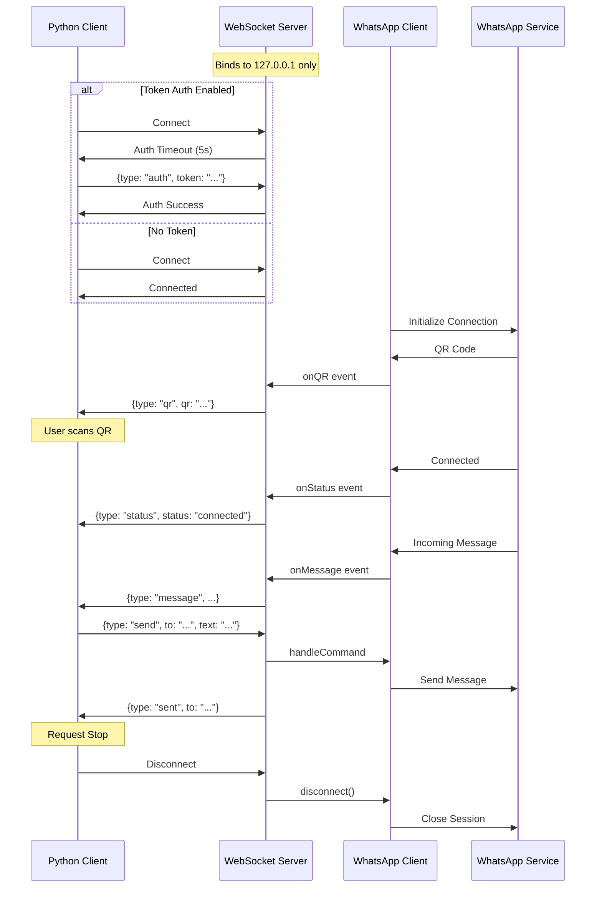

# Codebase Features

## bridge/src/server.ts
## Overview
The BridgeServer module provides a secure WebSocket-based communication bridge between Python clients and a WhatsApp integration, enabling bidirectional message flow and remote WhatsApp control through a locally-bound server with optional token authentication.

## Product Features

- **WebSocket Server** - Creates a WebSocket server for real-time bidirectional communication between Python clients and Node.js runtime
- **Localhost-Only Binding** - Security feature that binds exclusively to 127.0.0.1 to prevent external network exposure
- **Optional Token Authentication** - Configurable BRIDGE_TOKEN authentication with 5-second timeout handshake for securing client connections
- **WhatsApp Client Integration** - Embedded WhatsApp client instance for sending and receiving WhatsApp messages
- **Message Broadcasting** - Real-time broadcast of WhatsApp events (messages, QR codes, status updates) to all connected Python clients
- **Send Message Command** - Remote command execution allowing Python clients to send WhatsApp messages to specific recipients
- **QR Code Streaming** - Automatic broadcasting of WhatsApp authentication QR codes to connected clients
- **Connection Status Updates** - Real-time WhatsApp connection status notifications to all clients
- **Multi-Client Support** - Concurrent connection handling for multiple Python client instances
- **Graceful Shutdown** - Clean server shutdown with proper cleanup of WebSocket connections and WhatsApp disconnection
- **Error Handling & Reporting** - Comprehensive error handling with error message feedback to clients
- **Message Acknowledgment** - Confirmation responses sent back to clients upon successful message delivery
- **Session Persistence** - Utilizes WhatsApp authentication directory for maintaining persistent sessions

## Architecture Diagram

The following diagram illustrates the bridge communication flow and component interactions:

