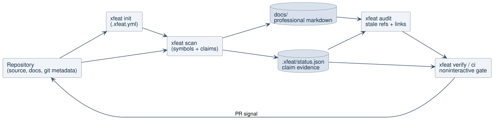

# Professional Documentation Workflow

## Problem

`xfeat` generates architecture and feature reports, but professional teams need
documentation that can be trusted in pull requests, onboarding, audits, and
incident response. Generated prose without source evidence, ownership, or
freshness checks becomes difficult to review and easy to distrust.

## Goal

Add an MVP workflow that turns `xfeat` into a source-grounded documentation
compiler and verifier while preserving the existing AI feature-map pipeline.

## User Outcome

Engineering leads can initialize documentation policy, generate grounded docs,
audit stale code references, and run a CI-friendly verification command without
requiring an Anthropic API key.

## Scope

- Add `xfeat init` to create `.xfeat.yml` and documentation folders.
- Add `xfeat scan [target]` to generate deterministic professional docs under
  `docs/` plus `.xfeat/status.json`.
- Add `xfeat audit [target] --changed` to report stale Markdown code references
  and broken relative links.
- Add `xfeat verify [target]` to validate generated status and documentation
  references.
- Add `xfeat ci [target]` as a noninteractive audit plus verify gate.
- Keep generated claims source-grounded with file paths, symbols, and line
  numbers.

## Non-Goals

- No hosted UI.
- No interactive codebase Q&A.
- No Backstage plugin package.
- No automatic PR comments.
- No new production dependency.

## Workflow Diagram

The MVP uses static repository evidence first, then produces documentation and a
machine-readable status file that CI can verify.

## Data Model

- `claim`: generated documentation statement backed by source evidence.
- `source`: relative file path, optional symbol name, and one-based line number.
- `status`: scan metadata, generated document paths, claim count, and audit
  results.
- `audit finding`: stale code reference, missing source file, or broken Markdown
  link.

## CLI Behavior

- `xfeat init` is idempotent. Existing `.xfeat.yml` is not overwritten.
- `xfeat scan` writes `docs/architecture/overview.md`,
  `docs/components/*.md`, `docs/onboarding.md`, `docs/adr-index.md`,
  `.xfeat/status.json`, and `xfeat-report.md`.
- `xfeat audit --changed` accepts the flag for CI compatibility. MVP behavior
  audits all Markdown because changed-file detection can be added later without
  changing command shape.
- `xfeat verify` fails when generated docs or claim sources are missing.
- `xfeat ci` exits nonzero when audit or verify finds blocking issues.

## Error Handling

- Missing docs are reported as verification findings.
- Missing source files referenced by claims are reported as verification
  findings.
- Broken relative Markdown links are audit findings.
- Stale backticked code references are audit findings only when the token looks
  code-specific and cannot be found in scanned source text.
- Empty repositories still generate status and a report, but verification warns
  about no source claims.

## Acceptance Criteria

- Focused tests cover init, scan output, audit findings, verify success, and CI
  failure behavior.
- Existing feature-map tests keep passing.
- Commands are noninteractive.
- New non-Markdown files stay below 420 lines.
- README documents the professional workflow.
