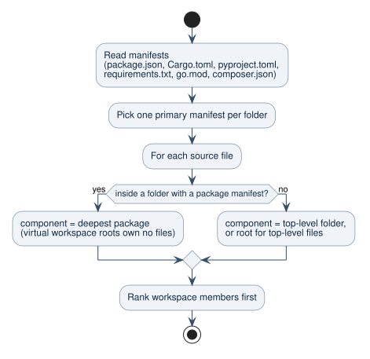
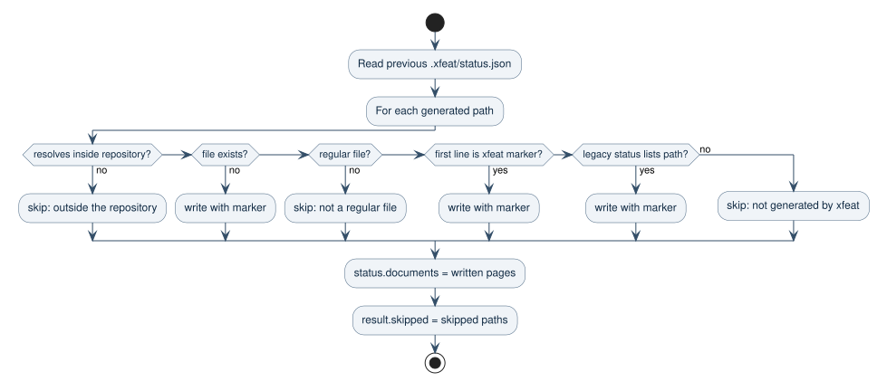

# Professional Documentation Workflow

## Problem

`xfeat` generates architecture and feature reports, but professional teams need
documentation that can be trusted in pull requests, onboarding, audits, and
incident response. Generated prose without source evidence, ownership, or
freshness checks becomes difficult to review and easy to distrust.

## Goal

Add an MVP workflow that turns `xfeat` into a source-grounded documentation
compiler and verifier while preserving the existing AI feature-map pipeline.
The scan output must be useful as human engineering documentation, not only as a
symbol inventory.

## User Outcome

Engineering leads can initialize documentation policy, generate grounded docs,
audit stale code references, and run a CI-friendly verification command without
requiring an Anthropic API key.

## Scope

- Add `xfeat init` to create `.xfeat.yml` and documentation folders.
- Add `xfeat scan [target]` to generate deterministic professional docs under
  `docs/` plus `.xfeat/status.json`.
- Add `xfeat audit [target] --changed` to report stale Markdown code references
  and broken relative links.
- Add `xfeat verify [target]` to validate generated status and documentation
  references.
- Add `xfeat ci [target]` as a noninteractive audit plus verify gate.
- Keep generated claims source-grounded with file paths, symbols, and line
  numbers.
- Infer semantic architecture, component, onboarding, and how-to docs from
  repository metadata, source excerpts, public symbols, and import relationships.
- Organize generated docs using Diátaxis roles: explanation for architecture,
  reference for components, tutorial-style onboarding, and task-focused how-to
  guides.

## Non-Goals

- No hosted UI.
- No interactive codebase Q&A.
- No Backstage plugin package.
- No automatic PR comments.
- No new production dependency.
- No required LLM or provider credential for the professional scan path.

## Workflow Diagram

The MVP uses static repository evidence first, then produces documentation and a
machine-readable status file that CI can verify.


## Data Model

- `claim`: generated documentation statement backed by source evidence.
- `source`: relative file path, optional symbol name, and one-based line number.
- `status`: scan metadata, generated document paths, claim count, and audit
  results.
- `audit finding`: stale code reference, missing source file, or broken Markdown
  link.

## CLI Behavior

- `xfeat init` is idempotent. Existing `.xfeat.yml` is not overwritten.
- `xfeat scan` writes `docs/architecture/overview.md`,
  `docs/components/*.md`, `docs/onboarding.md`, `docs/adr-index.md`,
  `docs/how-to/*.md`, `docs/reference/*.md`,
  `.xfeat/status.json`, and `xfeat-report.md`. It never overwrites a file it
  did not generate; see [Generated File Ownership](#generated-file-ownership).
- The `scan` JSON result lists `documents` that were written and `skipped`
  entries (`{ "path", "reason" }`) for generated paths left untouched. Its
  `facts` list files, components, line counts, and symbols, never source text,
  and the JSON is complete when stdout is a pipe.
- `xfeat audit --changed` accepts the flag for CI compatibility. MVP behavior
  audits all Markdown because changed-file detection can be added later without
  changing command shape.
- `xfeat verify` fails when generated docs or claim sources are missing.
- `xfeat ci` exits nonzero when audit or verify finds blocking issues.

## Error Handling

- Missing docs are reported as verification findings.
- A missing `.xfeat/status.json` is a `missing-status` finding and an
  unparseable one is an `invalid-status` finding; neither crashes `verify` or
  `ci`.
- Missing source files referenced by claims are reported as verification
  findings.
- Broken relative Markdown links are audit findings.
- Stale backticked code references are audit findings only when the token looks
  code-specific and cannot be found in scanned source text or package
  manifests. Manifests count because generated pages cite package names such
  as `ledger_tools` that source files may never mention.
- Empty repositories still generate status and a report, but verification warns
  about no source claims.

## Semantic Scan Behavior

- Read package manifests, README files, scripts, tests, and source files.
  Manifests are read with the shared portfolio readers, so `scan` and
  `portfolio scan` agree: `package.json`, `Cargo.toml`, `pyproject.toml`,
  `requirements.txt`, `go.mod`, and `composer.json`. Manifests under test and
  fixture folders are ignored.
- Prefer package/workspace boundaries for components. Fall back to top-level
  folders when package metadata is absent. See
  [Polyglot Repositories](#polyglot-repositories).
- Extract public APIs from language visibility rules (see
  [Public API Rules](#public-api-rules)) and rank them by package entrypoints:
  npm `exports`, `main`, and `bin`; Cargo `src/lib.rs`, `src/main.rs`, and
  `[[bin]]` paths; Python package `__init__.py`; Go `main.go`.
- Take the README summary from the first prose paragraph after the title.
  Hard-wrapped lines are joined, Markdown links and inline HTML are reduced to
  text, and summaries longer than 320 characters stop at a sentence boundary.
  The claim cites the paragraph's first line.
- Build a lightweight symbol graph from local `import`, `export from`, and
  `require` references so docs can describe runtime flow between components.
- Rank important files using package entrypoints, scripts, tests, public
  symbols, and import fan-in.
- Generate how-to guides from package scripts and test files. Each guide must
  include the command, why the task exists, and evidence links to the defining
  metadata or test file.
- Generate complete reference appendices for all claims, scanned source files,
  exported symbols, and import/dependency graph edges. Overview and component
  pages may summarize for readability, but must link to the complete appendices
  rather than silently dropping evidence.
- Mark heuristic statements with source evidence and avoid claiming runtime
  behavior that cannot be traced to package metadata, imports, tests, or source
  excerpts.

## Polyglot Repositories

A repository can mix ecosystems, for example a Cargo workspace with a Node.js
sidecar. `scan` treats every supported manifest as package metadata.

### Diagram: Component Resolution



This diagram shows how a source file is assigned to a component. Read it when
a generated component map groups files unexpectedly.

- Main entities: manifests are read from the whole repository. When one folder
  holds several manifests (for example `pyproject.toml` and
  `requirements.txt`), the first named manifest is the folder's primary
  manifest and the others only add metadata.
- Flow: 1. Read manifests. 2. Pick one primary manifest per folder. 3. Assign
  each source file to the deepest folder with a package manifest. 4. Assign
  remaining files to their top-level folder, or `root` for top-level files. 5. Rank workspace members first in the component map.
- Edge paths: a virtual workspace root (a `Cargo.toml` with `[workspace]` and
  no `[package]`) declares members but owns no files, so loose scripts keep
  their folder component instead of collapsing into `root`. Unnamed manifests such as a nested `requirements.txt` name their component
  after the folder path (`services/api`), two packages that share a name get
  their folder appended (`billing (web)`), and an unnamed manifest with no
  source files (`docs/requirements.txt`) gets no component page. Page file names
  are unique even on case-insensitive filesystems: npm `@acme/core` and Cargo
  `acme-core` both slug to `acme-core`, so the second page gets its folder
  appended (`acme-core-rust`), and how-to pages follow the same rule.
- References: [manifest adapter](../../lib/professional-docs-manifests.js),
  [shared readers](../../lib/portfolio-manifest-readers.js),
  [semantic model](../../lib/professional-docs-semantics.js),
  [tests](../../professional-docs-polyglot.test.js).

Rules:

- Workspace members come from npm `workspaces` and Cargo `workspace.members`.
  Globs (`*`, `**`), npm negations (`!path`), and Cargo `workspace.exclude`
  are resolved against manifest folders. Members rank before other components.
- The architecture overview states package metadata for each root manifest:
  the package name with its name line, or, for a virtual workspace, the member
  count with the `members` line. "No package metadata detected." appears only
  when the repository has no supported manifest.
- Cross-component dependency flows come from runtime dependencies in any
  ecosystem, matched by normalized package name within the same ecosystem.
  Cargo `workspace = true` and `path` dependencies resolve to member crates.
  A virtual workspace's `[workspace.dependencies]` table declares versions,
  not usage, so it produces no flows.
- Onboarding suggests `npm install` and npm scripts only when the repository
  root has a `package.json`, and how-to guides come only from root
  `package.json` scripts because their steps run from the repository root.
  Other ecosystems get no invented commands.
- Dependency evidence cites the line that declares the dependency, including
  TOML dotted keys such as `protocol.workspace = true`.
- A component whose manifest has no description says so and cites the name
  line, instead of rendering an empty responsibility.
- Source scanning ignores Cargo `target/` output alongside the existing build
  folders.

## Public API Rules

| Language              | Public                                                                                                                                                                                                                                           | Not public                                                                                                                                                                                      |
| --------------------- | ------------------------------------------------------------------------------------------------------------------------------------------------------------------------------------------------------------------------------------------------ | ----------------------------------------------------------------------------------------------------------------------------------------------------------------------------------------------- |
| JavaScript/TypeScript | `export` declarations and `export { }` lists.                                                                                                                                                                                                    | Everything not exported.                                                                                                                                                                        |
| Rust                  | `pub` items: `fn` (including `const`, `async`, `unsafe`, `extern` functions), `struct`, `enum`, `trait`, `type`, `const`, `static`, `mod`, and `pub use` re-exports, at the top level or inside `pub mod`, `impl`, `trait`, and `extern` blocks. | `pub(crate)`, `pub(super)`, `pub(in path)`, `pub(self)`, private items, glob re-exports, and anything inside a private `mod`, a `#[cfg(test)]` module, a function body, a comment, or a string. |
| Go                    | Top-level `func`, methods on exported types, `type`, `const`, and `var` whose name starts with an uppercase letter, including grouped `const ( )` and `var ( )` blocks.                                                                          | Lowercase identifiers, methods on unexported types, `_test.go` files, `internal/` packages, and `package main`.                                                                                 |
| Python                | Module-level `def`, `async def`, `class`, and `UPPER_CASE` constants. When the module declares `__all__` (including later `__all__ +=`), exactly the listed names; comments inside the list are ignored.                                         | Names starting with `_`, nested definitions, text inside triple-quoted strings, `_private.py` modules, `tests/` folders, and test modules (`test_*.py`, `*_test.py`, `conftest.py`).            |

Comments and strings are blanked before matching, so line numbers stay exact.
The rules are still static: they do not follow a Rust file declared as a
private module from another file (`mod internal;`), and they count `pub` items
in binary crates.

## Generated File Ownership

`scan` writes into the target repository, so it must not destroy hand-written
pages that happen to use a generated path such as `docs/onboarding.md`.

Every generated Markdown file starts with this marker line. It is an HTML
comment rather than YAML frontmatter (which portfolio pages use) so that
GitHub does not render a metadata table at the top of each scan page:

```markdown
<!-- xfeat:generated. xfeat scan overwrites this file; delete this line to keep manual edits. -->
```

### Diagram: Scan File Ownership



This diagram shows the write-or-skip decision for each generated path. Read it
before changing which files `scan` writes or how it detects its own output.

- Main entities: the marker line is the ownership signal inside each page.
  Pages written before markers existed are recognized by their exact opening:
  the title followed by one of the intro sentences those scans always wrote
  (for the report, `# xfeat Report` followed by `- Source files:`). Current
  pages use different intro sentences. `.xfeat/status.json` is never trusted
  for ownership, because it can be stale, missing after a fresh clone, or
  edited.
- Flow: 1. For each generated path that resolves inside the repository, write
  it when it does not exist, when its first line is the marker, or when it
  opens like a pre-marker page. 2. Otherwise skip it. 3. Record written pages
  in `status.documents` and skipped paths in the result, in `xfeat-report.md`,
  and as one warning line on stderr.
- Edge paths: directories and symbolic links at a generated path are skipped
  (`not a regular file`), and a path whose parent folder resolves outside the
  repository, for example a symlinked `docs/reference`, is skipped
  (`resolves outside the repository`). `scan` never writes outside the
  repository through a link. Deleting the marker line is how a team takes
  ownership of a page: the page no longer starts with the marker and its
  current intro is not a pre-marker intro, so later scans skip it. A
  hand-written page stays hand-written even when an old status file lists it.
- Skipped pages are not added to `status.documents`, so `verify` never treats a
  hand-written page as generated output. Links from generated pages to a
  skipped path still resolve, but point at the hand-written page.
- References: [writer](../../lib/professional-docs-writer.js),
  [scan](../../lib/professional-docs.js),
  [tests](../../professional-docs-ownership.test.js).

`.xfeat/status.json` and every folder `init` creates get the same containment
check: state is rewritten only when it is missing or a regular file inside the
repository, and folders are created only when they resolve inside it. Refused
paths appear in `skipped`. `.xfeat.yml` is created only when nothing exists at
that path, not even a dangling symlink. The repository root itself is resolved
through its nearest existing folder, so `init` on a new folder below a
symlinked parent (macOS `/tmp`) works. `init` and `scan` print one stderr line
listing every skipped path, and exit with code 1 when any path resolves
outside the repository, because the output is then incomplete for a reason
the user must look at.

## Acceptance Criteria

- Focused tests cover init, scan output, audit findings, verify success, and CI
  failure behavior.
- Focused tests prove that architecture docs include real purpose and runtime
  flow, component docs include responsibilities and public APIs, onboarding docs
  rank package metadata and source entrypoints, and how-to docs are inferred from
  scripts/tests with evidence links.
- Focused tests prove generated reference appendices are complete enough to
  include claims, files, exported symbols, import targets, and test evidence that
  would previously have been truncated.
- Focused tests prove a Cargo workspace yields one component per member crate,
  package metadata from `Cargo.toml`, Rust public APIs, dependency flows
  between crates, and a README summary joined across wrapped lines.
- Focused tests prove Python and Go public API rules, including `__all__`,
  private names, and Go test files.
- Focused tests prove `scan` skips hand-written files at generated paths,
  reports them in `skipped`, overwrites marked and pre-marker pages, ignores
  status-file listings, and respects a removed marker.
- Existing feature-map tests keep passing.
- Commands are noninteractive.
- New non-Markdown files stay below 420 lines.
- README documents the professional workflow.

## Test Plan

- [professional-docs.test.js](../../professional-docs.test.js): npm workspace
  behavior, audit, verify, and CLI output.
- [professional-docs-polyglot.test.js](../../professional-docs-polyglot.test.js):
  Cargo workspace, Python, and Go repositories in temporary folders.
- [professional-docs-exports.test.js](../../professional-docs-exports.test.js):
  per-language public API rules.
- [professional-docs-ownership.test.js](../../professional-docs-ownership.test.js):
  write-or-skip decisions and the `skipped` result.
- Dogfood: run `scan` on a scratch clone of a real polyglot Rust workspace and
  check the component map, public API counts, and README summary.
