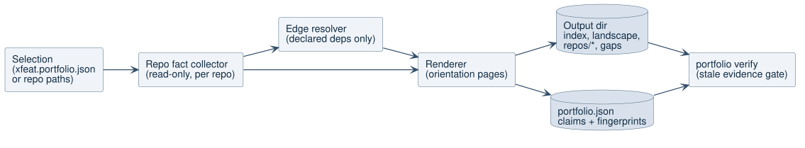
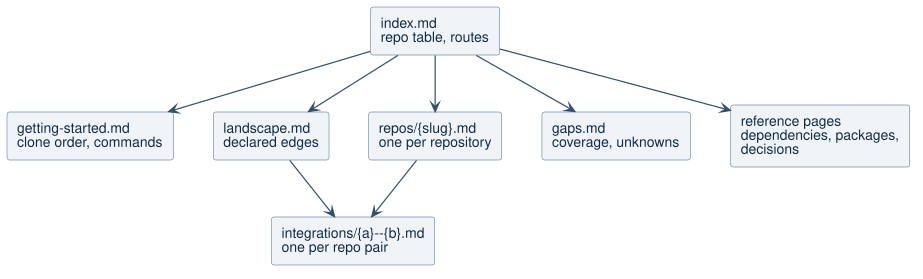
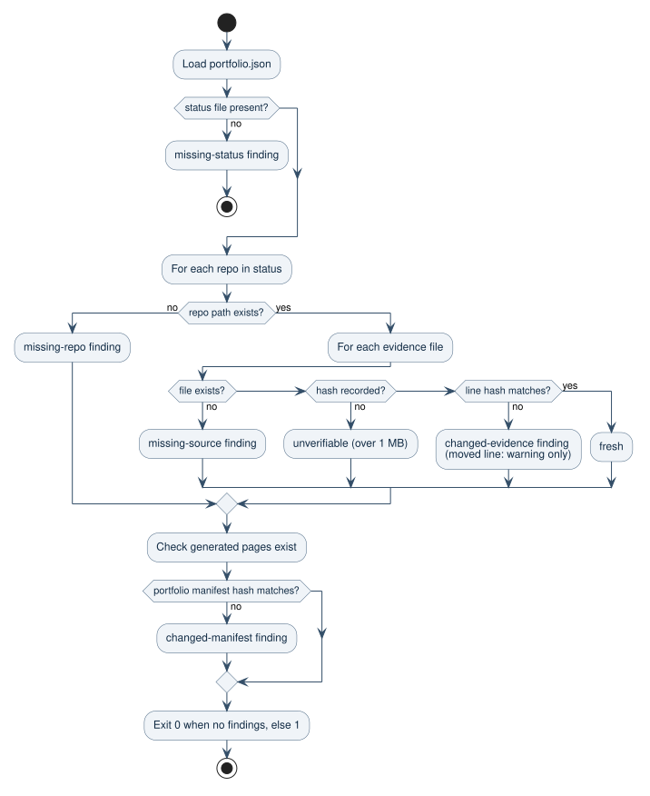

# Portfolio Documentation

## Problem

Teams rarely own one repository. Onboarding, incident response, and planning
need answers that span repositories: what each one is for, who owns it, how to
run it, and which repositories depend on which. `xfeat scan` documents one
repository and writes into it. It cannot describe a system made of several
repositories, and its single-repository heuristics misread polyglot
repositories (see the baseline failure in the
[research](../research/01a103e77ce2751b-multi-repo-documentation-research.md)).

## Goal

Add `xfeat portfolio`, a deterministic documentation build for a reviewable
selection of repositories. It produces a small set of routed pages backed by a
complete machine-readable model, and a verifier that fails when cited evidence
changes.

## User Outcome

An engineer joining a multi-repository team opens one `index.md`, finds which
repositories exist, who owns them, which ones to clone first, how to run them,
and how they connect, with every statement linked to the exact source line it
came from. A CI job can re-run `xfeat portfolio verify` and fail when that
evidence drifts.

## Scope

- `xfeat portfolio init` writes a reviewable `xfeat.portfolio.json` from a
  parent folder of repositories.
- `xfeat portfolio scan` reads the selection and writes the output folder.
- `xfeat portfolio verify` checks the output against the current repositories.
- `xfeat portfolio ci` runs verify plus a relative-link audit of the output.
- Ecosystems: npm, Cargo, Python (`pyproject.toml`, `requirements.txt`), Go,
  and Composer manifests, plus CODEOWNERS, Backstage `catalog-info.yaml`, CI
  workflows, Makefiles, justfiles, compose files, and API contract files.

## Non-Goals

- No LLM calls and no API key requirement.
- No cloning, fetching, or checking out refs. xfeat documents working trees as
  they are and records their SHAs.
- No writes into member repositories.
- No detection of runtime calls through HTTP URLs, queues, or service
  registries. The landscape is a declared-dependency map.
- No Backstage, MkDocs, or Antora adapters in this iteration.
- No generated `AGENTS.md` or overview prose for coding agents.

## Workflow

### Diagram: Portfolio Pipeline



This diagram shows how a selection becomes pages and a verifiable model. Read it
when changing where a fact is collected or which stage owns a decision.

- Main entities: the selection is the only list of repositories xfeat may read.
  The fact collector reads each repository without writing to it. The edge
  resolver matches declarations across repositories. The renderer turns the
  model into pages and `portfolio.json`. `verify` compares `portfolio.json`
  against the repositories later.
- Flow: 1. Load the selection from a manifest, explicit paths, or `--from`. 2. Collect facts per repository. 3. Resolve cross-repository edges. 4. Render
  pages and the model. 5. Verify on demand.
- Failure and edge paths: missing paths stop the scan with an actionable error.
  Unparseable manifests are recorded as gaps and do not stop the scan.
- References: [selection](../../lib/portfolio-selection.js),
  [manifests](../../lib/portfolio-manifests.js),
  [git metadata](../../lib/portfolio-git.js),
  [signals](../../lib/portfolio-signals.js),
  [commands](../../lib/portfolio-commands.js),
  [evidence](../../lib/portfolio-evidence.js).

### Diagram: Generated Pages



This diagram shows how generated pages route readers. Read it when adding,
removing, or renaming a generated page.

- Main entities: `index.md` routes and holds the only repository table.
  Repository pages describe one repository. Integration pages describe one
  pair of repositories that declare an edge. `gaps.md` reports what is unknown.
  Reference pages hold complete tables.
- Flow: 1. Start at `index.md`. 2. Use `getting-started.md` to clone and run. 3. Open a repository page for detail. 4. Follow an integration page to see
  both sides of a dependency.
- Failure and edge paths: pages with no content are not generated. A portfolio
  with no edges has no integration pages, and `landscape.md` says so.

### Diagram: Verification



This diagram shows how `verify` decides whether output is stale. Read it when
changing finding types or exit codes.

- Flow: 1. Load `portfolio.json`. 2. For each repository, re-read every cited
  line and compare its hash. 3. Check generated pages exist. 4. Compare the
  portfolio manifest hash. 5. Exit 0 only without blocking findings.
- Failure and edge paths: a cited line that moved is a warning, not a failure.
  A changed or missing line, a missing repository or page, and an edited or
  missing portfolio manifest fail. Evidence in files over 1 MB is never a claim,
  so it cannot pass as fresh. A repository whose HEAD advanced without changing
  cited lines is informational.
- References: [verify](../../lib/portfolio-docs.js),
  [evidence](../../lib/portfolio-evidence.js),
  [tests](../../portfolio-docs.test.js).

## Selection Manifest

`xfeat.portfolio.json` is JSON so it needs no parser dependency. Paths resolve
relative to the manifest file.

```json
{
  "name": "Billing Platform",
  "description": "Services that invoice and collect payments.",
  "output": "xfeat-portfolio",
  "repos": [
    {
      "path": "../billing-api",
      "system": "billing",
      "owner": "@acme/payments",
      "lifecycle": "production",
      "notes": "Owns the invoice state machine."
    },
    { "path": "../billing-web", "name": "Billing Web" }
  ]
}
```

- `path` is required. `name`, `description`, `system`, `owner`, `lifecycle`,
  `notes`, and `tags` are optional and are labeled `manifest` when rendered.
- Duplicate paths are removed. Duplicate names get parent-folder slugs.
- A selected folder inside a larger git repository is supported. Its git data
  is scoped to the folder.

## CLI Behavior

- `xfeat portfolio init [paths...] [--from <dir>] [--include <glob>]
[--exclude <glob>] [--manifest <file>] [--name <text>] [--out <dir>]` writes
  the manifest and never overwrites one. `--out` sets the manifest `output`.
- `xfeat portfolio scan [paths...] [--manifest <file>] [--from <dir>]
[--include <glob>] [--exclude <glob>] [--out <dir>] [--name <text>]
[--render-diagrams]`. Without paths, `--from`, or `--manifest`, it uses
  `./xfeat.portfolio.json`.
- `xfeat portfolio verify [--out <dir>] [--manifest <file>]`.
- `xfeat portfolio ci [--out <dir>] [--manifest <file>]`.
- Every command prints one JSON object and exits nonzero on blocking findings.
- An option a command does not read (for example `--render-diagrams` on
  `verify`) is an error, not silently ignored. `--flag=value` is accepted.

## Output

| Path                       | Type        | Content                                                                                                                                                |
| -------------------------- | ----------- | ------------------------------------------------------------------------------------------------------------------------------------------------------ |
| `index.md`                 | landscape   | Repository table grouped by system: purpose, owner, status, languages, verified SHA.                                                                   |
| `getting-started.md`       | tutorial    | Clone order with providers before consumers, and declared commands per repository.                                                                     |
| `landscape.md`             | landscape   | Declared edge table, and a landscape diagram when at most 15 repositories are connected.                                                               |
| `repos/{slug}.md`          | repository  | Purpose, ownership, status, modules, interfaces and entry points, commands, dependencies, runtime descriptors, docs, gaps.                             |
| `integrations/{a}--{b}.md` | integration | Every edge between two repositories with consumer and provider evidence.                                                                               |
| `dependencies.md`          | reference   | External dependencies shared by several repositories, grouped by declared version, and shared protobuf packages. Internal edges are on `landscape.md`. |
| `packages.md`              | reference   | Every package or module name each repository provides, with ambiguous names flagged.                                                                   |
| `decisions.md`             | reference   | ADRs found across repositories, linked in place.                                                                                                       |
| `gaps.md`                  | gaps        | Coverage percentages, per-repository gaps (including unresolved local dependencies), and ambiguous names.                                              |
| `llms.txt`                 | agent index | Link index under 8 KB, counted in bytes. Links only, no prose summaries.                                                                               |
| `portfolio.json`           | model       | Selection, repository facts, edges, claims with line hashes, SHAs, generated documents.                                                                |
| `diagrams/landscape.puml`  | diagram     | PlantUML source. `--render-diagrams` also writes `landscape.svg`; `landscape.md` embeds it only when rendering succeeded.                              |

Every Markdown page starts with frontmatter declaring `type` and `generator`.
Output contains no timestamps, so re-running on unchanged repositories produces
byte-identical files.

## Output Safety

- The output folder must resolve, after following symlinks, outside every
  selected repository. This is checked on the projected real path before any
  folder is created, and again after creation.
- Every write is refused when the target or its parent resolves outside the
  real output folder, including through a symlinked subfolder or a symlinked
  file.
- A rescan removes pages it generated earlier only when they are still inside
  the output folder and carry the `generator: xfeat portfolio` marker, or are
  known generated assets (`llms.txt`, `portfolio.json`, `diagrams/landscape.*`).
  Hand-written files are kept even when an old `portfolio.json` lists them.
- Git runs with the repository-locating variables that git exports to hooks
  (`GIT_DIR`, `GIT_WORK_TREE`, `GIT_INDEX_FILE`, and related) removed, so xfeat
  reads each selected folder's own repository even inside a hook.

## Evidence Model

- Every claim stores `{ repo, file, line, hash }`, where `hash` is the first 16
  hex characters of the SHA-256 of the trimmed cited line.
- Claims are labeled `source` (read directly from a file, including a README
  deprecation notice), `derived` (computed, such as dormancy), or `manifest`
  (declared in `xfeat.portfolio.json`).
- `portfolio.json` stores a SHA-256 of `xfeat.portfolio.json`. `verify` reports
  `changed-manifest` or `missing-manifest` when it changed or disappeared, since
  manifest values are rendered into pages.
- Evidence in files larger than 1 MB has a `null` hash, is not a claim, and is
  reported as `unverifiable` instead of fresh.
- Evidence links use commit permalinks for GitHub, GitLab, and Bitbucket when the
  repository is clean and the file is tracked. Otherwise they use a relative
  path to the local file.
- Remote URLs are normalized to `https://host/path` and embedded credentials are
  always removed. Dependency git URLs are normalized the same way, and a
  dependency "version" that contains `/`, `:`, or `@` (a URL, path, or alias) is
  reported as empty, so tokens in dependency specs never reach the output.
- Link paths are percent-encoded per segment, so spaces and `%` in file names
  produce working links. `ci` reports an undecodable link as broken.

## Cross-Repository Edges

| Kind               | Detection                                                                                                     | Confidence   |
| ------------------ | ------------------------------------------------------------------------------------------------------------- | ------------ |
| `path-dependency`  | A manifest dependency path resolves inside another selected repository.                                       | `declared`   |
| `git-dependency`   | A dependency git URL matches another repository's remote.                                                     | `declared`   |
| `go-module`        | The longest Go module path from another repository that prefixes a `go.mod` requirement.                      | `declared`   |
| `git-submodule`    | A `.gitmodules` URL, resolved like git resolves relative URLs, matches another repository's remote or folder. | `declared`   |
| `github-action`    | A workflow `uses:` references another repository's remote.                                                    | `declared`   |
| `terraform-module` | A Terraform `source` references another repository's remote.                                                  | `declared`   |
| `package-name`     | A dependency name equals a package another repository provides, by ecosystem.                                 | `name-match` |

- Names are compared per ecosystem after normalization (PEP 503 for Python,
  `_` and `-` equivalence for Cargo, lowercase for npm and Composer, exact for
  Go).
- A dependency whose name is also provided by the consuming repository is
  internal and is not an edge.
- A name, Go module path, or git remote shared by several selected
  repositories is reported as ambiguous in `gaps.md` and is not drawn.
- A path dependency cites the provider manifest at the declared path. A path
  dependency or relative submodule that resolves outside every selected
  repository is an `unresolved-dependency` gap.

## Commands

- Sources: CI `run:` steps and GitLab `script:` entries, package scripts,
  Makefile targets, and justfile recipes. CI wins on duplicates because it is
  evidence the command runs.
- Workflows whose file name mentions release, publish, deploy, backup, pages,
  labeler, stale, pr-title, or dependabot are skipped for commands. They are
  still read for `uses:` references.
- CI lines with workflow expressions (`${{ }}`, `$GITHUB_*`), shell control
  fragments, file chores, and toolchain installers are dropped.
- Categories (setup, build, test, lint, run, other) are matched with flags
  removed, so `--output-format` does not read as a lint command.
- `getting-started.md` shows one command per essential category. Repository
  pages list every declared command.

## Status, Ownership, And Systems

- Owner precedence: portfolio manifest, then `catalog-info.yaml` `spec.owner`,
  then the last catch-all CODEOWNERS rule. No owner is a gap.
- Lifecycle precedence: portfolio manifest, then `catalog-info.yaml`
  `spec.lifecycle`, then `deprecated` when the README declares deprecation, then
  `dormant` when the last commit is more than 365 days older than the newest
  commit in the selection, then `active`. Folders without git are `unknown`.
- System precedence: portfolio manifest, then `catalog-info.yaml`
  `spec.system`, then `Ungrouped`.

## Gaps

Each repository can report: no purpose (no README summary and no description),
no README file, no owner, no declared test command, no CI workflow, no license,
deprecated, dormant, not a git repository, uncommitted changes, unresolved local
dependencies, manifest parse errors, and manifests too large to read. `gaps.md`
also lists ambiguous names and the percentage of repositories with an owner, a
purpose, a declared test command, CI, and a license.

## Limits

- Files larger than 1 MB are not read as evidence.
- At most 200 protobuf files and 200 Terraform files per repository are read.
- `dependencies.md` lists at most 100 shared dependencies; `portfolio.json` has
  all of them.
- The landscape diagram is omitted when more than 15 repositories are
  connected; the edge table remains.
- A folder inside an unrelated repository that tracks no file in it is treated
  as not a git repository.
- Lines are hashed after trimming whitespace, so indentation changes do not mark
  evidence stale.
- Links for repositories with uncommitted changes, no commits, or no supported
  remote point to local files and only work on the machine that ran the scan.
  `scan` reports them as a warning.

## Acceptance Criteria

- Focused tests cover the TOML reader, manifest readers, selection, git metadata,
  signals, commands, edges, rendering, verify, and the CLI.
- A multi-repository fixture with npm, Cargo, Python, and Go produces resolved
  edges, a name-match edge, an ambiguous name, an integration page, and gaps.
- Scanning never modifies member repositories.
- Scanning twice without repository changes produces byte-identical output.
- `verify` passes after scan, warns on moved lines, and fails on changed lines,
  deleted files, deleted repositories, and an edited portfolio manifest.
- Scanning refuses output folders that resolve into a member repository and
  never writes or deletes outside the output folder.
- Remote credentials never appear in output.
- New non-Markdown files stay below 420 lines. Lint and the full test suite pass.
- A dogfood run on real local repositories is recorded as a success or failure
  story.

## Test Plan

- Unit tests per module with temporary folders under `os.tmpdir()` and real
  `git` repositories. Test git commands run with every `GIT_*` variable removed
  so a test inside a pre-commit hook cannot touch the enclosing repository.
- One end-to-end fixture scanned through `runPortfolioCommand` and through the
  CLI binary.
- Dogfood on a selection of local repositories covering Rust, TypeScript, and
  Python, with results recorded in `docs/stories`.
