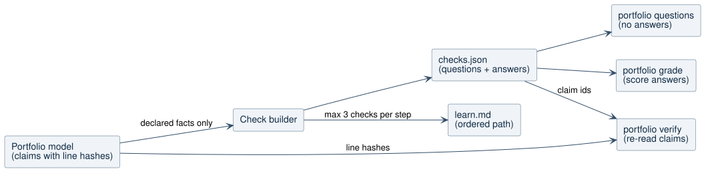
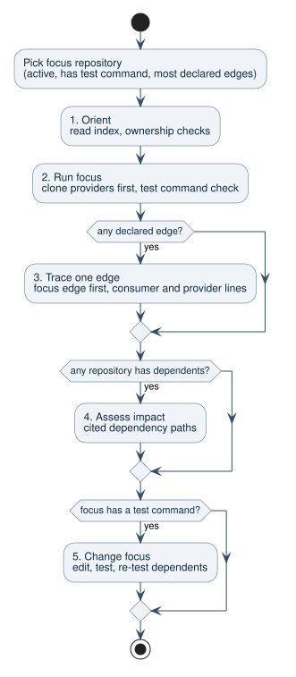

# Portfolio Learning Path and Checks

## Problem

`xfeat portfolio` answers what exists, who owns it, and how repositories
connect. It does not tell a newcomer where to start or in which order to read.
It also gives no way to test whether a reader, or a coding agent, actually
understood the portfolio. The
[portfolio research](../research/01a103e77ce2751b-multi-repo-documentation-research.md)
named a task-based usefulness metric as the right quality measure and left it
unautomated.

## Goal

Generate an ordered learning path and a set of checks from the existing
portfolio model. A check is a question whose answer is computed from declared
facts and cites the same claims that `verify` re-reads. Add two commands that
turn the checks into an evaluation: one prints the questions without answers,
one grades a set of answers.

## User Outcome

- A new engineer opens `learn.md`, follows at most five steps, and tests each
  step with up to three questions. Answers are hidden until opened and link to
  the source line they came from.
- A team evaluates whether the generated docs help a coding agent: give the
  agent the output of `xfeat portfolio questions`, collect its answers, and run
  `xfeat portfolio grade`.
- `xfeat portfolio ci` fails when a cited line behind a check changes, and
  names the affected checks.

## Evidence Behind The Design

The [research](../research/01a10804fd3079f7-explorable-docs-curriculum-research.md)
records sources and confidence. The rules it produces:

- Practice testing and self-explanation have robust effects; rereading does
  not. Each step ends with checks and one explanation prompt.
- Explorable maps as primary navigation left learners lost. The path is
  ordered and short; the graph stays in `portfolio.json`.
- Newcomers do best with an overview, then a small real task. The path ends
  with a change and a test run.
- Wrong documentation hurts agents more than missing documentation. Checks use
  only declared, cited facts, and stale evidence fails CI.
- Developers often ask whether a change can reach another component. Impact
  answers are cited dependency paths.

## Scope

- `checks.json` in the portfolio output folder.
- `learn.md` in the portfolio output folder, linked first from `index.md` and
  listed in `llms.txt`.
- `xfeat portfolio questions [--manifest <file>] [--out <dir>]`.
- `xfeat portfolio grade --answers <file> [--min-score <0..1>] [--manifest <file>] [--out <dir>]`.
- `verify` reports checks that cite unknown claims and names the checks
  affected by changed or missing evidence.
- An STE-lite sentence rule for generated learning pages, enforced by tests.

## Non-Goals

- No map view. It is deferred until checks show value.
- No LLM-generated questions, answers, or explanations.
- No questions about package-name matches or ambiguous names. Their answers are
  not verified.
- No merge of `xfeat scan` into the portfolio model.
- No spaced repetition or progress tracking. Output stays static files.

## Diagram: Checks Flow



This diagram shows where checks come from and which commands read them. Read
it before changing what a check may cite or how grading works.

- The check builder reads only declared facts from the portfolio model:
  ownership with evidence, declared commands, binaries, and edges with
  `declared` confidence.
- `checks.json` stores every check with its answer and claim ids. `learn.md`
  shows at most three checks per step.
- `portfolio questions` prints checks without answers. `portfolio grade` reads
  answers and scores them.
- `portfolio verify` re-reads every claim. A changed claim fails CI and the
  finding lists the checks that cite it.
- Limit: manifest-declared owners have no line evidence. Their checks cite the
  portfolio manifest, which `verify` hashes as a whole.

## Diagram: Learning Path



This diagram shows how steps are chosen. Read it before adding or reordering
steps.

1. Pick the focus repository: not deprecated or dormant when another choice
   exists, has a declared test command, most declared edges, then name order.
   A test command ranks first because the change step teaches the most.
2. **Orient**: read the index; ownership and binary checks, focus first.
3. **Run**: clone the focus repository's providers first, then the focus;
   test command check for the focus only.
4. **Trace**: one declared edge, preferring the focus repository as consumer,
   then as provider, then any edge; consumer and provider evidence; dependency
   and file checks; one explanation prompt.
5. **Impact**: the repository with the most dependents; cited dependency
   paths; impact check.
6. **Change**: edit the focus repository, run its test command in the folder
   that declares it, and re-test its dependents. Dependents here include
   package-name matches and ambiguous names, because re-testing too much is
   cheap and missing a dependent is not.

Generated sentences only state what xfeat can show: a repository without a
git remote is "got from its owner", not cloned; the Trace goal mentions a
provider line only when the edge has provider evidence; lists in answers and
re-test steps show at most ten names and point to `checks.json` for the rest.

Steps without evidence are not rendered. A portfolio without declared edges
gets Orient, Run, and Change.

## Data Model

`checks.json`:

```json
{
  "schemaVersion": 1,
  "generator": "xfeat portfolio",
  "focus": "billing-api",
  "checks": [
    {
      "id": "dependency-file:billing-api->ledger",
      "step": "trace",
      "kind": "dependency-file",
      "subject": "billing-api",
      "question": "Which file in `billing-api` declares its dependency on `ledger`?",
      "format": "file path relative to the repository root",
      "answer": { "type": "one-of", "values": ["go.mod"] },
      "claims": [
        "edge:billing-api->ledger:go-module:github.com/acme/ledger:consumer"
      ]
    }
  ]
}
```

| Kind               | Question                                                     | Answer type | Step   |
| ------------------ | ------------------------------------------------------------ | ----------- | ------ |
| `owner`            | Who owns `{repo}`?                                           | `set`       | orient |
| `binary`           | Which repository provides the program `{name}`?              | `value`     | orient |
| `test-command`     | Which declared command runs the tests of `{repo}`?           | `one-of`    | run    |
| `dependencies`     | Which selected repositories does `{repo}` depend on?         | `set`       | trace  |
| `dependency-file`  | Which file in `{repo}` declares its dependency on `{to}`?    | `one-of`    | trace  |
| `package-provider` | Which repository provides `{dependency}`?                    | `value`     | trace  |
| `impact`           | Which selected repositories can a change in `{repo}` affect? | `set`       | impact |

Rules:

- A check is generated only when every answer value has evidence: a claim with
  a line hash, or the hashed portfolio manifest.
- Dependency, file, provider, and impact checks use `declared` edges only.
- A dependency, file, provider, or impact check is skipped when a
  package-name match, an ambiguous name, or an uncited edge touches it. A
  `package.json` entry matched by name is still declared by its author, so a
  declared-only answer would mark a correct reader wrong.
- A file check is skipped when the same dependency is declared in more than
  one file. Edges keep the first declaration as evidence and list the others
  in `alsoDeclaredIn`.
- A binary check is generated only when one repository provides that name,
  and the name differs from the repository name. A provider check is skipped
  when the module path ends in the repository name, ignoring a `/vN` suffix. A
  question that contains its answer cannot tell a reader who knows the code
  from one who does not. Program names that are not strings are ignored.
- Run and impact steps only show checks about their own subject. Orientation
  fills up with other repositories after the focus.
- Impact is the reverse transitive closure over declared edges, excluding the
  subject.
- Check ids are stable for unchanged repositories, so answers from one run can
  be graded against the next.

## Grading

`answers.json` maps check ids to answers. A value may be a string or a list;
a comma-separated string counts as a list.

```json
{
  "owner:billing-api": "group:payments",
  "impact:ledger": ["billing-api", "sync-worker"]
}
```

Normalization before comparison: trim, remove surrounding backticks, collapse
whitespace, compare repository names and owners case-insensitively, and remove
a leading `./` or `{repo}/` from file paths. Test commands that run the same
script compare equal: `npm test`, `npm t`, `npm run-script test`, and
`npm run test`, the same forms for pnpm and yarn, and a leading `corepack`.
`bun test` stays distinct from `bun run test`, because it starts Bun's own
runner instead of the script. Without this rule the grader rewarded copying
xfeat's wording, which biased an evaluation toward agents that read the docs.

| Answer type | Correct when                                                                            |
| ----------- | --------------------------------------------------------------------------------------- |
| `value`     | The answer equals the expected value.                                                   |
| `one-of`    | The answer is one value equal to any expected value. A list of several values is wrong. |
| `set`       | The answer set equals the expected set.                                                 |

The report lists `score`, `correct`, `total`, and one result per check:
`correct`, `wrong`, or `missing`, with the expected answer. Unknown ids are
listed separately. Exit code is 0 unless `--min-score` is set and the score is
below it.

## Writing Rules (STE-lite)

Generated learning pages follow these rules, checked by tests:

- Sentences have 25 words or fewer. Inline code counts as one word.
- One goal per step, written as a sentence that starts with a verb.
- Identifiers stay verbatim in backticks.
- No ASD-STE100 dictionary and no STE compliance claim. The research records
  why.

## Edge Cases

- No declared edges: Trace and Impact are omitted; Orient, Run, and Change
  remain when their facts exist.
- No test command anywhere: Run lists clone steps only; Change is omitted.
- Every repository deprecated or dormant: the focus is chosen from all
  repositories.
- No checks at all: `checks.json` holds an empty list and `learn.md` says which
  facts are missing, linking `gaps.md`.
- Cycles in declared edges: impact closure terminates; paths never repeat a
  repository.
- `grade` before `scan`: error that `checks.json` is missing.
- Malformed `answers.json` or `--min-score` outside 0 to 1: error with exit
  code 1.

## Acceptance Criteria

- `portfolio scan` writes `learn.md` and `checks.json`, lists both in
  `portfolio.json` documents, and re-runs produce byte-identical files.
- Every check cites at least one claim id present in `portfolio.json`, or the
  manifest.
- `learn.md` shows at most five steps and at most three checks per step, and no
  sentence longer than 25 words.
- `portfolio questions` output contains no answers.
- `portfolio grade` scores a fully correct answer file at 1 and an empty one at
  0, and honours `--min-score`.
- Changing a cited line makes `portfolio verify` fail and the finding lists the
  affected check ids.

## Test Plan

- Unit: check builder on the shared fixture (owners, commands, binaries,
  declared edges, impact closure with a cycle), focus selection, and answer
  normalization.
- Unit: `learn.md` rendering, step omission, check limits, and the sentence
  rule.
- End to end: scan, questions, grade, verify after editing a cited line.
- Dogfood: run on the 74-repository local selection used for the portfolio
  dogfood, record check counts and grading of a correct and an empty answer
  file.
