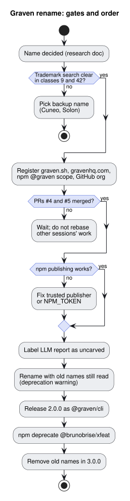

# Rename xfeat to Graven

## Problem

The product is named `xfeat` ("extract features"), after its first LLM feature
map. Its value is now source-grounded documentation: claims pinned to file,
line, and commit, a CI gate that fails on drift, and multi-repository
portfolios. The [name research](../research/01a108ce87a97a40-product-name-research.md)
chose **Graven**. This spec defines what the rename changes, what stays
compatible, and what must be true before any code changes.

Status is `proposed`: the decision is documented, the code is not renamed yet.

## Gates

Do not start the code rename until every gate holds. Each gate exists because
skipping it causes work that is hard to undo.

### Diagram: rename gates and order

This diagram shows the order of the gates and the release steps. Read it
before picking up the rename or when a gate fails.

- Flow: 1. trademark search; 2. register the domains, npm scope, and GitHub
  organization; 3. wait for open pull requests to merge; 4. confirm npm
  publishing works; 5. label LLM output; 6. rename with compatibility; 7. release 2.0.0; 8. deprecate the old package; 9. drop old names in 3.0.0.
- Failure path: if the trademark search finds a conflict in classes 9 or 42,
  stop and choose a backup name from the research doc (Cuneo, Solon). Do not
  register anything first.
- Edge case: a published npm package cannot be renamed back. Gate 1 must pass
  before step 7.

| Gate | Condition                                                                                                                                                   | Why                                                                                                                  |
| ---- | ----------------------------------------------------------------------------------------------------------------------------------------------------------- | -------------------------------------------------------------------------------------------------------------------- |
| G1   | Trademark searches for "Graven" in Nice classes 9 and 42 (EUIPO, USPTO, INPI) find no conflicting software mark.                                            | Stela was dropped late for a same-market conflict. A package published under a contested name must be renamed again. |
| G2   | `graven.sh`, `gravenhq.com`, the npm `@graven` scope, and a GitHub organization are registered.                                                             | The name is public once this spec merges; open names can be squatted.                                                |
| G3   | [brunobrise/xfeat#4](https://github.com/brunobrise/xfeat/pull/4) and [brunobrise/xfeat#5](https://github.com/brunobrise/xfeat/pull/5) are merged or closed. | The rename touches 18 code files and 72 occurrences of `xfeat` that those branches also change.                      |
| G4   | The release workflow publishes to npm again (trusted publisher or a valid NPM_TOKEN secret).                                                                | Releases fail since 2026-06. A rename that cannot publish leaves users on a package that never says it moved.        |

## Scope

### User-facing names

Every name a user types, reads, or commits changes. Defaults below come from
[`lib/professional-docs.js`](../../lib/professional-docs.js),
[`lib/professional-docs-writer.js`](../../lib/professional-docs-writer.js),
[`lib/portfolio-docs.js`](../../lib/portfolio-docs.js),
[`lib/portfolio-selection.js`](../../lib/portfolio-selection.js),
[`lib/portfolio-files.js`](../../lib/portfolio-files.js), and
[`index.js`](../../index.js).

| Surface            | Today                          | After                                                                   |
| ------------------ | ------------------------------ | ----------------------------------------------------------------------- |
| npm package        | `@brunobrise/xfeat`            | `@graven/cli` (fallback `@brunobrise/graven` if G2 fails for the scope) |
| CLI binary         | `xfeat`                        | `graven`                                                                |
| Config             | `.xfeat.yml`                   | `.graven.yml`                                                           |
| State folder       | `.xfeat/` (`status.json`)      | `.graven/`                                                              |
| Ignore file        | `.xfeatignore`                 | `.gravenignore`                                                         |
| Report             | `xfeat-report.md`              | `graven-report.md`                                                      |
| Portfolio manifest | `xfeat.portfolio.json`         | `graven.portfolio.json`                                                 |
| Portfolio output   | `xfeat-portfolio/`             | `graven-portfolio/`                                                     |
| Generated marker   | `<!-- xfeat:generated ... -->` | `<!-- graven:generated ... -->`                                         |
| Diagram SVG marker | `data-xfeat-white-canvas`      | `data-graven-white-canvas` (both recognized in 2.x)                     |
| LLM cache          | `.extract-cache-<folder>.json` | `.graven/cache-<folder>.json`                                           |

The LLM feature map output names (`<folder>-features.md` and
`<folder>-features/`) do not contain the product name and stay.

### Compatibility for one major version

Users have committed the old files. Version 2.x must keep them working.

1. **Read old, write new.** When the new file is missing and the old one
   exists (`.xfeat.yml`, `.xfeat/`, `.xfeatignore`, `xfeat.portfolio.json`),
   read the old one and print one line on stderr naming the file to rename.
   Never write old names.
2. **Both markers are generated.** A page with `<!-- xfeat:generated` is still
   treated as generated, so `scan` may overwrite it, and the rewrite uses the
   new marker. Deleting either marker keeps manual edits, as today.
3. **Old binary.** The package keeps an `xfeat` bin in 2.x that prints a
   deprecation line on stderr and runs the same command.
4. **Old package.** Publish a last `@brunobrise/xfeat` release, then
   `npm deprecate` it with a message naming `@graven/cli`.
5. **Removal.** Version 3.0.0 removes the old names, the `xfeat` bin, and the
   fallback reads.

### Uncarved label

The brand promise is that every claim is carved: backed by a file, line, and
commit. The LLM feature map is not. Before the rename ships, the feature map
written at [`index.js`](../../index.js) (`<folder>-features.md`) must open with
a notice that a language model wrote it and that its statements are not
verified against source. The brand vocabulary calls this output _uncarved_.

## Out of scope

- Renaming repository files, test names, or internal identifiers that users
  never see.
- Renaming the GitHub repository. Do it after 2.0.0 ships; GitHub redirects
  the old URL.
- A website. The [brand guide](../brand/01a108ce87f47480-graven-brand-guide.md)
  covers identity only.

## Acceptance criteria

- Tests cover each old-name fallback: the old file is read, the warning is
  printed once, and nothing is written under the old name.
- A repository scanned by 1.x and then by 2.x keeps its generated pages
  overwritable and its manual pages untouched.
- `graven --help`, generated pages, reports, and errors never print `xfeat`,
  except in deprecation warnings.
- The LLM feature map opens with the uncarved notice.
- The 2.0.0 release commit is a breaking change (`feat!:`), so
  semantic-release bumps the major version.
- README, docs index, and specs use the new names; specs keep a one-line note
  that the product was named xfeat before 2.0.0.
