```mermaid
flowchart TB
    subgraph Users["Users"]
        U1[📱 Mobile Apps]
        U2[💻 Desktop Clients]
    end

    subgraph ChatPlatforms["Chat Platform Channels"]
        TG[Telegram]
        DC[Discord]
        WA[WhatsApp]
        SL[Slack]
        FS[Feishu/Lark]
        DT[DingTalk]
        QQ[QQ]
        MX[Matrix]
        EM[Email]
        MC[Mochat]
    end

    subgraph NanobotCore["Nanobot AI Framework"]
        subgraph ChannelLayer["Channel Adapters"]
            CA[Platform-specific<br/>Message Handlers]
        end

        subgraph AgentCore["Core Agent (~4k LOC)"]
            AG[Agent Logic]
            TK[Tool System]
            MM[Memory Manager]
            CR[Cron Scheduler]
            HB[Heartbeat System]
        end

        subgraph ProviderLayer["LLM Provider Registry"]
            PR["Provider Router<br/>(LiteLLM)"]
        end

        subgraph Security["Security Layer"]
            AC[Access Control]
            SC[Command Filter]
            PS[Path Sanitizer]
        end

        subgraph Config["Configuration"]
            CF[config.json]
            ENV[Environment Vars]
        end
    end

    subgraph LLMProviders["LLM Providers"]
        OAI[OpenAI]
        ANT[Anthropic]
        GEM[Google Gemini]
        DSK[DeepSeek]
        GRQ[Groq]
        VLL[vLLM/Local]
        OR[OpenRouter]
    end

    subgraph ExternalTools["External Tools (MCP)"]
        MCP1[Tool Server 1]
        MCP2[Tool Server 2]
        CH[ClawHub Skills]
    end

    subgraph Deployment["Deployment"]
        DK[Docker Container]
        DCY[docker-compose.yml]
        DF[Dockerfile<br/>Python 3.12 + Node 20]
    end

    Users --> ChatPlatforms
    ChatPlatforms --> CA
    CA --> Security
    Security --> AG
    AG <--> TK
    AG <--> MM
    AG <--> CR
    AG <--> HB
    AG --> PR
    PR --> LLMProviders
    TK --> ExternalTools
    Config --> AgentCore
    Deployment --> NanobotCore

    WA -.->|Bridge| DF

    style AgentCore fill:#e1f5fe
    style Security fill:#ffebee
    style LLMProviders fill:#f3e5f5
    style Deployment fill:#fff3e0
```

```mermaid
flowchart TB
    subgraph External["External System"]
        WORKSPACE["📁 Workspace<br/>HEARTBEAT.md"]
        CALLBACKS["🔌 Callbacks<br/>(on_execute, on_notify)"]
        LLM_PROVIDER["🤖 LLM Provider"]
    end

    subgraph HeartbeatComponent["nanobot/heartbeat"]
        direction TB

        subgraph Interface["__init__.py<br/>Module Interface"]
            PUBLIC["HeartbeatService<br/>(Public API)"]
        end

        subgraph Core["service.py<br/>Core Implementation"]
            direction LR

            subgraph Lifecycle["Lifecycle Management"]
                START["start()"]
                STOP["stop()"]
                TRIGGER["trigger_now()"]
            end

            subgraph Engine["Heartbeat Engine"]
                LOOP["⏰ Async Loop<br/>(Configurable Interval)"]
                READER["📄 File Reader<br/>(HEARTBEAT.md)"]
                DECIDER["🧠 LLM Decision<br/>(Phase 1: skip/run)"]
                EXECUTOR["⚡ Task Executor<br/>(Phase 2)"]
            end
        end
    end

    %% Connections
    PUBLIC --> START
    PUBLIC --> STOP
    PUBLIC --> TRIGGER

    START --> LOOP
    TRIGGER --> LOOP

    LOOP -->|"Interval Tick"| READER
    READER -->|"Read Tasks"| WORKSPACE
    READER -->|"Task Content"| DECIDER
    DECIDER -->|"LLM Analysis"| LLM_PROVIDER
    LLM_PROVIDER -->|"Decision: run"| EXECUTOR
    LLM_PROVIDER -->|"Decision: skip"| LOOP

    EXECUTOR -->|"Execute"| CALLBACKS
    EXECUTOR -->|"Results"| CALLBACKS

    %% Styling
    classDef component fill:#e1f5fe,stroke:#01579b,stroke-width:2px
    classDef external fill:#fff3e0,stroke:#e65100,stroke-width:2px
    classDef process fill:#f3e5f5,stroke:#4a148c,stroke-width:1px

    class HeartbeatComponent,Interface,Core component
    class External,WORKSPACE,CALLBACKS,LLM_PROVIDER external
    class Lifecycle,Engine,START,STOP,TRIGGER,LOOP,READER,DECIDER,EXECUTOR process
```

```mermaid
flowchart TB
    subgraph Clients["System Clients"]
        direction LR
        NC[Nanobot Core]
        CLI[CLI Commands]
    end

    subgraph Registry["Provider Registry"]
        PR[registry.py<br/>Provider Metadata]
        PR --> |"Provider Lookup"| DET{Detection Logic}
        DET --> |"Model Keyword"| STD[Standard Providers]
        DET --> |"API Key Prefix"| GW[Gateways]
        DET --> |"Base URL"| LOC[Local/Custom]
    end

    subgraph Abstraction["Abstraction Layer"]
        INIT["__init__.py<br/>Module Exports"]
        BASE["base.py<br/>LLMProvider ABC"]
        RESP["LLMResponse Dataclass"]
        TC["ToolCallRequest Dataclass"]

        BASE --> RESP
        BASE --> TC
        INIT --> BASE
    end

    subgraph Providers["Provider Implementations"]
        direction TB

        LP["litellm_provider.py<br/>LiteLLM Wrapper"]
        CP["custom_provider.py<br/>Direct OpenAI-Compatible"]
        OCP["openai_codex_provider.py<br/>ChatGPT Backend + OAuth"]

        LP --> |"Multi-Provider"| PROVS[("Anthropic, OpenAI,<br/>Gemini, DeepSeek,<br/>OpenRouter, etc.")]
        CP --> |"Direct API"| LOCAL["Local vLLM,<br/>Self-Hosted"]
        OCP --> |"OAuth + SSE"| CODEX["GPT-5.1-codex"]
    end

    subgraph Voice["Voice Services"]
        TR["transcription.py<br/>Groq Whisper"]
        TR --> |"Audio → Text"| GROQ["Groq API"]
    end

    NC --> |"Chat Request"| INIT
    CLI --> |"Status/Config"| PR

    BASE -.-> |"implements"| LP
    BASE -.-> |"implements"| CP
    BASE -.-> |"implements"| OCP

    PR --> |"Route to Provider"| LP
    PR --> |"Bypass LiteLLM"| CP
    PR --> |"OAuth Provider"| OCP

    style BASE fill:#e1f5fe,stroke:#01579b
    style PR fill:#fff3e0,stroke:#e65100
    style LP fill:#e8f5e9,stroke:#1b5e20
    style RESP fill:#f3e5f5,stroke:#4a148c
```

# Codebase Architecture & Feature Map

# Global Architecture Overview: Nanobot AI Framework

---

## 1. Executive Summary

**Nanobot** is an ultra-lightweight (~4,000 lines of core agent code), research-ready personal AI assistant framework that serves as a **unified gateway** bridging multiple chat platforms with various Large Language Model (LLM) providers. The system transforms a raw LLM connection into an intelligent, stateful, and capable digital worker through a modular, extensible architecture.

### Core Value Proposition

- **Multi-Channel Communication Hub**: Unified interface supporting 11+ chat platforms (Telegram, Discord, WhatsApp, Slack, Feishu, DingTalk, QQ, Matrix, Email, Mochat)
- **LLM Provider Agnosticism**: Seamless integration with 15+ LLM providers via LiteLLM, including OpenAI, Anthropic, Google, DeepSeek, Groq, and local vLLM support
- **Extensible Tool System**: MCP (Model Context Protocol) support, built-in shell/file operations, and a skills marketplace (ClawHub)
- **Enterprise-Grade Features**: Persistent memory, scheduled tasks, comprehensive security controls, and containerized deployment

### Technical Philosophy

The framework emphasizes **minimalism without sacrificing functionality**—providing enterprise-grade features in a footprint 99% smaller than comparable solutions. It operates as both a reusable Python library and an executable CLI tool, with a dual Python 3.12 + Node.js 20 runtime for WhatsApp bridge support.

---

## 2. Major Pillars/Domains

The Nanobot ecosystem is organized into **seven major architectural pillars**, each representing a distinct domain of responsibility:

```
┌─────────────────────────────────────────────────────────────────────────────┐
│                        NANOBOT AI FRAMEWORK                                 │
├─────────────────────────────────────────────────────────────────────────────┤
│                                                                             │
│  ┌─────────────┐  ┌─────────────┐  ┌─────────────┐  ┌─────────────┐        │
│  │   CHANNEL   │  │    AGENT    │  │  PROVIDER   │  │     BUS     │        │
│  │   LAYER     │  │    CORE     │  │   LAYER     │  │   LAYER     │        │
│  │             │  │             │  │             │  │             │        │
│  │ 10+ Chat    │  │ Perception  │  │ 15+ LLM     │  │ Async Event │        │
│  │ Platforms   │  │ Memory      │  │ Providers   │  │ Messaging   │        │
│  │             │  │ Skills      │  │             │  │             │        │
│  │             │  │ Subagents   │  │             │  │             │        │
│  └─────────────┘  └─────────────┘  └─────────────┘  └─────────────┘        │
│                                                                             │
│  ┌─────────────┐  ┌─────────────┐  ┌─────────────┐                         │
│  │    SKILL    │  │    TOOL     │  │    INFRA    │                         │
│  │   SYSTEM    │  │   SYSTEM    │  │ STRUCTURE   │                         │
│  │             │  │             │  │             │                         │
│  │ Pluggable   │  │ Filesystem  │  │ Config      │                         │
│  │ Capabilities│  │ Web Search  │  │ Session     │                         │
│  │ ClawHub     │  │ Shell/Cron  │  │ CLI/Templates│                        │
│  │ Registry    │  │ MCP Bridge  │  │ Utils       │                         │
│  └─────────────┘  └─────────────┘  └─────────────┘                         │
│                                                                             │
└─────────────────────────────────────────────────────────────────────────────┘
```

### Pillar 1: Channel Layer (`nanobot/channels`)

**Purpose**: Multi-platform messaging gateway providing unified, bidirectional communication.

| Component                | Responsibility                                          |
| ------------------------ | ------------------------------------------------------- |
| `BaseChannel`            | Abstract interface for all platform implementations     |
| `ChannelManager`         | Lifecycle management and message routing                |
| Platform Implementations | 10+ adapters (Telegram, Discord, WhatsApp, Slack, etc.) |

**Key Features**: Plugin architecture, message bus integration, unified security/access control, rich media handling, automatic reconnection.

### Pillar 2: Agent Core (`nanobot/agent`)

**Purpose**: The central nervous system implementing autonomous AI agent architecture.

| Component     | Responsibility                                        |
| ------------- | ----------------------------------------------------- |
| `loop.py`     | Autonomous perceive-decide-act cycle                  |
| `context.py`  | Dynamic multi-source context assembly                 |
| `memory.py`   | Dual-layer persistent memory (MEMORY.md + HISTORY.md) |
| `skills.py`   | Runtime skill discovery and loading                   |
| `subagent.py` | Asynchronous specialized task delegation              |

**Key Features**: LLM-powered memory consolidation, progressive skill loading, 15-iteration subagent loops.

### Pillar 3: Provider Layer (`nanobot/providers`)

**Purpose**: Unified LLM abstraction layer for provider-agnostic AI interactions.

| Component             | Responsibility                            |
| --------------------- | ----------------------------------------- |
| `LLMProvider` (ABC)   | Standardized interface for all providers  |
| `registry.py`         | Provider metadata and intelligent routing |
| `litellm_provider.py` | Multi-provider wrapper                    |
| `custom_provider.py`  | Direct OpenAI-compatible API support      |
| `transcription.py`    | Groq Whisper voice transcription          |

**Key Features**: 20+ providers, tool/function calling, reasoning model support, streaming responses.

### Pillar 4: Bus Layer (`nanobot/bus`)

**Purpose**: Central nervous system for asynchronous, event-driven communication.

| Component    | Responsibility                                         |
| ------------ | ------------------------------------------------------ |
| `events.py`  | `InboundMessage` and `OutboundMessage` data structures |
| `queue.py`   | Bidirectional async queues                             |
| `MessageBus` | Unified public API for channel-agent decoupling        |

**Key Features**: Platform normalization, session/context management, asyncio buffering.

### Pillar 5: Skill System (`nanobot/skills`)

**Purpose**: Pluggable capability extension through directory-based architecture.

| Skill           | Capability                                        |
| --------------- | ------------------------------------------------- |
| `memory`        | Two-layer persistent memory (semantic + episodic) |
| `cron`          | Time-based job scheduling (reminder + task modes) |
| `github`        | GitHub CLI integration (CI/CD, PRs, issues)       |
| `summarize`     | Multi-modal content condensation                  |
| `weather`       | Zero-configuration weather retrieval              |
| `tmux`          | Terminal automation and orchestration             |
| `clawhub`       | Package management for skill registry             |
| `skill-creator` | Meta-skill for creating new skills                |

**Key Features**: OpenClaw compatibility, YAML frontmatter + Markdown definitions, ClawHub marketplace integration.

### Pillar 6: Tool System (`nanobot/agent/tools`)

**Purpose**: Extensible tooling subsystem for external system interaction.

| Tool            | Capability                                         |
| --------------- | -------------------------------------------------- |
| `filesystem.py` | Sandboxed read/write/edit/list operations          |
| `message.py`    | Multi-channel message delivery                     |
| `web.py`        | Brave Search API + URL content extraction          |
| `cron.py`       | Job scheduling with timezone support               |
| `shell.py`      | Controlled command execution with safety denylists |
| `spawn.py`      | Subagent spawning for parallel operations          |
| `mcp.py`        | Model Context Protocol client bridge               |

**Key Features**: JSON Schema validation, OpenAI function-calling compatibility, async execution.

### Pillar 7: Infrastructure Structure

**Purpose**: Foundational services supporting the entire application.

| Component           | Responsibility                                                 |
| ------------------- | -------------------------------------------------------------- |
| `nanobot/config`    | Centralized configuration management with Pydantic validation  |
| `nanobot/session`   | Persistent conversation memory (JSONL storage)                 |
| `nanobot/cli`       | Primary user interface (interactive chat, gateway mode, admin) |
| `nanobot/cron`      | Persistent asynchronous job scheduling engine                  |
| `nanobot/heartbeat` | Periodic task orchestration (30-min cycle)                     |
| `nanobot/templates` | Agent identity, persona, and behavioral configuration          |
| `nanobot/utils`     | Cross-platform filesystem operations                           |
| `bridge/`           | WhatsApp Web protocol bridge (Node.js/Baileys)                 |

---

## 3. High-Level Architecture Diagram

```mermaid
flowchart TB
    subgraph Users["👥 Users"]
        U1[📱 Mobile Apps]
        U2[💻 Desktop Clients]
    end

    subgraph ChatPlatforms["📡 Chat Platform Channels"]
        TG[Telegram]
        DC[Discord]
        WA[WhatsApp]
        SL[Slack]
        FS[Feishu/Lark]
        DT[DingTalk]
        QQ[QQ]
        MX[Matrix]
        EM[Email]
        MC[Mochat]
    end

    subgraph BridgeLayer["🌉 Protocol Bridges"]
        WABRIDGE["WhatsApp Bridge<br/>(Node.js/Baileys)<br/>bridge/src"]
    end

    subgraph NanobotCore["🤖 Nanobot AI Framework"]
        subgraph ChannelLayer["Channel Adapters"]
            CHMGR["ChannelManager<br/>nanobot/channels"]
        end

        subgraph BusLayer["Message Bus"]
            BUS["MessageBus<br/>nanobot/bus<br/><i>Async Event Queue</i>"]
        end

        subgraph AgentCore["Core Agent (~4k LOC)"]
            AG["Agent Loop<br/>nanobot/agent"]
            CTX["Context Builder"]
            MEM["Memory Store<br/>(MEMORY.md + HISTORY.md)"]
            SUB["Subagent Manager"]
        end

        subgraph ToolLayer["Tool System"]
            TOOLS["ToolRegistry<br/>nanobot/agent/tools"]
            FS_TOOL["Filesystem"]
            WEB_TOOL["Web Search"]
            SHELL_TOOL["Shell"]
            MCP_TOOL["MCP Bridge"]
        end

        subgraph SkillLayer["Skill System"]
            SKILLS["SkillsLoader<br/>nanobot/skills"]
            SKILL_REGISTRY["ClawHub Registry"]
        end

        subgraph ProviderLayer["LLM Provider Registry"]
            PR["Provider Router<br/>nanobot/providers<br/>(LiteLLM)"]
        end

        subgraph SecurityLayer["Security Layer"]
            AC["Access Control"]
            SCMD["Command Filter"]
            PSAN["Path Sanitizer"]
        end

        subgraph InfraLayer["Infrastructure"]
            CFG["Config Manager<br/>nanobot/config"]
            SESS["Session Manager<br/>nanobot/session"]
            CRON["Cron Scheduler<br/>nanobot/cron"]
            HB["Heartbeat Service<br/>nanobot/heartbeat"]
            TPL["Templates<br/>nanobot/templates"]
        end
    end

    subgraph LLMProviders["🧠 LLM Providers"]
        OAI[OpenAI]
        ANT[Anthropic]
        GEM[Google Gemini]
        DSK[DeepSeek]
        GRQ[Groq]
        VLL[vLLM/Local]
        OR[OpenRouter]
    end

    subgraph ExternalTools["🔧 External Tools (MCP)"]
        MCP1["MCP Server 1"]
        MCP2["MCP Server 2"]
    end

    subgraph Deployment["📦 Deployment"]
        DK["Docker Container<br/>Python 3.12 + Node 20"]
        DCY["docker-compose.yml"]
    end

    subgraph Storage["💾 Persistent Storage"]
        WORKSPACE["~/.nanobot/workspace/<br/>• MEMORY.md<br/>• HISTORY.md<br/>• skills"]
    end
```



---

## Component Breakdown

### Directory: `nanobot`

# Component Summary: `nanobot`

## 1. Overarching Purpose

**Nanobot** is a lightweight, modular AI agent framework designed to provide a minimal yet extensible foundation for building AI-powered agents. The component serves as both a reusable library and an executable CLI tool, emphasizing simplicity and agility (symbolized by its cat emoji branding 🐈).

The framework abstracts the complexity of AI agent development into a clean, importable Python package while also offering direct command-line access for rapid interaction and development workflows.

---

## 2. Core Macro-Features

| Macro-Feature               | Description                                                                 | Consumer Benefit                                          |
| --------------------------- | --------------------------------------------------------------------------- | --------------------------------------------------------- |
| **Framework Core**          | Minimal, streamlined base for AI agent construction                         | Developers can build agents without boilerplate overhead  |
| **Dual Interface**          | Runnable as both an imported library and a CLI module (`python -m nanobot`) | Flexibility for programmatic use and shell scripting      |
| **Versioned Distribution**  | Semantic versioning (v0.1.4.post3) with clean package structure             | Reliable dependency management and reproducibility        |
| **Extensible Architecture** | Designed as a base framework for specialization                             | Easy to extend with custom agent behaviors                |
| **CLI Application System**  | Integrated command-line application via `app` instance                      | Direct access to framework capabilities from the terminal |

---

## 3. Component Interaction Diagram

The following C4 Container diagram illustrates the `nanobot` component's structure and its interaction patterns:

```mermaid
flowchart TB
    subgraph External["External Actors"]
        USER["👤 Developer / User"]
        SCRIPT["📜 External Script"]
    end

    subgraph Nanobot["nanobot Package v0.1.4.post3 🐈"]
        direction TB
        INIT["__init__.py<br/><i>Package Core</i>"]
        MAIN["__main__.py<br/><i>CLI Entry Point</i>"]
        APP["app<br/><i>CLI Application Instance</i>"]

        INIT -->|"defines framework"| PKG["Nanobot Framework<br/><i>AI Agent Building Blocks</i>"]
        MAIN -->|"imports & invokes"| APP
        APP -->|"extends"| PKG
    end

    USER -->|"python -m nanobot"| MAIN
    SCRIPT -->|"import nanobot"| INIT
    USER -->|"CLI Commands"| APP

    style Nanobot fill:#e1f5fe,stroke:#01579b,stroke-width:2px
    style INIT fill:#fff3e0,stroke:#e65100
    style MAIN fill:#fff3e0,stroke:#e65100
    style APP fill:#f3e5f5,stroke:#4a148c
    style PKG fill:#e8f5e9,stroke:#1b5e20
```



### Flow Description

1. **Library Usage Path**: External scripts import `nanobot` → `__init__.py` exposes the framework core → Developer accesses AI agent building blocks programmatically.

2. **CLI Usage Path**: User executes `python -m nanobot` → `__main__.py` acts as the entry point → Invokes the `app` CLI instance → Commands interact with the framework core.

3. **Extensibility**: Both interfaces converge on the same underlying framework, ensuring consistent behavior whether used as a library or CLI tool.

### Directory: `bridge`

# Component Summary: `bridge`

## 1. Overarching Purpose

The **bridge** component serves as a dedicated connectivity layer that integrates WhatsApp messaging capabilities into the broader Nanobot ecosystem. It acts as a translation interface between the Nanobot platform and the WhatsApp Web protocol, enabling programmatic sending and receiving of WhatsApp messages through a WebSocket-based architecture.

This component encapsulates all WhatsApp-specific logic, authentication flows, and connection management, isolating this complexity from the main application while providing a clean integration point for real-time messaging functionality.

---

## 2. Core Macro-Features

| Macro-Feature                         | Description                                                                                                                                     |
| ------------------------------------- | ----------------------------------------------------------------------------------------------------------------------------------------------- |
| **WhatsApp Protocol Bridge**          | Enables bidirectional message flow between the Nanobot system and WhatsApp using the Baileys library as the protocol implementation layer.      |
| **WebSocket Real-Time Communication** | Provides persistent, event-driven connections for instant message delivery and reception without polling overhead.                              |
| **QR Code Authentication Flow**       | Manages the WhatsApp Web authentication lifecycle, including terminal-based QR code generation for secure device pairing.                       |
| **Production-Grade Observability**    | Implements structured logging via Pino for debugging, audit trails, and operational monitoring in production environments.                      |
| **Type-Safe Development Platform**    | Offers full TypeScript support with strict type checking, ES2022 compilation targets, and declaration file generation for downstream consumers. |
| **Modern Runtime Foundation**         | Built on Node.js 20+ with ES modules, ensuring access to latest JavaScript features and long-term support.                                      |

---

## 3. Component Architecture Diagram


---

## Summary

The **bridge** component is a specialized infrastructure module that abstracts WhatsApp Web protocol complexity into a manageable, type-safe, and production-ready package. By leveraging the Baileys library for protocol handling and Pino for observability, it provides the Nanobot platform with reliable real-time messaging capabilities while maintaining clean separation of concerns through its compiled TypeScript architecture.

### Directory: `nanobot/agent`

# Component Summary: `nanobot/agent`

## 1. Overarching Purpose

The `nanobot/agent` component is the **central nervous system** of the nanobot framework. It implements a fully autonomous AI agent architecture capable of perceiving context, persisting memory, acquiring skills, and delegating complex tasks to specialized subagents. This component transforms a raw LLM connection into an intelligent, stateful, and capable digital worker.

## 2. Core Macro-Features

| Macro-Feature                    | Description                                                                                                            | Key Components           |
| -------------------------------- | ---------------------------------------------------------------------------------------------------------------------- | ------------------------ |
| **Autonomous Agent Loop**        | The core execution engine that drives the agent's perceive-decide-act cycle                                            | `loop.py`, `__init__.py` |
| **Context Intelligence**         | Dynamic assembly of rich, multi-source context including system prompts, memory, skills, and runtime environment       | `context.py`             |
| **Dual-Layer Memory System**     | Persistent long-term factual memory combined with searchable conversation history, featuring LLM-powered consolidation | `memory.py`              |
| **Dynamic Skill System**         | Runtime discovery, validation, and loading of markdown-based capabilities with dependency checking                     | `skills.py`              |
| **Delegated Subagent Execution** | Asynchronous spawning of specialized background agents for complex, multi-step task execution                          | `subagent.py`            |

---

## 3. Component Architecture Diagram


---

## 4. Data Flow Sequence

```mermaid
sequenceDiagram
    participant User
    participant Loop as AgentLoop
    participant Context as ContextBuilder
    participant Memory as MemoryStore
    participant Skills as SkillsLoader
    participant LLM
    participant Subagent as SubagentManager

    User->>Loop: Send Message

    rect rgb(240, 249, 255)
        Note over Loop,Skills: Context Assembly Phase
        Loop->>Context: Build context
        Context->>Memory: Get long-term memory
        Memory-->>Context: Return MEMORY.md content
        Context->>Skills: Get always-active skills
        Skills-->>Context: Return validated skills
        Context->>Context: Load bootstrap files
        Context->>Context: Inject runtime metadata
        Context-->>Loop: Complete message list
    end

    rect rgb(240, 255, 240)
        Note over Loop,LLM: Reasoning Phase
        Loop->>LLM: Send context + messages
        LLM-->>Loop: Response with tool calls
    end

    rect rgb(255, 250, 240)
        Note over Loop,Subagent: Delegation Phase (Optional)
        alt Complex Task Detected
            Loop->>Subagent: Spawn background task
            Subagent->>Subagent: Execute 15-iteration loop
            Subagent->>Subagent: Use tools (fs, shell, web)
            Subagent-->>Loop: Report result via message bus
        end
    end

    rect rgb(255, 240, 245)
        Note over Loop,Memory: Consolidation Phase
        Loop->>Memory: Trigger consolidation
        Memory->>LLM: Extract key information
        LLM-->>Memory: Structured updates
        Memory->>Memory: Append to HISTORY.md
        Memory->>Memory: Merge into MEMORY.md
    end

    Loop-->>User: Response
```

---

## 5. Key Design Patterns

| Pattern                       | Implementation                                                                     | Benefit                                                |
| ----------------------------- | ---------------------------------------------------------------------------------- | ------------------------------------------------------ |
| **Hub-and-Spoke**             | `__init__.py` exposes clean API, components interact through central orchestration | Loose coupling, clear boundaries                       |
| **Two-Layer Memory**          | Separate factual memory (MEMORY.md) and searchable history (HISTORY.md)            | Balances recall precision with context efficiency      |
| **Progressive Skill Loading** | Skills loaded on-demand with requirement validation                                | Reduces context bloat, ensures capability availability |
| **Delegation Pattern**        | Main agent spawns specialized subagents for complex tasks                          | Parallel execution, task isolation, focused expertise  |
| **Context Assembly Pipeline** | Modular builders construct context from multiple sources                           | Extensible, maintainable prompt engineering            |

### Directory: `bridge/src`

# Component Summary: `bridge/src`

## 1. Overarching Purpose

The `bridge/src` component is a **standalone Node.js middleware service** that acts as a protocol translator and connection broker between WhatsApp Web and the nanobot Python backend. It bridges the gap between the JavaScript-based WhatsApp Web API (Baileys library) and Python applications by exposing a WebSocket interface, handling the complexity of WhatsApp's proprietary protocol, authentication lifecycle, and real-time message streaming.

---

## 2. Core Macro-Features

| Macro-Feature                           | Description                                                                                                                               |
| --------------------------------------- | ----------------------------------------------------------------------------------------------------------------------------------------- |
| **WebSocket Bridge Server**             | Localhost-bound WebSocket server enabling multi-client connections from Python backends with optional token-based authentication          |
| **WhatsApp Protocol Abstraction**       | Complete encapsulation of Baileys WhatsApp Web client, handling QR authentication, session persistence, and auto-reconnection             |
| **Bidirectional Message Routing**       | Forwards inbound WhatsApp messages (text, media, documents) to all connected clients and routes outbound messages from Python to WhatsApp |
| **Authentication Lifecycle Management** | Manages QR code generation/broadcasting, credential persistence, and session restoration across restarts                                  |
| **Real-Time Event Broadcasting**        | Fan-out architecture for propagating connection status, messages, QR codes, and errors to all connected WebSocket clients                 |
| **Graceful Process Management**         | Signal handling (SIGINT/SIGTERM) for clean shutdown of connections, server, and resources                                                 |

---

## 3. Component Architecture Diagram

```mermaid
C4 Container
    title Bridge Component - Container Diagram

    Person user, "End User", "Sends/receives WhatsApp messages"

    System_Ext(whatsapp, "WhatsApp Servers", "Meta's WhatsApp infrastructure")

    Container_Boundary(bridge, "bridge/src Component") {
        Container(index, "index.ts", "Entry Point", "Process lifecycle, config loading, crypto polyfill")
        Container(server, "server.ts", "WebSocket Server", "Client connections, auth, message routing, broadcasting")
        Container(whatsapp_client, "whatsapp.ts", "WhatsApp Client", "Baileys wrapper, QR auth, message send/receive")
        ContainerDb(types, "types.d.ts", "Type Definitions", "TypeScript declarations for qrcode-terminal")
    }

    Container_Ext(python_backend, "Python Backend", "nanobot core", "Connects via WebSocket to bridge")

    Rel(user, whatsapp, "Uses")
    Rel(whatsapp_client, whatsapp, "WebSocket\n(WhatsApp Protocol)")
    Rel(index, server, "Initializes")
    Rel(index, whatsapp_client, "Initializes")
    Rel(server, whatsapp_client, "Calls send()\nReceives callbacks")
    Rel(server, types, "Uses types")
    Rel(python_backend, server, "WebSocket\n(ws://127.0.0.1:3001)")

    UpdateRelLayout(Vertical)
```

---

## 4. Message Flow Sequence


---

## 5. Key Design Decisions

| Decision                        | Rationale                                                                                                   |
| ------------------------------- | ----------------------------------------------------------------------------------------------------------- |
| **Localhost-only binding**      | Security by default - prevents external network exposure of the bridge                                      |
| **Multi-client broadcast**      | Enables multiple Python workers/instances to receive events simultaneously                                  |
| **Credential persistence**      | Avoids repeated QR scans by storing auth state in configurable directory                                    |
| **Type-safe protocol**          | Structured message types (`send`, `message`, `status`, `qr`, `error`, `sent`) ensure reliable communication |
| **5-second reconnection delay** | Balances rapid recovery with avoiding connection thrashing                                                  |
| **Media content indicators**    | Preserves message semantics with `[Image]`, `[Video]`, etc. for non-text content                            |

### Directory: `.`

# Component Summary: Nanobot AI Framework

## 1. Overarching Purpose

**Nanobot** is an ultra-lightweight (~4,000 lines of core agent code), research-ready personal AI assistant framework designed for rapid deployment and extensibility. It serves as a unified gateway that bridges multiple chat platforms with various Large Language Model (LLM) providers, enabling users to interact with AI agents through their preferred communication channels while maintaining consistent agent capabilities across all platforms.

The framework emphasizes minimalism without sacrificing functionality—providing enterprise-grade features like scheduled tasks, persistent memory, tool extensibility (via MCP), and comprehensive security controls in a footprint 99% smaller than comparable solutions.

---

## 2. Core Macro-Features

| Macro-Feature                       | Description                                                                                                                                                            |
| ----------------------------------- | ---------------------------------------------------------------------------------------------------------------------------------------------------------------------- |
| **Multi-Channel Communication Hub** | Unified interface supporting 11+ chat platforms (Telegram, Discord, WhatsApp, Slack, Feishu, DingTalk, QQ, Matrix, Email, Mochat) with platform-specific optimizations |
| **LLM Provider Agnosticism**        | Seamless integration with 15+ LLM providers (OpenAI, Anthropic, Google, DeepSeek, Groq, etc.) via LiteLLM, including local vLLM support                                |
| **Extensible Tool System**          | MCP (Model Context Protocol) support for external tool servers, built-in shell/file operations, and a skills marketplace (ClawHub)                                     |
| **Containerized Deployment**        | Production-ready Docker/Docker Compose setup with Python 3.12 + Node.js 20 hybrid runtime for WhatsApp bridge support                                                  |
| **Security & Access Control**       | Multi-layered protection including user allow-lists, dangerous command blocking, path traversal prevention, and workspace sandboxing                                   |
| **Persistent Memory & Scheduling**  | Session management, conversation history, and cron-based task automation with heartbeat system                                                                         |
| **Developer Experience**            | Clean architecture with provider registry, CLI mode, and comprehensive documentation                                                                                   |

---

## 3. Architecture Diagram



---

## 4. Component Interaction Flow

The diagram above illustrates the **request flow architecture**:

1. **User Interaction**: Users send messages through any supported chat platform
2. **Channel Adaptation**: Platform-specific adapters normalize messages into a unified format
3. **Security Gate**: Access control lists verify user permissions; command filters block dangerous patterns
4. **Agent Processing**: The core agent orchestrates reasoning, tool calls, and memory operations
5. **LLM Integration**: The provider router directs requests to the appropriate LLM based on configuration
6. **Tool Execution**: External MCP servers and built-in tools extend agent capabilities
7. **Response Delivery**: Formatted responses return through the original channel

---

## 5. Key Design Principles

| Principle             | Implementation                                                      |
| --------------------- | ------------------------------------------------------------------- |
| **Minimalism**        | Core agent in ~4,000 lines; adapter pattern isolates infrastructure |
| **Extensibility**     | Plugin-based providers (2-step registration) and MCP tool servers   |
| **Security-First**    | Layered defenses with sandboxing, allow-lists, and audit logging    |
| **Research-Ready**    | Clean, readable codebase designed for easy modification             |
| **Production-Viable** | Docker orchestration with resource limits and health monitoring     |

### Directory: `nanobot/bus`

# Component Summary: `nanobot/bus`

## 1. Overarching Purpose

The `nanobot/bus` component serves as the **central nervous system for asynchronous, event-driven communication** within the Nanobot application. It provides a decoupled messaging infrastructure that acts as an intermediary layer between external chat platforms (Telegram, Discord, Slack, WhatsApp) and the agent core. Its primary goal is to enable loose coupling between message producers (channels) and consumers (agents) through a standardized, type-safe message bus architecture.

---

## 2. Core Macro-Features

| Macro-Feature                         | Description                                                                                                                                                           |
| ------------------------------------- | --------------------------------------------------------------------------------------------------------------------------------------------------------------------- |
| **Bidirectional Message Bus**         | Provides full-duplex communication with separate inbound and outbound async queues, enabling seamless channel-to-agent and agent-to-channel messaging.                |
| **Multi-Channel Event Normalization** | Standardizes incoming messages from heterogeneous platforms (Telegram, Discord, Slack, WhatsApp) into unified `InboundMessage` and `OutboundMessage` data structures. |
| **Session & Context Management**      | Automatically generates session keys combining channel type and chat ID, supporting thread-scoped conversations and chat-specific context tracking.                   |
| **Media-Rich Messaging**              | Supports media attachments (URLs) and channel-specific metadata for both inbound and outbound message flows.                                                          |
| **Asynchronous Buffering**            | Acts as a message buffer using asyncio queues to handle message bursts and processing delays with non-blocking operations.                                            |

---

## 3. Component Architecture Diagram

The following C4 Container-level diagram illustrates the message flow and interactions within the `nanobot/bus` component:


---

## 4. Interaction Flow Summary

1. **Inbound Path**: External platforms send raw messages → `events.py` normalizes them into `InboundMessage` objects → `queue.py` buffers them in the inbound queue → Agent core consumes and processes.

2. **Outbound Path**: Agent core generates responses as `OutboundMessage` objects → `queue.py` buffers them in the outbound queue → Channel handlers dispatch to the appropriate platform.

3. **Decoupling**: The `MessageBus` class (`__init__.py`) provides a unified public API, ensuring that channels and agents remain completely decoupled—they interact only with the bus, never directly with each other.

### Directory: `nanobot/config`

# Component Summary: `nanobot/config`

## 1. Overarching Purpose

The `nanobot/config` component serves as the **centralized configuration management layer** for the Nanobot AI chatbot platform. It provides a type-safe, validated, and persistent configuration system that supports the application's extensive multi-channel messaging capabilities, LLM provider integrations, and agent behaviors. The component abstracts configuration complexity away from the rest of the application, offering a clean API for loading, validating, migrating, and accessing configuration settings with robust error handling and backward compatibility.

---

## 2. Core Macro-Features

| Macro-Feature                            | Description                                      | Key Capabilities                                                                                                                                |
| ---------------------------------------- | ------------------------------------------------ | ----------------------------------------------------------------------------------------------------------------------------------------------- |
| **Configuration Orchestration**          | Unified entry point for all configuration needs  | Clean public API via `__init__.py`, path resolution, module encapsulation                                                                       |
| **Persistence & Lifecycle Management**   | Handles the full lifecycle of configuration data | JSON file I/O, auto-creation of directories, UTF-8 encoding, graceful error recovery                                                            |
| **Schema Validation & Type Safety**      | Pydantic-based structured configuration          | 10+ messaging platforms, 15+ LLM providers, agent settings, tool configurations, gateway server settings                                        |
| **Backward Compatibility & Migration**   | Ensures smooth upgrades across versions          | Automatic schema migration, legacy format handling, version-aware upgrades                                                                      |
| **Multi-Platform Channel Configuration** | Comprehensive messaging platform support         | WhatsApp, Telegram, Discord, Slack, Matrix, Feishu, DingTalk, Email, MoChat, QQ with authentication, access control, and behavior customization |
| **LLM Provider Management**              | Flexible AI model provider configuration         | Auto-detection by model name, custom endpoints, OAuth handling, API gateway support                                                             |

---

## 3. Component Architecture Diagram


---

## 4. Data Flow Summary

The diagram above illustrates the configuration loading flow:

1. **Entry Point**: External callers use `load_config()` from `__init__.py`
2. **Resolution**: `loader.py` resolves the configuration path (default or custom)
3. **Loading**: JSON file is read with UTF-8 encoding
4. **Migration**: Legacy configurations are automatically upgraded
5. **Validation**: Pydantic validates against the comprehensive `schema.py` model
6. **Fallback**: On corruption/invalid JSON, graceful fallback to defaults
7. **Access**: Type-safe `Config` object is returned to consumers

The schema layer provides structured access to all platform-specific configurations (channels, LLMs, tools, gateway) while supporting environment variable overrides and dual case-sensitivity for keys.

### Directory: `nanobot/cli`

# Component Summary: `nanobot/cli`

## 1. Overarching Purpose

The **`nanobot/cli`** component serves as the **primary user interface layer** for the Nanobot AI assistant ecosystem. It provides a comprehensive command-line interface that bridges human users with the core AI capabilities, enabling interaction through multiple paradigms:

- **Interactive Chat Sessions** - Real-time conversational interface with rich terminal UI
- **Gateway/Daemon Mode** - Long-running service for multi-channel message processing
- **System Administration** - Configuration, provider management, and scheduled task orchestration

This component abstracts the complexity of the underlying AI, messaging, and scheduling systems into an accessible, user-friendly CLI with guided onboarding, persistent history, and graceful lifecycle management.

---

## 2. Core Macro-Features

| Macro-Feature                   | Description                                                                                                                                                                        |
| ------------------------------- | ---------------------------------------------------------------------------------------------------------------------------------------------------------------------------------- |
| **Interactive Chat Interface**  | Real-time AI conversation with markdown rendering, command history, progress indicators, and session isolation via configurable session IDs                                        |
| **Multi-Channel Gateway**       | Daemon mode enabling AI assistant availability across 9+ platforms (WhatsApp, Discord, Telegram, Slack, Feishu, DingTalk, QQ, Email, Mochat) with unified message bus architecture |
| **Provider Authentication Hub** | Centralized OAuth flows (OpenAI Codex, GitHub Copilot), API key management, and custom/local model endpoint configuration via LiteLLM integration                                  |
| **Cron Scheduler**              | Full lifecycle management of scheduled tasks with interval, cron expression, and timestamp-based scheduling plus manual execution                                                  |
| **Onboarding & Configuration**  | Automated workspace initialization, template synchronization, configuration validation, and guided setup workflow                                                                  |
| **Heartbeat Service**           | Periodic automated task execution with smart channel targeting for proactive AI behaviors                                                                                          |

---

## 3. Component Architecture Diagram


---

## 4. Interaction Flow Diagram


---

## 5. Design Patterns & Architecture Notes

| Aspect                   | Implementation                                                              |
| ------------------------ | --------------------------------------------------------------------------- |
| **Framework**            | Typer (Click wrapper) with rich terminal UI via `prompt_toolkit` and `rich` |
| **Async Model**          | Fully asynchronous I/O throughout for non-blocking operations               |
| **State Management**     | Persistent history (`~/.nanobot/history/`), terminal state restoration      |
| **Extensibility**        | Modular sub-command groups (`channels`, `cron`, `provider`)                 |
| **Graceful Degradation** | Signal handlers for clean shutdown, input buffer flushing                   |

### Directory: `nanobot/channels`

# Component Summary: `nanobot/channels`

## 1. Overarching Purpose

The `nanobot/channels` component is a **multi-platform messaging gateway** that provides unified, bidirectional communication between the Nanobot core system and 10+ external messaging platforms. It abstracts away the complexity of each platform's unique protocols, authentication mechanisms, and message formats, presenting a consistent interface to the rest of the application through a plugin architecture and centralized message bus integration.

## 2. Core Macro-Features

### 🏗️ **Plugin Architecture & Extensibility**

- Modular channel system with a standardized `BaseChannel` abstract class
- Configuration-driven channel initialization with graceful fallback for missing dependencies
- Clean public API exposing only essential components (`BaseChannel`, `ChannelManager`)

### 🚌 **Message Bus Integration**

- All channels publish inbound messages to a centralized event bus
- Centralized outbound message dispatcher routes responses to appropriate channels
- Platform-agnostic message routing throughout the system

### 🔐 **Unified Security & Access Control**

- Permission-based allowlist system inherited across all channel implementations
- Sender validation and unauthorized access logging
- Platform-specific authentication (OAuth2, bot tokens, access tokens)

### 📨 **Bidirectional Communication**

- **Inbound**: Real-time message reception via WebSockets, long-polling, IMAP, or Socket.IO
- **Outbound**: Message sending with platform-specific formatting (Markdown, HTML, interactive cards)
- Automatic message splitting for platform character limits

### 📎 **Rich Media Handling**

- Multi-format media support (images, audio, video, documents)
- Automatic upload/download with MIME type detection
- Voice message transcription (Telegram via Groq API)

### 🔄 **Reliability & Resilience**

- Automatic reconnection with configurable retry intervals
- Message deduplication using LRU caches
- Graceful startup/shutdown with proper resource cleanup
- Error-resilient operations with comprehensive logging

### 🌐 **Platform Coverage**

| Platform        | Protocol          | Key Features                                |
| --------------- | ----------------- | ------------------------------------------- |
| **Telegram**    | Long Polling      | Commands, voice transcription, media groups |
| **Discord**     | Gateway WebSocket | Typing indicators, rate limit handling      |
| **Slack**       | Socket Mode       | Threads, mrkdwn conversion, reactions       |
| **Feishu/Lark** | WebSocket         | Interactive cards, rich text parsing        |
| **DingTalk**    | WebSocket + HTTP  | OAuth2 tokens, markdown support             |
| **WhatsApp**    | WebSocket Bridge  | QR auth, group support                      |
| **Email**       | IMAP/SMTP         | Threading, privacy controls                 |
| **Matrix**      | Long Polling      | E2EE, room management                       |
| **QQ**          | botpy SDK         | C2C messaging                               |
| **Mochat**      | Socket.IO         | Mention routing, message buffering          |

---

## 3. Architecture Diagram


---

## 4. Message Flow Sequence


---

## 5. Key Design Patterns

| Pattern                 | Implementation                          | Benefit                            |
| ----------------------- | --------------------------------------- | ---------------------------------- |
| **Plugin Architecture** | `BaseChannel` abstract class            | Easy addition of new platforms     |
| **Strategy Pattern**    | Per-platform message formatting         | Consistent output across platforms |
| **Observer Pattern**    | Message bus event propagation           | Decoupled communication            |
| **Factory Pattern**     | `ChannelManager` initialization         | Configuration-driven instantiation |
| **Template Method**     | `BaseChannel._handle_inbound_message()` | Standardized message processing    |

### Directory: `nanobot/cron`

# Component Summary: `nanobot/cron`

## 1. Overarching Purpose

The `nanobot/cron` component is a **persistent, asynchronous job scheduling engine** designed specifically for automating agent tasks. It provides a robust cron-based scheduling service that enables the broader system to execute tasks at specific times, recurring intervals, or based on cron expressions—all with full state persistence across service restarts.

---

## 2. Core Macro-Features

| Feature                             | Description                                                                                                                                                 |
| ----------------------------------- | ----------------------------------------------------------------------------------------------------------------------------------------------------------- |
| **Multi-Pattern Scheduling**        | Supports three scheduling paradigms: one-time execution (`at`), interval-based recurrence (`every`), and traditional cron expressions with timezone support |
| **Persistent Job Storage**          | Jobs are automatically persisted to JSON file storage, enabling state recovery and continuity across service restarts                                       |
| **Asynchronous Execution Engine**   | Event-driven, non-blocking job execution with dynamic timer re-arming based on upcoming job schedules                                                       |
| **Agent Task Automation**           | Purpose-built payloads for agent turn execution, message delivery to communication channels, and system event triggers                                      |
| **Full Job Lifecycle Management**   | Complete CRUD operations for jobs, including enable/disable toggling, manual execution, and automatic cleanup of one-shot jobs                              |
| **Execution Tracking & Resilience** | Comprehensive tracking of job execution status, error capture, and graceful handling of failures or corrupted storage                                       |

---

## 3. Component Architecture


---

## 4. Execution Flow


---

## 5. Integration Points

The `nanobot/cron` component exposes a clean public API via `__init__.py`:

| Export         | Purpose                                          |
| -------------- | ------------------------------------------------ |
| `CronService`  | Main service class for scheduling operations     |
| `CronJob`      | Job definition with schedule, payload, and state |
| `CronSchedule` | Schedule configuration (at/every/cron patterns)  |

This component integrates with the broader `nanobot` system by:

- **Triggering agent turns** on scheduled intervals
- **Delivering messages** to communication channels (e.g., WhatsApp)
- **Persisting state** for reliability across restarts
- **Providing status monitoring** for operational visibility

### Directory: `nanobot/heartbeat`

# Component Summary: `nanobot/heartbeat`

## 1. Overarching Purpose

The **heartbeat** component is a **periodic task orchestration service** that enables autonomous, scheduled activation of AI agents. It acts as a "pulse" mechanism that wakes up the system at configurable intervals to evaluate and execute tasks defined in a `HEARTBEAT.md` file, using LLM-powered intelligence to determine task relevance and priority.

This component bridges the gap between passive agent systems and proactive, time-aware automation—transforming a reactive AI into one that can self-initiate work based on schedules and conditions.

---

## 2. Core Macro-Features

| Macro-Feature                        | Description                                                                                                                                                    |
| ------------------------------------ | -------------------------------------------------------------------------------------------------------------------------------------------------------------- |
| **Scheduled Agent Activation**       | Provides a configurable periodic wake-up mechanism (default 30 min) that triggers agent evaluation cycles without external intervention                        |
| **LLM-Powered Task Decision Engine** | Uses a two-phase LLM decision model with structured tool-calling to intelligently determine whether defined tasks require execution, avoiding unnecessary work |
| **HEARTBEAT.md Task Registry**       | Monitors and parses a markdown-based task definition file, serving as a declarative source of truth for scheduled work                                         |
| **Pluggable Execution Callbacks**    | Offers extensible `on_execute` and `on_notify` hooks, allowing the broader system to inject custom task handling and notification logic                        |
| **Async Lifecycle Management**       | Full start/stop/trigger controls with background task management, duplicate prevention, and graceful shutdown capabilities                                     |

---

## 3. Component Architecture Diagram



---

## 4. Interaction Flow (Sequence Perspective)

```mermaid
sequenceDiagram
    participant System as External System
    participant HS as HeartbeatService
    participant Loop as Background Loop
    participant File as HEARTBEAT.md
    participant LLM as LLM Provider
    participant Callback as on_execute

    System->>HS: start()
    HS->>Loop: Create asyncio task
    activate Loop

    loop Every N seconds
        Loop->>File: Read task definitions
        File-->>Loop: Markdown content

        Loop->>LLM: Phase 1: Analyze tasks
        Note over LLM: Structured tool call<br/>(skip or run action)

        alt Tasks Need Execution
            LLM-->>Loop: Decision: "run" + summary
            Loop->>Callback: Phase 2: on_execute(summary)
            Callback-->>Loop: Execution result
            Loop->>System: on_notify(result)
        else No Tasks Active
            LLM-->>Loop: Decision: "skip"
        end
    end

    System->>HS: stop()
    HS->>Loop: Cancel & cleanup
    deactivate Loop
```

---

## 5. Design Patterns Observed

| Pattern              | Implementation                                                            |
| -------------------- | ------------------------------------------------------------------------- |
| **Facade Pattern**   | `__init__.py` exposes only `HeartbeatService`, hiding internal complexity |
| **Template Method**  | Two-phase execution model with fixed decision → execution flow            |
| **Observer Pattern** | `on_execute` and `on_notify` callbacks allow external observers to react  |
| **Strategy Pattern** | LLM-based decision strategy is pluggable via provider interface           |

### Directory: `nanobot/skills`

# Component Summary: `nanobot/skills`

## 1. Overarching Purpose

The `nanobot/skills` component serves as a **pluggable capability extension system** for the nanobot agent. It implements a directory-based architecture where discrete skills—defined through YAML frontmatter metadata and Markdown instruction files—can be dynamically discovered, executed, and managed. This component transforms the core nanobot from a generic agent into a modular, task-specific orchestrator by loading only the capabilities required for a given context.

The system follows the **OpenClaw compatibility standard**, ensuring skills are portable and can be shared across different agent implementations through the ClawHub registry ecosystem.

---

## 2. Core Macro-Features

| Macro-Feature                          | Description                                                                                                                                                       | Consumer Impact                                                |
| -------------------------------------- | ----------------------------------------------------------------------------------------------------------------------------------------------------------------- | -------------------------------------------------------------- |
| **Skill Lifecycle Management**         | Provides end-to-end tooling for creating, discovering, installing, and executing skills through a standardized directory structure with YAML/Markdown definitions | Enables dynamic capability extension without core code changes |
| **External System Integration Layer**  | Unified interfaces to GitHub (via `gh` CLI), weather APIs (wttr.in, Open-Meteo), and terminal multiplexers (tmux)                                                 | Gives the agent real-world action capabilities                 |
| **Content Processing Pipeline**        | Summarization and extraction from heterogeneous sources—URLs, local files, and YouTube videos                                                                     | Provides information synthesis capabilities                    |
| **Federated Skill Registry (ClawHub)** | Integration with ClawHub marketplace for searching and installing community-contributed skills                                                                    | Enables ecosystem growth and skill reusability                 |
| **Self-Bootstrapping Tooling**         | Built-in skill creation capability allowing the agent to author new skills autonomously                                                                           | Supports recursive self-improvement and customization          |

---

## 3. Component Architecture Diagram


---

## Key Architectural Insights

1. **Convention over Configuration**: Skills are auto-discovered by scanning the directory structure—no central registry file is required.

2. **Declarative Execution**: The Markdown-based instruction format allows skills to define _what_ should happen without hardcoding _how_ the agent accomplishes it, leaving execution strategy to the agent's reasoning layer.

3. **Recursive Extensibility**: The `Skill Creator` skill enables the system to generate new skills, making the component self-improving.

4. **Ecosystem Connectivity**: ClawHub registry integration positions this component as both a consumer and potential publisher in a broader skill-sharing ecosystem.

### Directory: `nanobot/providers`

# Component Summary: `nanobot/providers`

## 1. Overarching Purpose

The `nanobot/providers` component serves as the **unified LLM abstraction layer** for the nanobot system. It provides a provider-agnostic interface for interacting with 20+ Large Language Model providers, gateways, and local deployments. The component handles the complexity of multi-provider authentication, request/response normalization, tool/function calling, and provider-specific optimizations—allowing the rest of the system to interact with any LLM through a consistent, standardized interface.

## 2. Core Macro-Features

| Feature                        | Description                                                                                                                                   |
| ------------------------------ | --------------------------------------------------------------------------------------------------------------------------------------------- |
| **Unified Provider Interface** | Single `LLMProvider` abstract base class that all providers implement, ensuring consistent `chat_completion()` signatures across all backends |
| **Multi-Provider Routing**     | Intelligent provider detection and routing via the registry, supporting keyword matching, API key prefixes, and base URL detection            |
| **Provider Registry System**   | Centralized metadata store defining 20+ providers with authentication methods, model prefixes, environment mappings, and capability flags     |
| **Tool/Function Calling**      | Native support for OpenAI-style function calling across all providers with automatic schema conversion and JSON argument repair               |
| **Reasoning Model Support**    | Specialized handling for thinking-enabled models (DeepSeek-R1, Kimi K2.5, Anthropic) with reasoning content extraction                        |
| **Message Sanitization**       | Automatic normalization of message content to prevent provider-specific errors (empty content handling, format filtering)                     |
| **Multi-Modal & Streaming**    | Support for image inputs (Codex) and SSE streaming responses with incremental content building                                                |
| **Voice Transcription**        | Groq Whisper API integration for audio-to-text conversion with async processing                                                               |
| **Flexible Authentication**    | Support for API keys, OAuth flows (Codex, GitHub Copilot), and custom headers                                                                 |

---

## 3. Architecture Diagram



---

## 4. Component Interaction Flow

```mermaid
sequenceDiagram
    participant Core as Nanobot Core
    participant Init as __init__.py
    participant Reg as Registry
    participant Base as LLMProvider
    participant Prov as Provider Impl
    participant LLM as LLM API

    Core->>Init: Import LLMProvider, LLMResponse
    Init->>Base: Expose abstract interface

    Core->>Reg: resolve_provider(model, config)
    Reg->>Reg: Match by keyword/prefix/URL
    Reg-->>Core: ProviderSpec (type, env vars, prefix)

    Core->>Prov: new(provider_spec, api_key, base_url)
    Prov-->>Core: Provider instance

    Core->>Prov: chat_completion(messages, tools, params)
    Prov->>Base: sanitize_messages(messages)
    Base-->>Prov: Cleaned messages
    Prov->>Prov: Build provider-specific request
    Prov->>LLM: Async HTTP request
    LLM-->>Prov: Raw response / SSE stream
    Prov->>Prov: Parse response + tool calls
    Prov-->>Core: LLMResponse(text, tool_calls, usage)
```

---

## 5. Key Design Patterns

| Pattern              | Implementation                                                                                |
| -------------------- | --------------------------------------------------------------------------------------------- |
| **Strategy Pattern** | `LLMProvider` abstract base allows swapping providers at runtime without changing client code |
| **Registry Pattern** | `registry.py` provides centralized provider metadata with priority-based matching             |
| **Factory Pattern**  | Provider instantiation based on configuration and model detection                             |
| **Adapter Pattern**  | Each provider adapts its native API to the unified `LLMResponse` structure                    |
| **Template Method**  | `base.py` defines sanitization hooks that providers inherit and utilize                       |

### Directory: `nanobot/session`

# Component Summary: `nanobot/session`

## 1. Overarching Purpose

The `nanobot/session` component serves as the **persistent conversation memory layer** for the nanobot system. It provides a robust abstraction for managing stateful chat sessions that persist across application restarts, enabling the AI assistant to maintain context and conversation history over extended interactions. The component bridges ephemeral in-memory operations with durable JSONL file storage, ensuring conversation continuity while optimizing for LLM context management.

---

## 2. Core Macro-Features

| Macro-Feature                    | Description                                                                                     | Consumer Benefit                                                                      |
| -------------------------------- | ----------------------------------------------------------------------------------------------- | ------------------------------------------------------------------------------------- |
| **Session Lifecycle Management** | Create, retrieve, cache, and invalidate conversation sessions keyed by channel/chat identifiers | Unified session handling with O(1) cache access for active conversations              |
| **Persistent Message History**   | Append-only, timestamped message storage with role-based tracking (user/assistant/tool)         | Durable conversation memory that survives restarts; optimized for LLM context windows |
| **Intelligent History Pruning**  | Smart slicing that respects conversation turn boundaries, preventing orphaned tool results      | Maintains conversation coherence even when history limits are enforced                |
| **Workspace-Scoped Storage**     | JSONL-based persistence organized by workspace with atomic write operations                     | Human-readable, portable session data with cross-platform compatibility               |
| **Legacy Migration Engine**      | Automatic detection and migration from legacy global session directories                        | Zero-downtime upgrades with backward compatibility for existing deployments           |
| **Consolidation State Tracking** | Metadata for tracking which messages have been processed by memory/summarization systems        | Enables incremental processing for long-running conversations                         |

---

## 3. Component Architecture Diagram

```mermaid
classDiagram
    direction TB

    namespace Public_API {
        class SessionManager {
            +get_or_create(key: str) Session
            +clear(key: str) void
            +invalidate(key: str) void
            +list_sessions() List~SessionMeta~
            -_cache: Dict~str, Session~
            -_workspace_path: Path
        }

        class Session {
            +key: str
            +messages: List~Message~
            +metadata: Dict
            +created_at: datetime
            +updated_at: datetime
            +add_message(role, content, tool_calls, tool_call_id)
            +save()
            +consolidation_progress: int
        }
    }

    namespace Storage_Layer {
        class JSONLStorage {
            +save(session: Session)
            +load(key: str) Session
            +migrate_legacy()
        }

        class Message {
            +role: str
            +content: str
            +timestamp: datetime
            +tool_calls: Optional
            +tool_call_id: Optional
        }
    }

    SessionManager "1" --> "*" Session : manages
    Session "1" --> "*" Message : contains
    SessionManager --> JSONLStorage : persists via
    JSONLStorage ..> Session : deserializes to

    note for SessionManager "Entry point defined in __init__.py\nExposes clean public API via __all__"
    note for JSONLStorage "Handles atomic writes,\nlegacy migration, and\nworkspace-scoped paths"
```

---

## 4. Interaction Flow Diagram

```mermaid
sequenceDiagram
    participant Client as nanobot/core
    participant SM as SessionManager
    participant Cache as In-Memory Cache
    participant FS as JSONL Storage

    Client->>SM: get_or_create("channel:chat_id")
    SM->>Cache: check_cache(key)

    alt Cache Hit
        Cache-->>SM: Session
    else Cache Miss
        SM->>FS: load_session(key)
        alt Session Exists
            FS-->>SM: Session data
            SM->>SM: deserialize messages
        else New Session
            SM->>SM: create new Session()
        end
        SM->>Cache: store(session)
    end

    SM-->>Client: Session

    Client->>SM: session.add_message("user", "Hello")
    SM->>Cache: update cache
    SM->>FS: save_session(session)
    FS-->>SM: persisted

    Note over SM,FS: Atomic JSONL write with UTF-8 encoding
```

---

## 5. Design Patterns Observed

| Pattern                   | Implementation                                                                        |
| ------------------------- | ------------------------------------------------------------------------------------- |
| **Facade**                | `__init__.py` exposes only `SessionManager` and `Session`, hiding internal complexity |
| **Cache-Aside**           | In-memory cache with fallback to persistent storage                                   |
| **Repository**            | JSONL storage abstracts file system operations from domain logic                      |
| **Append-Only Event Log** | Messages are never modified, only appended—optimizing for LLM cache efficiency        |

### Directory: `nanobot/utils`

# Component Summary: `nanobot/utils`

## 1. Overarching Purpose

The `nanobot/utils` component serves as the **foundational infrastructure layer** for the nanobot application. It provides low-level, cross-platform filesystem operations, path management, and workspace initialization utilities. This component abstracts away OS-specific complexities and ensures consistent, safe file operations across the entire system.

---

## 2. Core Macro-Features

| Macro-Feature                 | Description                                                                                                    | Consumer Benefit                                                |
| ----------------------------- | -------------------------------------------------------------------------------------------------------------- | --------------------------------------------------------------- |
| **Workspace Management**      | Unified workspace initialization with default structure creation, tilde expansion, and configurable root paths | Single-call workspace setup with guaranteed directory structure |
| **Data Directory Management** | Centralized application data storage at `~/.nanobot` with auto-creation                                        | Consistent persistent storage location across sessions          |
| **Template Synchronization**  | Non-destructive deployment of bundled templates to workspace (memory, skills, history files)                   | Zero-configuration startup with sensible defaults               |
| **Safe Filename Operations**  | Cross-platform filename sanitization removing invalid characters                                               | Prevention of filesystem errors on any OS                       |
| **Path Resolution Layer**     | Flexible path resolution supporting custom workspaces and tilde expansion                                      | Configurable deployment locations without code changes          |

---

## 3. Component Architecture Diagram

```mermaid
flowchart TB
    subgraph External["External Consumers"]
        APP["Nanobot Core Application"]
        CLI["CLI Commands"]
        AGENTS["Agent Modules"]
    end

    subgraph Utils["nanobot/utils Component"]
        direction TB

        subgraph Init["__init__.py"]
            ALLEXPORT["Public API Exports\n(__all__)"]
        end

        subgraph Helpers["helpers.py"]
            direction LR

            subgraph PathMgmt["Path Management"]
                GETWP["get_workspace_path()"]
                GETDP["get_data_path()"]
            end

            subgraph FileOps["File Operations"]
                ENSURE["ensure_dir()"]
                SANITIZE["sanitize_filename()"]
                SYNC["sync_templates()"]
            end

            subgraph Utilities["Utilities"]
                TIMESTAMP["get_timestamp()"]
            end
        end
    end

    subgraph FileSystem["Filesystem Layer"]
        direction TB
        DATA_DIR["~/.nanobot/\n(Data Directory)"]
        WORKSPACE["~/.nanobot/workspace/\n(Workspace Root)"]
        MEMORY["memory/"]
        SKILLS["skills/"]
        TEMPLATES["Bundled Templates\n(Package Resources)"]
    end

    %% External connections
    APP --> ALLEXPORT
    CLI --> ALLEXPORT
    AGENTS --> ALLEXPORT

    %% Internal routing
    ALLEXPORT --> GETWP
    ALLEXPORT --> GETDP
    ALLEXPORT --> ENSURE
    ALLEXPORT --> SANITIZE
    ALLEXPORT --> SYNC

    %% Path management flows
    GETWP --> ENSURE
    GETWP --> WORKSPACE
    GETDP --> ENSURE
    GETDP --> DATA_DIR

    %% Template sync flow
    SYNC --> TEMPLATES
    SYNC --> ENSURE
    SYNC --> MEMORY
    SYNC --> SKILLS
    SYNC --> WORKSPACE

    %% Utilities
    ENSURE --> WORKSPACE
    ENSURE --> DATA_DIR
    SANITIZE --> |"Safe Filenames"| WORKSPACE

    %% Styling
    classDef coreModule fill:#e1f5fe,stroke:#01579b,stroke-width:2px
    classDef publicAPI fill:#fff3e0,stroke:#e65100,stroke-width:2px
    classDef fileOp fill:#e8f5e9,stroke:#2e7d32,stroke-width:1px
    classDef pathOp fill:#f3e5f5,stroke:#7b1fa2,stroke-width:1px
    classDef storage fill:#fce4ec,stroke:#c2185b,stroke-width:2px
    classDef external fill:#fff8e1,stroke:#ff8f00,stroke-width:1px,stroke-dasharray: 5 5

    class Init,Helpers coreModule
    class ALLEXPORT publicAPI
    class ENSURE,SANITIZE,SYNC fileOp
    class GETWP,GETDP,TIMESTAMP pathOp
    class DATA_DIR,WORKSPACE,MEMORY,SKILLS,TEMPLATES storage
    class APP,CLI,AGENTS external
```

---

## Key Design Patterns

| Pattern                        | Implementation                                                               |
| ------------------------------ | ---------------------------------------------------------------------------- |
| **Facade**                     | `__init__.py` exposes a clean, minimal public API hiding internal complexity |
| **Lazy Initialization**        | Directories created on first access rather than eagerly                      |
| **Non-Destructive Sync**       | Template synchronization preserves existing user files                       |
| **Cross-Platform Abstraction** | `pathlib` usage ensures Windows/macOS/Linux compatibility                    |

### Directory: `nanobot/templates`

# Component Summary: `nanobot/templates`

## 1. Overarching Purpose

The `nanobot/templates` component serves as the **configuration and behavioral foundation layer** for the Nanobot AI assistant system. It provides a declarative, template-based approach to defining the agent's identity, operational constraints, user context, and autonomous task scheduling capabilities. This component essentially functions as the "nervous system configuration" that shapes how the AI agent perceives, interacts, and operates within its environment.

---

## 2. Core Macro-Features

| Macro-Feature                       | Description                                                                                                    | Constituent Files           |
| ----------------------------------- | -------------------------------------------------------------------------------------------------------------- | --------------------------- |
| **Agent Identity & Persona System** | Defines the AI assistant's personality, values, communication style, and behavioral constraints                | `SOUL.md`                   |
| **User Personalization Engine**     | Captures user preferences, expertise level, work context, and custom interaction rules for tailored responses  | `USER.md`                   |
| **Autonomous Task Orchestration**   | Enables periodic, heartbeat-driven task execution with lifecycle management (active/completed states)          | `HEARTBEAT.md`, `AGENTS.md` |
| **Scheduled Reminder Framework**    | Provides cron-based time-specific reminder creation with channel routing and delivery capabilities             | `AGENTS.md`, `TOOLS.md`     |
| **Execution Safety & Governance**   | Enforces command timeouts, blocks dangerous operations, and manages output truncation and workspace boundaries | `TOOLS.md`                  |

---

## 3. Component Interaction Diagram

The following C4 Container diagram illustrates how the template files interact to form a cohesive agent configuration system:

```mermaid
flowchart TB
    subgraph Templates["<b>nanobot/templates</b><br/>Configuration Layer"]
        direction TB

        SOUL["<b>SOUL.md</b><br/>Personality & Values<br/>━━━━━━━━━━━━━━<br/>• Identity Definition<br/>• Communication Style<br/>• Core Values Framework"]

        USER["<b>USER.md</b><br/>User Profile<br/>━━━━━━━━━━━━━━<br/>• Identity & Preferences<br/>• Technical Expertise<br/>• Work Context"]

        AGENTS["<b>AGENTS.md</b><br/>Agent Instructions<br/>━━━━━━━━━━━━━━<br/>• Reminder Management<br/>• Heartbeat Task Rules<br/>• Behavior Guidelines"]

        HEARTBEAT["<b>HEARTBEAT.md</b><br/>Task Queue<br/>━━━━━━━━━━━━━━<br/>• Active Tasks<br/>• Completed Tasks<br/>• 30-min Cycle"]

        TOOLS["<b>TOOLS.md</b><br/>Safety Constraints<br/>━━━━━━━━━━━━━━<br/>• Command Timeouts<br/>• Dangerous Command Block<br/>• Workspace Limits"]
    end

    subgraph Runtime["<b>Nanobot Runtime</b><br/>Agent Execution Engine"]
        ENGINE[("🤖 AI Agent<br/>Execution Core")]
        CRON["⏰ Cron<br/>Scheduler"]
        CHANNEL["📤 Delivery<br/>Channels"]
    end

    %% Configuration Flow
    SOUL -->|"Shapes Persona"| ENGINE
    USER -->|"Personalizes Responses"| ENGINE
    TOOLS -->|"Enforces Safety"| ENGINE

    %% Task Orchestration Flow
    AGENTS -->|"Defines Task Rules"| ENGINE
    ENGINE -->|"Reads/Writes Tasks"| HEARTBEAT
    HEARTBEAT -->|"Triggers Every 30min"| ENGINE

    %% Reminder Flow
    AGENTS -->|"Schedules Reminders"| CRON
    CRON -->|"Triggers Delivery"| CHANNEL
    ENGINE -->|"Routes to User"| CHANNEL

    %% Styling
    classDef soul fill:#e1f5fe,stroke:#01579b,stroke-width:2px
    classDef user fill:#f3e5f5,stroke:#4a148c,stroke-width:2px
    classDef agents fill:#fff3e0,stroke:#e65100,stroke-width:2px
    classDef heartbeat fill:#e8f5e9,stroke:#1b5e20,stroke-width:2px
    classDef tools fill:#ffebee,stroke:#b71c1c,stroke-width:2px
    classDef runtime fill:#eceff1,stroke:#37474f,stroke-width:2px

    class SOUL soul
    class USER user
    class AGENTS agents
    class HEARTBEAT heartbeat
    class TOOLS tools
    class ENGINE,CRON,CHANNEL runtime
```

---

## 4. Architectural Insights

### Configuration Hierarchy

The templates follow a **layered configuration pattern**:

1. **Base Layer** (`SOUL.md`) — Immutable identity and values
2. **User Layer** (`USER.md`) — Mutable user-specific personalization
3. **Operational Layer** (`AGENTS.md`, `HEARTBEAT.md`) — Dynamic task and reminder orchestration
4. **Governance Layer** (`TOOLS.md`) — Cross-cutting safety constraints

### Key Interaction Patterns

- **Heartbeat Loop**: The `HEARTBEAT.md` file acts as a persistent task queue that the agent polls every 30 minutes, guided by rules defined in `AGENTS.md`
- **Persona Injection**: `SOUL.md` and `USER.md` are loaded at initialization to establish the agent's behavioral baseline before any task execution
- **Safety Interceptor**: `TOOLS.md` constraints are applied as a guardrail layer around all command executions

### Directory: `nanobot/skills/clawhub`

# Component Summary: `nanobot/skills/clawhub`

## 1. Overarching Purpose

The `clawhub` component serves as the **Package Management Client** for the nanobot system. It acts as a bridge between the local nanobot workspace and the ClawHub public skill registry. Its primary goal is to extend the capabilities of the AI agent by enabling dynamic discovery, installation, and lifecycle management of external "skills" (plugins/modules) through natural language interfaces and standard CLI operations.

## 2. Core Macro-Features

Based on the file analysis, this component provides the following high-level capabilities to the broader system:

- **Semantic Skill Discovery:** Provides a search engine interface that translates natural language queries into vector-based searches, allowing users to find relevant agent capabilities without knowing exact package names.
- **Workspace Lifecycle Management:** Automates the installation and maintenance of skills within the isolated `~/.nanobot/workspace/skills/` directory, ensuring the environment remains clean and dependencies are localized.
- **Zero-Friction Onboarding:** Removes barriers to entry by allowing search and installation without authentication, leveraging `npx` for execution without requiring global dependencies.
- **Ecosystem Integration:** Facilitates a two-way street with the ClawHub registry—consuming public skills and providing a pathway for users to publish their own creations.

---

## 3. Component Architecture Diagram

The following C4 Container diagram illustrates the interaction flow between the user, the nanobot system, and the external ClawHub registry managed by this component.

```mermaid
C4Container
    title Component Interaction: ClawHub Skill Manager

    Person(user, "User", "Interacts via natural language or CLI")

    System_Boundary(nanobot, "Nanobot System") {
        Container(clawhub_skill, "ClawHub Skill", "Skill Module", "Interprets intent and orchestrates skill management")
        Container(workspace, "Nanobot Workspace", "File System", "~/.nanobot/workspace/skills/")
        Container(nanobot_core, "Nanobot Core", "Agent Runtime", "Executes skills and manages session")
    }

    System_External(clawhub_registry, "ClawHub Registry", "Public skill database & vector search engine")

    Rel(user, nanobot_core, "Requests skill install/search", "Natural Language")
    Rel(nanobot_core, clawhub_skill, "Delegates task")

    Rel(clawhub_skill, clawhub_registry, "1. Search skills (Vector Search)", "HTTPS/npx")
    Rel(clawhub_skill, clawhub_registry, "2. Fetch skill package", "HTTPS/npx")

    Rel(clawhub_skill, workspace, "3. Write/Update skill files", "File I/O")

    Rel(nanobot_core, workspace, "4. Load new skills", "Session Restart")

    UpdateRelStyle(user, nanobot_core, $textColor="blue")
    UpdateRelStyle(clawhub_skill, clawhub_registry, $textColor="red")
    UpdateRelStyle(clawhub_skill, workspace, $textColor="green")
```

### Directory: `nanobot/skills/cron`

# Component Summary: `nanobot/skills/cron`

## 1. Overarching Purpose

The **cron** skill is a **time-based job scheduling subsystem** that enables the AI agent to manage delayed, recurring, and one-time asynchronous tasks. It bridges the gap between conversational intent and scheduled execution, allowing users to naturalistically request reminders or automated task workflows that persist beyond the immediate interaction context.

---

## 2. Core Macro-Features

| Macro-Feature                            | Description                                                                                                                                |
| ---------------------------------------- | ------------------------------------------------------------------------------------------------------------------------------------------ |
| **Dual Execution Modes**                 | Supports both **Reminder Mode** (passive notifications to user) and **Task Mode** (active agent-executed operations with results returned) |
| **Flexible Scheduling Engine**           | Unified interface supporting three scheduling paradigms: fixed intervals, cron expressions, and one-time ISO datetime triggers             |
| **Timezone-Aware Processing**            | Full IANA timezone support ensuring cron expressions execute at correct local times regardless of server location                          |
| **Natural Language Time Interpretation** | Translates conversational time descriptions into structured scheduling parameters                                                          |
| **Complete Job Lifecycle Management**    | Full CRUD operations (Add/List/Remove) for managing scheduled jobs with auto-cleanup for one-time executions                               |
| **Dynamic Agent Task Delegation**        | Scheduled tasks are interpreted and executed by the agent at runtime, enabling context-aware deferred actions                              |

---

## 3. Component Architecture Diagram

```mermaid
flowchart TB
    subgraph External["External Actors"]
        User["User"]
        Agent["AI Agent Core"]
    end

    subgraph CronSkill["nanobot/skills/cron"]
        direction TB

        subgraph Interface["Action Interface"]
            Add["ADD Job"]
            List["LIST Jobs"]
            Remove["REMOVE Job"]
        end

        subgraph Parser["Time Expression Parser"]
            NLP["Natural Language<br/>Time Converter"]
            ISO["ISO Datetime<br/>Processor"]
            CronExpr["Cron Expression<br/>Validator"]
        end

        subgraph Scheduler["Scheduling Engine"]
            TZ["Timezone Handler<br/>(IANA Support)"]
            JobQueue["Job Registry"]
        end

        subgraph Execution["Execution Modes"]
            Reminder["Reminder Mode<br/>(Notify User)"]
            Task["Task Mode<br/>(Agent Executes)"]
        end
    end

    subgraph Output["Outcomes"]
        Notify["User Notification"]
        ActionResult["Task Results"]
    end

    User -->|"Schedule request"| Agent
    Agent -->|"Action Parameter"| Interface

    Add --> Parser
    List --> JobQueue
    Remove --> JobQueue

    NLP --> TZ
    ISO --> TZ
    CronExpr --> TZ

    TZ --> JobQueue
    JobQueue -->|"Trigger at schedule"| Execution

    Reminder --> Notify
    Task -->|"Execute & return"| ActionResult
    ActionResult --> Agent

    Notify --> User

    style CronSkill fill:#e1f5fe,stroke:#01579b
    style External fill:#fff3e0,stroke:#e65100
    style Output fill:#e8f5e9,stroke:#1b5e20
```

---

## Summary

The `cron` skill transforms the AI agent from a purely reactive system into a **proactive, time-aware orchestrator**. By encapsulating scheduling complexity (timezone handling, cron parsing, interval calculation) behind a simple action-based interface, it enables sophisticated automation patterns like:

- **Periodic health checks or status reports** (recurring task mode)
- **Follow-up reminders for user commitments** (reminder mode)
- **Deferred one-time actions** (ISO datetime scheduling)

The component maintains a clean separation between **scheduling semantics** (when to run) and **execution semantics** (what to run), allowing the agent's dynamic interpretation capabilities to handle task context at execution time.

### Directory: `nanobot/skills/memory`

# Component Summary: `nanobot/skills/memory`

## 1. Overarching Purpose

The **Memory** component is a persistent, two-layer memory subsystem designed to give the AI assistant long-term continuity across sessions. It solves the fundamental problem of statelessness in LLM-based systems by maintaining both **semantic knowledge** (facts, preferences, context) and **episodic history** (timestamped events). The system operates as an always-active background skill that automatically loads context, persists new information, and manages storage through intelligent consolidation.

---

## 2. Core Macro-Features

| Macro-Feature                  | Description                                                                                      | Consumer Benefit                                                                               |
| ------------------------------ | ------------------------------------------------------------------------------------------------ | ---------------------------------------------------------------------------------------------- |
| **Semantic Memory Layer**      | Persistent storage of facts, user preferences, project context, and relationships in `MEMORY.md` | AI recalls who you are, what you prefer, and project-specific knowledge without re-explanation |
| **Episodic Memory Layer**      | Append-only, timestamped event log in `HISTORY.md`                                               | Full audit trail of past interactions and decisions                                            |
| **Automatic Context Loading**  | Long-term memory is injected into every session's context window                                 | Zero-friction continuity—no manual loading required                                            |
| **Historical Search**          | Grep-based retrieval with regex and pattern combination support                                  | Find past events, decisions, or discussions quickly                                            |
| **Autonomous Consolidation**   | Automatic summarization of conversations and extraction of facts                                 | Self-managing system that prevents context bloat while preserving important information        |
| **Real-Time Fact Persistence** | Immediate writes to memory via `edit_file`/`write_file`                                          | Critical information is saved instantly, not lost on session end                               |

---

## 3. Architecture Diagram

```mermaid
flowchart TB
    subgraph Session["🔄 Active Session"]
        User[("User Interaction")]
        AI["AI Assistant Context"]
    end

    subgraph MemorySystem["📁 Memory Component (Always-Active Skill)"]
        direction TB

        subgraph SemanticLayer["🧠 Semantic Memory Layer"]
            MEMFile[("MEMORY.md<br/>━━━━━━━━━━━<br/>• User Preferences<br/>• Project Context<br/>• Relationships<br/>• Long-term Facts")]
        end

        subgraph EpisodicLayer["📜 Episodic Memory Layer"]
            HISTFile[("HISTORY.md<br/>━━━━━━━━━━━<br/>• Timestamped Events<br/>• Conversation Summaries<br/>• [YYYY-MM-DD HH:MM]")]
        end

        subgraph Operations["⚙️ Memory Operations"]
            AutoLoad["Auto-Load<br/>(Session Start)"]
            FactExtract["Fact Extraction<br/>(Automatic)"]
            Consolidate["Consolidation<br/>(Size-Triggered)"]
            Search["Grep Search<br/>(On-Demand)"]
        end
    end

    %% Session flows
    User -->|"Conversation"| AI
    AutoLoad -->|"1. Load Context"| AI
    AI -->|"2. New Information"| FactExtract
    AI -->|"Search Query"| Search

    %% Storage flows
    FactExtract -->|"Extract Facts"| MEMFile
    FactExtract -->|"Log Events"| HISTFile
    Consolidate -->|"Summarize & Move"| HISTFile
    Consolidate -->|"Extract Facts"| MEMFile

    %% Search flow
    Search -->|"Pattern Match"| HISTFile
    Search -->|"Results"| AI

    %% Styling
    classDef fileNode fill:#e1f5fe,stroke:#01579b,stroke-width:2px
    classDef opNode fill:#fff3e0,stroke:#e65100,stroke-width:2px
    classDef entityNode fill:#f3e5f5,stroke:#4a148c,stroke-width:2px

    class MEMFile,HISTFile fileNode
    class AutoLoad,FactExtract,Consolidate,Search opNode
    class User,AI entityNode
```

---

## Key Architectural Insights

1. **Dual-Store Pattern**: The separation of `MEMORY.md` (structured facts) from `HISTORY.md` (chronological events) mirrors human memory systems—semantic vs. episodic memory.

2. **Zero-Touch Operations**: The `always: true` flag ensures the skill runs continuously, requiring no user invocation for memory functions.

3. **Write-Optimized Design**: Append-only history with real-time fact writes ensures durability, while periodic consolidation prevents unbounded growth.

4. **Retrieval Flexibility**: Grep-based search allows both simple keyword lookups and complex regex patterns (`grep -iE "meeting|deadline"`) for power users.

### Directory: `nanobot/agent/tools`

# Component Summary: `nanobot/agent/tools`

## 1. Overarching Purpose

The `nanobot/agent/tools` component serves as the **extensible tooling subsystem** for the Nanobot agent framework. It provides a standardized architecture for creating, validating, registering, and executing tools that enable AI agents to interact with external systems, users, and data sources. The component abstracts diverse capabilities—from filesystem operations to web search, from scheduling to subprocess spawning—behind a unified asynchronous interface with comprehensive JSON Schema validation and OpenAI function-calling compatibility.

## 2. Core Macro-Features

| Macro-Feature                    | Description                                                                                                                       | Key Files                |
| -------------------------------- | --------------------------------------------------------------------------------------------------------------------------------- | ------------------------ |
| **Tool Framework & Validation**  | Abstract base class with rigorous JSON Schema parameter validation, type checking, and OpenAI-compatible schema generation        | `base.py`, `__init__.py` |
| **Dynamic Tool Registry**        | Runtime tool registration, discovery, and asynchronous execution with automatic parameter validation and error handling           | `registry.py`            |
| **Multi-Channel Messaging**      | Unified message delivery across platforms (Telegram, Discord) with media attachments, context management, and turn-based tracking | `message.py`             |
| **Secure Filesystem Operations** | Sandboxed read/write/edit/list operations with path traversal prevention and workspace confinement                                | `filesystem.py`          |
| **Web Interaction Suite**        | Brave Search API integration and intelligent URL content extraction with HTML-to-Markdown conversion                              | `web.py`                 |
| **Job Scheduling System**        | Cron-based, interval, and one-time task scheduling with timezone support and automatic cleanup                                    | `cron.py`                |
| **Controlled Shell Execution**   | Asynchronous command execution with safety denylists, allowlist mode, timeout protection, and workspace restrictions              | `shell.py`               |
| **Subagent Spawning**            | Background task delegation to child agents for parallel, non-blocking complex operations                                          | `spawn.py`               |
| **MCP Protocol Bridge**          | Model Context Protocol client that wraps external MCP server tools as native Nanobot tools with namespacing                       | `mcp.py`                 |

---

## 3. Architecture Diagram

```mermaid
classDiagram
    direction TB

    namespace "Public API" {
        class InitModule {
            <<module>>
            +Tool
            +ToolRegistry
        }
    }

    namespace "Core Framework" {
        class ToolBase {
            <<abstract>>
            +name: str
            +description: str
            +parameters: dict
            +execute()* async
            +validate_params()
            +get_schema()
            -_validate_json_schema()
        }

        class ToolRegistry {
            -_tools: dict
            +register(tool)
            +unregister(name)
            +get(name)
            +execute(name, params)*
            +get_definitions()
            +list_tools()
        }
    }

    namespace "Built-in Tools" {
        class FilesystemTool {
            +read_file()
            +write_file()
            +edit_file()
            +list_directory()
            -_resolve_path()
            -_validate_path()
        }

        class MessageTool {
            +send_message()
            +set_context()
            +reset_turn()
            -_send_callback()
        }

        class WebTool {
            +web_search()
            +fetch_url()
            -_html_to_markdown()
            -_extract_content()
        }

        class CronTool {
            +add_job()
            +list_jobs()
            +remove_job()
            -_validate_timezone()
        }

        class ShellTool {
            +execute_command()
            -_check_denylist()
            -_extract_paths()
            -_validate_workspace()
        }

        class SpawnTool {
            +spawn_subagent()
            -_create_session_key()
        }
    }

    namespace "External Integration" {
        class MCPClient {
            +connect_servers()
            +discover_tools()
            +wrap_mcp_tool()
            -_handle_stdio_transport()
            -_handle_http_transport()
        }
    }

    namespace "External Services" {
        class CronService {
            <<external>>
        }
        class SubagentManager {
            <<external>>
        }
        class BraveSearchAPI {
            <<external>>
        }
        class MCPServers {
            <<external>>
        }
    }

    %% Relationships
    InitModule --> ToolBase : exposes
    InitModule --> ToolRegistry : exposes

    ToolRegistry "1" --> "*" ToolBase : manages
    ToolBase <|-- FilesystemTool : extends
    ToolBase <|-- MessageTool : extends
    ToolBase <|-- WebTool : extends
    ToolBase <|-- CronTool : extends
    ToolBase <|-- ShellTool : extends
    ToolBase <|-- SpawnTool : extends

    MCPClient --> ToolRegistry : registers wrapped tools
    MCPClient --> MCPServers : connects

    CronTool --> CronService : uses
    SpawnTool --> SubagentManager : uses
    WebTool --> BraveSearchAPI : queries
```

---

## 4. Data Flow: Tool Execution Lifecycle

```mermaid
sequenceDiagram
    participant Agent as Nanobot Agent
    participant Registry as ToolRegistry
    participant Tool as Tool Instance
    participant Validator as JSON Validator
    participant External as External System

    Agent->>Registry: get_definitions()
    Registry-->>Agent: OpenAI Function Schemas

    Agent->>Registry: execute("tool_name", params)
    Registry->>Registry: get("tool_name")

    alt Tool Not Found
        Registry-->>Agent: Error + Available Tools
    else Tool Found
        Registry->>Tool: validate_params(params)
        Tool->>Validator: JSON Schema Validation

        alt Validation Failed
            Validator-->>Tool: Error List
            Tool-->>Registry: Validation Errors
            Registry-->>Agent: Parameter Error
        else Validation Passed
            Validator-->>Tool: Valid
            Registry->>Tool: execute(params) async

            Tool->>External: Perform Operation

            alt Execution Success
                External-->>Tool: Result
                Tool-->>Registry: Success Result
                Registry-->>Agent: Tool Output
            else Execution Error
                External-->>Tool: Exception
                Tool-->>Registry: Error Result
                Registry->>Registry: Enhance Error with Hints
                Registry-->>Agent: Error + Retry Hints
            end
        end
    end
```

---

## 5. Key Design Patterns

| Pattern               | Implementation                                                           | Benefit                                       |
| --------------------- | ------------------------------------------------------------------------ | --------------------------------------------- |
| **Abstract Factory**  | `Tool` base class defines contract; concrete tools implement `execute()` | Consistent interface for diverse capabilities |
| **Registry Pattern**  | `ToolRegistry` centralizes tool lifecycle management                     | Dynamic discovery and OpenAI schema export    |
| **Adapter Pattern**   | `mcp.py` wraps external MCP tools as native Nanobot tools                | Seamless third-party integration              |
| **Sandbox/Proxy**     | `filesystem.py` and `shell.py` enforce workspace boundaries              | Security through path confinement             |
| **Async/Await**       | All tools implement `async def execute()`                                | Non-blocking I/O for scalability              |
| **Callback Strategy** | `message.py` uses pluggable send callbacks                               | Platform-agnostic message delivery            |

### Directory: `nanobot/skills/github`

# Component Summary: `nanobot/skills/github`

## 1. Overarching Purpose

The **GitHub Skill** component serves as a **GitHub Platform Integration Layer** that bridges the nanobot system with GitHub's ecosystem via the `gh` CLI tool. It encapsulates all GitHub-related operations into a unified, structured interface that abstracts away CLI complexity while providing powerful automation capabilities for repository management, CI/CD monitoring, and API interactions.

This component transforms raw GitHub CLI capabilities into a **declarative, skill-based interface** that can be invoked by the broader nanobot system to perform complex GitHub operations without requiring direct CLI knowledge.

---

## 2. Core Macro-Features

| Macro-Feature                         | Description                                                                                                       | Business Value                                                             |
| ------------------------------------- | ----------------------------------------------------------------------------------------------------------------- | -------------------------------------------------------------------------- |
| **CI/CD Observability**               | Real-time monitoring of GitHub Actions workflows, including failure detection, log retrieval, and status tracking | Enables rapid incident response and automated CI health checks             |
| **Pull Request Lifecycle Management** | Comprehensive PR operations including status checks, detail retrieval, and field-specific queries                 | Supports code review automation and merge workflows                        |
| **Direct API Gateway**                | Pass-through access to GitHub's REST/GraphQL APIs via `gh api` with jq filtering                                  | Provides unlimited extensibility for advanced use cases                    |
| **Issue Tracking Integration**        | Structured issue queries with custom field selection and JSON output                                              | Enables project management and triage automation                           |
| **Cross-Platform Runtime**            | Multi-platform installation support (Homebrew, APT) with automatic dependency resolution                          | Ensures consistent behavior across macOS and Linux environments            |
| **Repository-Agnostic Operations**    | Flexible repository targeting via auto-detection, explicit flags, or direct URLs                                  | Supports operations across multiple repositories without context switching |

---

## 3. Component Architecture Diagram

```mermaid
flowchart TB
    subgraph NB["🤖 Nanobot Core System"]
        direction TB
        ORCH[("Skill Orchestrator")]
        SKILL["SKILL.md<br/>GitHub Skill Definition"]
    end

    subgraph GH_COMP["📦 nanobot/skills/github"]
        direction TB

        subgraph FEATURES["Capability Layer"]
            PR["🔀 Pull Request<br/>Management"]
            WF["⚙️ Workflow<br/>Monitoring"]
            API["🔌 API<br/>Gateway"]
            ISS["📋 Issue<br/>Management"]
        end

        subgraph UTILS["Utility Layer"]
            FMT["JSON/jq<br/>Formatter"]
            REPO["Repository<br/>Resolver"]
        end
    end

    subgraph EXT["🌐 External Dependencies"]
        direction LR
        GH_CLI["GitHub CLI<br/>(gh binary)"]
        BREW["Homebrew"]
        APT["APT Package<br/>Manager"]
    end

    subgraph GH_API["☁️ GitHub Platform"]
        direction TB
        REST["REST API"]
        GQL["GraphQL API"]
        ACTIONS["GitHub Actions"]
        PRS["Pull Requests"]
        ISSUES["Issues"]
    end

    %% Internal Flow
    ORCH -->|"Invokes Skill"| SKILL
    SKILL --> PR
    SKILL --> WF
    SKILL --> API
    SKILL --> ISS

    PR --> FMT
    WF --> FMT
    API --> FMT
    ISS --> FMT

    FMT --> REPO

    %% External Dependencies
    SKILL -.->|"Dependency Check"| GH_CLI
    BREW -.->|"Install"| GH_CLI
    APT -.->|"Install"| GH_CLI

    %% API Connections
    REPO -->|"Executes Commands"| GH_CLI
    GH_CLI -->|"API Calls"| REST
    GH_CLI -->|"API Calls"| GQL

    REST --> ACTIONS
    REST --> PRS
    REST --> ISSUES
    GQL --> PRS
    GQL --> ISSUES

    %% Styling
    classDef core fill:#e1f5fe,stroke:#01579b,stroke-width:2px
    classDef feature fill:#fff3e0,stroke:#e65100,stroke-width:2px
    classDef external fill:#f3e5f5,stroke:#4a148c,stroke-width:2px
    classDef github fill:#e8f5e9,stroke:#1b5e20,stroke-width:2px

    class ORCH,SKILL core
    class PR,WF,API,ISS,FMT,REPO feature
    class GH_CLI,BREW,APT external
    class REST,GQL,ACTIONS,PRS,ISSUES github
```

---

## 4. Interaction Flow (Runtime Sequence)

```mermaid
sequenceDiagram
    participant User as 👤 User/Agent
    participant NB as Nanobot Core
    participant Skill as GitHub Skill
    participant CLI as gh CLI
    participant GH as GitHub API

    User->>NB: Request GitHub Operation
    NB->>Skill: Load SKILL.md

    alt CLI Not Installed
        Skill->>CLI: Check Binary Dependency
        CLI-->>Skill: Not Found
        Skill-->>NB: Trigger Installation (brew/apt)
    end

    NB->>Skill: Execute Operation

    alt Repository Context Needed
        Skill->>Skill: Resolve Repository<br/>(auto-detect | explicit | URL)
    end

    Skill->>CLI: Construct gh Command
    CLI->>GH: API Request
    GH-->>CLI: Response Data
    CLI-->>Skill: JSON Output

    alt jq Filtering Required
        Skill->>Skill: Apply jq Transform
    end

    Skill-->>NB: Structured Result
    NB-->>User: Formatted Response
```

---

## 5. Key Design Patterns

| Pattern                      | Implementation                                   | Benefit                                                    |
| ---------------------------- | ------------------------------------------------ | ---------------------------------------------------------- |
| **Skill Definition Pattern** | Single `SKILL.md` declarative configuration      | Self-documenting, version-controlled capability definition |
| **Adapter Pattern**          | Wraps `gh` CLI with structured interface         | Isolates external dependency, enables testing/mocking      |
| **Strategy Pattern**         | Multiple installation methods (brew/apt)         | Platform-agnostic deployment                               |
| **Facade Pattern**           | Unified interface over diverse GitHub operations | Simplifies consumer complexity                             |

---

## 6. Dependencies & Requirements

| Dependency | Type                    | Purpose                                       |
| ---------- | ----------------------- | --------------------------------------------- |
| `gh` CLI   | **Required Binary**     | Primary interface to GitHub APIs              |
| `jq`       | **Implicit Dependency** | JSON parsing (used by `gh` output formatting) |
| Homebrew   | Optional                | Installation method for macOS/Linux           |
| APT        | Optional                | Installation method for Debian/Ubuntu         |

### Directory: `nanobot/skills/summarize`

# Component Summary: `nanobot/skills/summarize`

## 1. Overarching Purpose

The `summarize` component is a **multi-modal content condensation engine**. Its primary purpose is to act as an intelligent interface that normalizes disparate content sources (web pages, local documents, video transcripts) and applies Large Language Model (LLM) processing to generate configurable, high-quality text summaries. It serves as a robust fallback mechanism within the `nanobot` ecosystem for transcription and text extraction tasks when specialized tools are unavailable.

## 2. Core Macro-Features

Based on the file analysis, this component provides the following high-level capabilities to the broader system:

- **Unified Content Ingestion Layer:** Abstracts the complexity of fetching content from heterogeneous sources—websites (via HTTP or Firecrawl), local filesystems (including PDF parsing), and video platforms (YouTube)—presenting a standardized text stream to the processing unit.
- **Polyglot AI Orchestration:** Provides a vendor-agnostic interface for text generation, enabling seamless switching between major LLM providers (OpenAI, Anthropic, xAI, Google Gemini) based on availability or configuration.
- **Configurable Summarization Strategies:** Offers granular control over output verbosity and structure through presets (short/medium/long) and token limits, catering to both human consumption and programmatic usage (JSON mode).
- **Resilient Extraction Mechanisms:** Implements fallback strategies (e.g., Apify for YouTube, Firecrawl for complex web content) to ensure high availability of content extraction even when primary methods fail.

## 3. Component Architecture Diagram

The following C4 Container diagram illustrates the flow of data from external sources through the `summarize` component's internal logic to the final output generation.

```mermaid
graph TD
    subgraph "External Sources"
        WEB[Web URLs]
        FS[Local Files / PDFs]
        YT[YouTube Videos]
    end

    subgraph "summarize Component"
        direction TB
        CLI[CLI Interface / Entry Point]

        subgraph "Ingestion Layer"
            WEB_HANDLER[HTTP / Firecrawl Handler]
            FILE_PARSER[File Parser]
            YT_EXTRACT[YouTube Transcript Extractor]
        end

        TEXT_NORMALIZER[Text Normalizer]

        subgraph "AI Provider Gateway"
            PROV_ROUTER{Provider Router}
            OPENAI[OpenAI API]
            ANTHROPIC[Anthropic API]
            XAI[xAI API]
            GEMINI[Google Gemini API]
        end

        CONFIG[Configuration Manager]
        DB[(Config Store<br/>~/.summarize/config.json)]
    end

    subgraph "Outputs"
        HUMAN_OUT[Human-Readable Summary]
        JSON_OUT[JSON Output]
        RAW_TEXT[Raw Extracted Text]
    end

    %% Relationships
    WEB --> WEB_HANDLER
    FS --> FILE_PARSER
    YT --> YT_EXTRACT

    WEB_HANDLER --> TEXT_NORMALIZER
    FILE_PARSER --> TEXT_NORMALIZER
    YT_EXTRACT --> TEXT_NORMALIZER

    CLI --> TEXT_NORMALIZER
    TEXT_NORMALIZER --> PROV_ROUTER

    PROV_ROUTER --> OPENAI
    PROV_ROUTER --> ANTHROPIC
    PROV_ROUTER --> XAI
    PROV_ROUTER --> GEMINI

    CONFIG --> DB
    CONFIG -.-> PROV_ROUTER
    CONFIG -.-> CLI

    OPENAI --> HUMAN_OUT
    ANTHROPIC --> JSON_OUT
    TEXT_NORMALIZER -- Extract Only --> RAW_TEXT
```

### Directory: `nanobot/skills/skill-creator`

# Component Summary: `nanobot/skills/skill-creator`

## 1. Overarching Purpose

The **Skill Creator** component is a **meta-skill framework**—a self-describing system that enables the creation, validation, and packaging of modular AI agent capabilities called "AgentSkills." It serves as both a **design specification** and a **toolkit**, providing the architectural blueprint for how skills should be structured while delivering the automation tooling to instantiate and package them. This component embodies the principle of "eating your own dog food"—it is itself a skill that teaches the system how to build more skills.

## 2. Core Macro-Features

| Macro-Feature                          | Description                                                                                                                          | Business Value                                                                                                                |
| -------------------------------------- | ------------------------------------------------------------------------------------------------------------------------------------ | ----------------------------------------------------------------------------------------------------------------------------- |
| **Skill Architecture Governance**      | Establishes the canonical structure (SKILL.md + bundled resources) with progressive disclosure patterns                              | Ensures consistency, maintainability, and optimal context window usage across all skills                                      |
| **Context Window Optimization Engine** | Conciseness-first framework with token-cost justification, <500 line limits, and three-level loading strategy                        | Maximizes AI agent efficiency by minimizing cognitive load and token consumption                                              |
| **Degrees of Freedom Framework**       | Classification system (High/Medium/Low freedom) for determining appropriate abstraction levels in skill implementation               | Balances flexibility with reliability—text instructions for context-dependent decisions, scripts for deterministic operations |
| **Automated Skill Scaffolding**        | `init_skill.py` tool that generates proper directory structures, templates, and optional resource directories                        | Reduces skill creation friction and enforces structural standards from the start                                              |
| **Validation & Packaging Pipeline**    | `package_skill.py` with automatic validation (frontmatter, naming, structure, description quality) and .skill distributable creation | Ensures quality gates before distribution; produces portable, self-contained skill packages                                   |
| **Resource Taxonomy System**           | Categorizes bundled resources into Scripts (executable), References (loadable docs), and Assets (output templates)                   | Provides clear separation of concerns for different resource types                                                            |

---

## 3. Component Interaction Diagram

The following diagram illustrates the **Skill Creation Workflow** and how the constituent files interact to produce a packaged, distributable skill:

```mermaid
flowchart TD
    subgraph "Skill Creator Component"
        SKILL_MD["SKILL.md<br/><i>Design Specification & Workflow Guide</i>"]
        INIT["init_skill.py<br/><i>Scaffolding Tool</i>"]
        PACKAGE["package_skill.py<br/><i>Validation & Packaging Tool</i>"]
    end

    subgraph "Skill Creation Workflow"
        direction TB
        STEP1[/"1. UNDERSTAND<br/>Gather examples & validate requirements"/]
        STEP2[/"2. PLAN<br/>Identify scripts, references, assets"/]
        STEP3[/"3. INITIALIZE<br/>Generate structure"/]
        STEP4[/"4. EDIT<br/>Implement resources & write SKILL.md"/]
        STEP5[/"5. PACKAGE<br/>Validate & create .skill file"/]
        STEP6[/"6. ITERATE<br/>Real-world testing & refinement"/]
    end

    subgraph "Generated Skill Structure"
        direction TB
        NEW_SKILL_MD["skill-name/SKILL.md<br/><i>YAML frontmatter + Markdown body</i>"]
        SCRIPTS["scripts/<br/><i>Executable code</i>"]
        REFS["references/<br/><i>Loadable documentation</i>"]
        ASSETS["assets/<br/><i>Output templates</i>"]
    end

    subgraph "Output"
        SKILL_FILE[("skill-name.skill<br/><i>Distributable zip package</i>")]
    end

    %% Workflow connections
    STEP1 --> STEP2
    STEP2 --> STEP3
    STEP3 --> STEP4
    STEP4 --> STEP5
    STEP5 --> STEP6
    STEP6 -.->|"feedback loop"| STEP4

    %% Component to workflow mapping
    SKILL_MD -.->|"guides all steps"| STEP1
    SKILL_MD -.->|"Degrees of Freedom<br/>Framework"| STEP2
    INIT -->|"auto-generates"| STEP3
    PACKAGE -->|"validates & bundles"| STEP5

    %% Initialization outputs
    STEP3 --> NEW_SKILL_MD
    STEP3 --> SCRIPTS
    STEP3 --> REFS
    STEP3 --> ASSETS

    %% Packaging inputs
    NEW_SKILL_MD & SCRIPTS & REFS & ASSETS --> STEP5
    STEP5 --> SKILL_FILE

    %% Styling
    classDef spec fill:#e1f5fe,stroke:#01579b,stroke-width:2px
    classDef tool fill:#fff3e0,stroke:#e65100,stroke-width:2px
    classDef workflow fill:#f3e5f5,stroke:#4a148c,stroke-width:1px,rx:20
    classDef output fill:#e8f5e9,stroke:#1b5e20,stroke-width:2px
    classDef generated fill:#fce4ec,stroke:#880e4f,stroke-width:1px

    class SKILL_MD spec
    class INIT,PACKAGE tool
    class STEP1,STEP2,STEP3,STEP4,STEP5,STEP6 workflow
    class SKILL_FILE output
    class NEW_SKILL_MD,SCRIPTS,REFS,ASSETS generated
```

---

## 4. Key Design Principles Synthesized

| Principle                   | Implementation                                                                                    |
| --------------------------- | ------------------------------------------------------------------------------------------------- |
| **Progressive Disclosure**  | Three-level loading: metadata (frontmatter) → body (SKILL.md) → resources (on-demand)             |
| **Token Economy**           | Every piece of information must justify its context cost; prefer examples over explanations       |
| **Assumed Intelligence**    | Agents are smart—only document non-obvious context; avoid hand-holding                            |
| **Single Source of Truth**  | No duplication between SKILL.md and reference files; each piece of information lives in one place |
| **Fail-Fast Validation**    | Packaging validates structure, naming, and quality before distribution                            |
| **Self-Contained Packages** | Skills carry all necessary resources; no external dependencies at runtime                         |

### Directory: `nanobot/skills/weather`

# Component Summary: `nanobot/skills/weather`

## 1. Overarching Purpose

The **Weather Skill** is a self-contained capability module that provides the nanobot system with comprehensive weather intelligence. It acts as an abstraction layer for retrieving meteorological data, designed with a **zero-configuration philosophy**—requiring no API keys, authentication, or external dependencies beyond the standard `curl` binary. Its primary goal is to deliver real-time weather conditions and forecasts to the nanobot in various consumer-friendly formats.

---

## 2. Core Macro-Features

| Macro-Feature                     | Description                                                                                                                                                                              |
| --------------------------------- | ---------------------------------------------------------------------------------------------------------------------------------------------------------------------------------------- |
| **Keyless Weather Retrieval**     | Provides frictionless access to weather data by leveraging free, open APIs (wttr.in & Open-Meteo) without authentication barriers.                                                       |
| **Multi-Source Redundancy**       | Implements a fallback architecture with primary (wttr.in) and secondary (Open-Meteo) data sources to ensure high availability and reliability.                                           |
| **Universal Location Resolution** | Accepts flexible location inputs including city names, IATA airport codes (e.g., `JFK`), and geographic coordinates (lat/long).                                                          |
| **Adaptive Output Formatting**    | Delivers weather data in multiple formats: compact one-line summaries with emoji indicators, detailed multi-day forecasts, PNG images, and structured JSON for programmatic consumption. |
| **User Preference Customization** | Supports metric/USCS unit switching, time range filtering (current-only vs. full forecast), and URL encoding for complex location names.                                                 |

---

## 3. Component Architecture Diagram

```mermaid
flowchart TB
    subgraph NB["🤖 Nanobot System"]
        REQ["Weather Request"]
    end

    subgraph WS["nanobot/skills/weather"]
        direction TB

        subgraph CONFIG["Configuration Layer"]
            UNITS["Unit System<br/>(Metric / USCS)"]
            FORMAT["Output Format<br/>(Compact / Detailed / PNG / JSON)"]
            TIME["Time Range<br/>(Current / Today / Forecast)"]
        end

        subgraph CORE["Processing Engine"]
            LOC["Location Parser<br/>(City / Airport / Coordinates)"]
            ENC["URL Encoder"]
        end

        subgraph SOURCES["Data Source Layer"]
            direction LR
            PRI["wttr.in<br/>(Primary)"]
            SEC["Open-Meteo<br/>(Fallback)"]
        end
    end

    subgraph OUTPUT["Response Formats"]
        COMPACT["Compact Summary<br/>🌤️ 72°F, Partly Cloudy"]
        DETAIL["Detailed Forecast<br/>(Multi-day, metrics)"]
        IMG["PNG Image"]
        JSON["Structured JSON"]
    end

    REQ --> LOC
    LOC --> ENC
    ENC --> PRI
    PRI -.->|Fallback| SEC

    UNITS --> CORE
    FORMAT --> CORE
    TIME --> CORE

    PRI --> OUTPUT
    SEC --> OUTPUT

    COMPACT --> NB
    DETAIL --> NB
    IMG --> NB
    JSON --> NB

    style WS fill:#e1f5fe,stroke:#01579b,stroke-width:2px
    style SOURCES fill:#fff3e0,stroke:#e65100,stroke-width:2px
    style OUTPUT fill:#e8f5e9,stroke:#1b5e20,stroke-width:2px
```

---

## Summary

The **Weather Skill** is a lightweight, dependency-minimal module that transforms raw HTTP requests into rich, human-readable weather intelligence. By abstracting the complexity of multiple weather APIs and providing flexible output options, it enables the nanobot to respond to weather-related queries with minimal overhead and maximum reliability.

### Directory: `nanobot/templates/memory`

# Component Summary: `nanobot/templates/memory`

## 1. Overarching Purpose

The **memory** component serves as the **persistent long-term memory subsystem** for the nanobot architecture. It provides a structured, human-readable storage mechanism that enables the nanobot to maintain context continuity across sessions, remember user preferences, track project information, and preserve important knowledge. This component transforms the nanobot from a stateless interaction system into one capable of learning and retaining information over time.

---

## 2. Core Macro-Features

| Macro-Feature                     | Description                                                                                                                                        |
| --------------------------------- | -------------------------------------------------------------------------------------------------------------------------------------------------- |
| **Session Continuity Engine**     | Bridges context between discrete interaction sessions, allowing the nanobot to "remember" previous conversations and established context           |
| **User Profile Persistence**      | Maintains a durable record of user-specific information including personal details, communication preferences, and behavioral patterns             |
| **Project Context Management**    | Stores and retrieves information about ongoing projects, enabling the nanobot to provide contextually relevant assistance without re-establishment |
| **Knowledge Repository**          | Provides a structured repository for critical notes, reminders, and important information that should persist indefinitely                         |
| **Self-Updating Memory**          | Supports automatic write capabilities where the nanobot can autonomously update memory when significant information is encountered                 |
| **Human-Readable Storage Format** | Uses Markdown-based storage ensuring transparency, debuggability, and manual editability by users or developers                                    |

---

## 3. Component Architecture Diagram

```mermaid
flowchart TB
    subgraph NB["Nanobot System"]
        direction TB

        subgraph Memory["Memory Component"]
            MD["MEMORY.md<br/>Structured Template"]
            PY["__init__.py<br/>Module Interface"]
        end

        subgraph Core["Nanobot Core"]
            ENG["Interaction Engine"]
            PROC["Context Processor"]
        end
    end

    subgraph Storage["Persistent Layer"]
        FS[("File System<br/>.md Storage")]
    end

    subgraph External["External Interactions"]
        USER["User Sessions"]
    end

    %% Relationships
    USER -->|"Session Data"| ENG
    ENG -->|"Significant Info"| PROC
    PROC -->|"Write Memory"| PY
    PY -->|"Render Template"| MD
    MD -->|"Persist"| FS
    FS -->|"Read on Init"| MD
    MD -->|"Load Context"| PY
    PY -->|"Provide Memory"| PROC
    PROC -->|"Contextual Response"| ENG
    ENG -->|"Personalized Reply"| USER

    %% Styling
    classDef memory fill:#e1f5fe,stroke:#01579b,stroke-width:2px
    classDef core fill:#fff3e0,stroke:#e65100,stroke-width:2px
    classDef storage fill:#e8f5e9,stroke:#1b5e20,stroke-width:2px
    classDef external fill:#fce4ec,stroke:#880e4f,stroke-width:2px

    class MD,PY memory
    class ENG,PROC core
    class FS storage
    class USER external
```

---

## 4. Data Flow Summary

The diagram above illustrates the **memory lifecycle**:

1. **Ingestion** → User interactions are processed by the Interaction Engine
2. **Evaluation** → The Context Processor identifies information worth remembering
3. **Storage** → Significant data flows through the module interface to the Markdown template
4. **Persistence** → The template writes to the file system for long-term storage
5. **Retrieval** → On subsequent sessions, stored memory is loaded back into the context processor
6. **Application** → The nanobot uses historical context to provide personalized, continuous assistance

### Directory: `nanobot/skills/tmux`

# Component Summary: `nanobot/skills/tmux`

## 1. Overarching Purpose

The **tmux skill** is a **Terminal Automation & Orchestration Layer** that bridges the Nanobot system with interactive command-line interfaces. It transforms stateless command execution into stateful, interactive sessions—enabling the system to "see" and "control" terminal applications much like a human operator would.

At its core, this component solves the fundamental challenge of **programmatic interaction with interactive CLIs** (REPLs, coding agents, long-running processes) by wrapping tmux's session management capabilities into a coherent skill interface.

---

## 2. Core Macro-Features

| Macro-Feature                    | Description                                                                                                  | Business Value                                                   |
| -------------------------------- | ------------------------------------------------------------------------------------------------------------ | ---------------------------------------------------------------- |
| **Interactive Session Control**  | Create, target, and manage isolated tmux sessions with precise pane/window targeting (`session:window.pane`) | Enables deterministic automation of terminal workflows           |
| **Keystroke Automation**         | Send keystrokes, control sequences (Ctrl+C), and literal input to running processes                          | Allows programmatic control of any interactive CLI               |
| **Output Scraping & Monitoring** | Capture terminal output and wait for patterns/prompts with configurable timeouts                             | Provides visibility into async/long-running operations           |
| **Parallel Agent Orchestration** | Run multiple autonomous coding agents (Codex, Claude Code) concurrently in isolated sessions                 | Multiplies development throughput with conflict-free parallelism |
| **Session Lifecycle Management** | Full CRUD operations on sessions, windows, panes, and entire tmux servers                                    | Clean resource management and isolation                          |

---

## 3. Architecture Diagram

The following C4 Container diagram illustrates the component's internal structure and external interactions:

```mermaid
flowchart TB
    subgraph External["External Systems"]
        AGENT_CLIS["Coding Agents<br/>(Claude Code, Codex)"]
        SHELL["Shell Environment<br/>(bash/zsh/fish)"]
        FS["File System<br/>(Git Worktrees, Socket Dir)"]
    end

    subgraph Nanobot["Nanobot System"]
        SKILL_INTF["Skill Interface"]
    end

    subgraph TmuxSkill["nanobot/skills/tmux"]
        direction TB

        subgraph Config["Configuration Layer"]
            ENV["Environment Variables<br/>NANOBOT_TMUX_SOCKET_DIR<br/>PYTHON_BASIC_REPL"]
            SKILL_MD["SKILL.md<br/>Capability Definition"]
        end

        subgraph Core["Core Capabilities"]
            SESSION_MGR["Session Manager<br/>• Create/Kill Sessions<br/>• List/Discover Sessions<br/>• Socket Isolation"]
            INPUT_CTRL["Input Controller<br/>• Send Keys (literal mode)<br/>• Control Sequences<br/>• Safe Input Handling"]
            OUTPUT_MON["Output Monitor<br/>• Pane Scraping<br/>• Pattern Waiting<br/>• Prompt Detection"]
            TARGET["Targeting Engine<br/>• session:window.pane<br/>• Multi-pane Support"]
        end

        subgraph Orchestration["Orchestration Layer"]
            PARALLEL["Parallel Agent Runner<br/>• Multi-session coordination<br/>• Independent worktrees"]
            HELPERS["Helper Scripts<br/>• find-sessions.sh<br/>• wait-for-text.sh"]
        end
    end

    subgraph TmuxServer["tmux Server(s)"]
        direction LR
        SES1["Session 1<br/>Agent A"]
        SES2["Session 2<br/>Agent B"]
        SES3["Session N<br/>Agent N"]
    end

    %% Relationships
    SKILL_INTF -->|"Invokes Skill"| SKILL_MD
    SKILL_MD --> SESSION_MGR
    SKILL_MD --> INPUT_CTRL
    SKILL_MD --> OUTPUT_MON

    SESSION_MGR -->|"Creates/Manages"| TmuxServer
    INPUT_CTRL -->|"Sends Keystrokes"| TmuxServer
    OUTPUT_MON -->|"Scrapes Output"| TmuxServer
    TARGET -->|"Addresses Panes"| TmuxServer

    PARALLEL --> SESSION_MGR
    PARALLEL --> INPUT_CTRL
    PARALLEL --> OUTPUT_MON
    HELPERS --> OUTPUT_MON
    HELPERS --> SESSION_MGR

    ENV -.->|"Configures"| SESSION_MGR
    ENV -.->|"Configures"| INPUT_CTRL

    TmuxServer -->|"Hosts"| AGENT_CLIS
    TmuxServer -->|"Runs in"| SHELL
    SESSION_MGR -->|"Socket Storage"| FS
    PARALLEL -->|"Uses Worktrees"| FS

    %% Styling
    classDef core fill:#3b82f6,stroke:#1d4ed8,color:#fff
    classDef config fill:#6b7280,stroke:#374151,color:#fff
    classDef external fill:#f3f4f6,stroke:#9ca3af,color:#1f2937
    classDef orchestration fill:#10b981,stroke:#047857,color:#fff
    classDef server fill:#f59e0b,stroke:#b45309,color:#fff

    class SESSION_MGR,INPUT_CTRL,OUTPUT_MON,TARGET core
    class ENV,SKILL_MD config
    class AGENT_CLIS,SHELL,FS external
    class PARALLEL,HELPERS orchestration
    class SES1,SES2,SES3 server
```

---

## 4. Key Interaction Flow

```mermaid
sequenceDiagram
    participant N as Nanobot
    participant T as tmux Skill
    participant S as tmux Server
    participant A as Coding Agent

    Note over N,A: Parallel Agent Orchestration Flow

    N->>T: Request: Run 3 agents in parallel
    T->>T: Generate isolated socket paths
    loop For each agent
        T->>S: Create session (isolated socket)
        S-->>T: Session created
        T->>S: Send startup command (send-keys)
        S->>A: Execute agent CLI
    end

    T-->>N: Sessions ready

    Note over N,A: Output Monitoring

    loop Until completion
        T->>S: Capture pane output
        S-->>T: Terminal buffer
        T->>T: Check for prompt/pattern
        alt Pattern found
            T-->>N: Command completed
        else Timeout
            T-->>N: Timeout error
        end
    end

    Note over N,A: Cleanup

    N->>T: Kill sessions
    T->>S: Terminate sessions
    S-->>T: Confirmed
```

---

## 5. Design Patterns Observed

| Pattern       | Implementation                                                     |
| ------------- | ------------------------------------------------------------------ |
| **Facade**    | SKILL.md provides a unified interface over complex tmux operations |
| **Isolation** | Socket-per-session prevents cross-talk between parallel agents     |
| **Observer**  | Pattern-based output monitoring with polling intervals             |
| **Builder**   | Session targeting via composable `session:window.pane` syntax      |

---

## 6. Integration Points

- **Upstream**: Invoked by Nanobot's skill dispatch system
- **Downstream**: Controls tmux servers, which host coding agents and shells
- **Configuration**: Environment variables for socket paths and REPL compatibility
- **Sidecar**: Helper shell scripts for common operations

### Directory: `nanobot/skills/tmux/scripts`

# Component Summary: `nanobot/skills/tmux/scripts`

## 1. Overarching Purpose

This component provides a **tmux automation and orchestration toolkit** for the nanobot system. It enables programmatic discovery of terminal sessions and synchronization with terminal output, serving as the foundational layer for automated terminal interaction and monitoring workflows.

---

## 2. Core Macro-Features

| Macro-Feature                     | Description                                                                  | Consumer Benefit                                                                                                      |
| --------------------------------- | ---------------------------------------------------------------------------- | --------------------------------------------------------------------------------------------------------------------- |
| **Session Discovery & Inventory** | Multi-socket session enumeration with filtering capabilities                 | Enables nanobot to locate and target specific terminal sessions across isolated socket namespaces                     |
| **Output Synchronization**        | Blocking wait-for-pattern mechanism with timeout governance                  | Allows nanobot to coordinate actions with terminal state changes (e.g., wait for command completion, service startup) |
| **Multi-tenancy Support**         | Socket isolation via configurable directories (`NANOBOT_TMUX_SOCKET_DIR`)    | Supports running multiple nanobot instances with isolated terminal environments                                       |
| **Observability Layer**           | Session metadata extraction (status, timestamps) and pane content inspection | Provides visibility into terminal state for decision-making and debugging                                             |

---

## 3. Component Interaction Diagram

```mermaid
flowchart TB
    subgraph "External System"
        TMUX[tmux server/sessions]
    end

    subgraph "nanobot/skills/tmux/scripts"
        direction TB

        subgraph "Discovery Layer"
            FS[find-sessions.sh]
        end

        subgraph "Synchronization Layer"
            WFT[wait-for-text.sh]
        end
    end

    subgraph "Consumers"
        NB[nanobot Orchestrator]
        EXT[External Automation]
    end

    %% Relationships
    NB -->|"1. Discover available sessions"| FS
    FS -->|"2. Query sockets & sessions"| TMUX
    FS -->|"3. Return session list"| NB

    NB -->|"4. Select target pane"| WFT
    WFT -->|"5. Poll pane content"| TMUX
    WFT -->|"6. Pattern match / timeout"| NB

    EXT -.->|"Optional direct usage"| FS
    EXT -.->|"Optional direct usage"| WFT

    %% Data flow annotations
    FS -.->|"Reads: NANOBOT_TMUX_SOCKET_DIR"| ENV[(Environment)]

    style FS fill:#e1f5fe,stroke:#01579b
    style WFT fill:#fff3e0,stroke:#e65100
    style TMUX fill:#f3e5f5,stroke:#4a148c
```

---

## 4. Interaction Flow (Typical Usage Pattern)

```mermaid
sequenceDiagram
    participant Bot as nanobot
    participant FS as find-sessions.sh
    participant TMUX as tmux server
    participant WFT as wait-for-text.sh

    Note over Bot,WFT: Discovery Phase
    Bot->>FS: Execute with socket dir
    FS->>FS: Validate tmux dependency
    FS->>TMUX: List sessions (-L/-S/-A)
    TMUX-->>FS: Session metadata
    FS->>FS: Filter by query (optional)
    FS-->>Bot: Session list (name, status, time)

    Note over Bot,WFT: Synchronization Phase
    Bot->>WFT: Execute with target & pattern
    WFT->>WFT: Validate parameters
    loop Until timeout or match
        WFT->>TMUX: capture-pane -J -p
        TMUX-->>WFT: Pane content
        WFT->>WFT: Pattern match check
    end
    alt Pattern Found
        WFT-->>Bot: Exit 0 (success)
    else Timeout
        WFT-->>Bot: Exit 1 + diagnostics
    end
```

---

## 5. Design Characteristics

- **Unix Philosophy Adherence**: Each script has a single, well-defined responsibility
- **Composability**: Scripts can be chained—`find-sessions.sh` output informs `wait-for-text.sh` targeting
- **Defensive Programming**: Extensive input validation, dependency checks, and graceful error handling
- **Self-Documentation**: Built-in help flags (`-h/--help`) for operational support

---

## File-Level Details

#### `.dockerignore`

## Overview

This module defines Docker build exclusion rules that prevent unnecessary files (Python artifacts, build outputs, dependencies, and sensitive data) from being copied into Docker images during the build process, optimizing image size and security.

## Features

- **Python Artifact Exclusion** - Filters out Python bytecode files (`*.pyc`, `*.pyo`, `*.pyd`) and cache directories (`__pycache__`)
- **Package Build Exclusion** - Excludes Python package build artifacts (`dist/`, `build/`, `*.egg-info`)
- **Version Control Exclusion** - Prevents Git repository metadata (`.git`) from being included in Docker images
- **Environment Configuration Protection** - Blocks environment files (`.env`) containing sensitive credentials
- **Node.js Dependency Exclusion** - Filters out Node.js module directories (`node_modules/`)
- **Asset Directory Exclusion** - Excludes asset directories (`.assets`)
- **Project-Specific Build Exclusion** - Removes compiled/built artifacts from specific project directories (`bridge/dist/`)
- **Workspace Directory Exclusion** - Filters out workspace directories (`workspace/`)

#### `.gitignore`

## Overview

This is a Python project configuration file that defines exclusion patterns for version control, specifying which files, directories, and artifacts should be ignored by Git tracking.

## Features

- **Python bytecode exclusion** - Ignores all compiled Python files (.pyc, .pyo, .pyd, .pyw, .pyz, .pywz, .pyzz)
- **Virtual environment isolation** - Excludes Python virtual environment directories (.venv/, venv/)
- **Build artifact management** - Prevents tracking of distribution (dist/) and build (build/) directories
- **Package metadata exclusion** - Ignores Python egg files and metadata directories (_.egg, _.egg-info/)
- **Cache directory management** - Excludes Python cache (**pycache**/) and pytest cache (.pytest_cache/) directories
- **Environment variable protection** - Ignores .env files containing sensitive configuration
- **Dependency lock file exclusion** - Prevents poetry.lock from version control
- **Documentation directory exclusion** - Ignores docs/ directory
- **Test directory exclusion** - Excludes tests/ from version control
- **Asset management** - Ignores .assets directory
- **Log file exclusion** - Prevents tracking of botpy.log application logs

#### `COMMUNICATION.md`

## Overview

This module provides QR codes for users to join HKUDS discussion groups on WeChat and Feishu messaging platforms.

## Features

- **WeChat Group Access** - QR code for joining HKUDS WeChat discussion group
- **Feishu Group Access** - QR code for joining HKUDS Feishu discussion group
- **QR Code Scanning** - Users can join groups by scanning the provided QR codes
- **Visual QR Code Display** - Embedded QR code image with 400px width display
- **Multi-Platform Communication** - Supports two distinct messaging platforms for community engagement

#### `Dockerfile`

## Overview

This Dockerfile configures a containerized application called "Nanobot" that combines Python and Node.js runtimes to provide a WhatsApp integration bridge with a gateway service exposed on port 18790.

## Features

- **Python 3.12 Runtime Environment** - Built on Debian Bookworm Slim with UV package manager for efficient Python dependency management
- **Node.js 20 Integration** - Installs Node.js 20.x runtime to support JavaScript-based bridge components
- **WhatsApp Bridge Support** - Dedicated bridge module with npm-based build process for WhatsApp connectivity
- **Layered Docker Build Optimization** - Implements multi-stage dependency installation with cached layers for faster rebuilds
- **System Dependency Management** - Installs essential build tools including curl, git, and CA certificates
- **Package Manager Integration** - Utilizes UV for Python packages and npm for Node.js modules
- **Application Gateway Service** - Exposes gateway service on default port 18790
- **Configuration Directory Setup** - Creates dedicated configuration directory at `/root/.nanobot`
- **Modular Application Structure** - Separates core application (`nanobot`) from bridge components (`bridge`)
- **Default Status Command** - Entrypoint configured to run status check by default
- **Clean Build Process** - Removes unnecessary packages and caches to minimize image size

#### `README.md`

## Overview

nanobot is an ultra-lightweight personal AI assistant framework (~4,000 lines of code) that provides core agent functionality with multi-channel chat platform integration, supporting multiple LLM providers and extensible tool systems.

## Features

### Core Architecture

- **Ultra-Lightweight Design** - ~4,000 lines of core agent code (99% smaller than Clawdbot)
- **Research-Ready Codebase** - Clean, readable, and easily modifiable architecture
- **Minimal Resource Footprint** - Fast startup and low resource consumption
- **One-Click Deployment** - Quick setup and configuration

### Multi-Channel Chat Platform Support

- **Telegram** - Bot integration with user whitelisting
- **Discord** - Bot with message content intent support
- **WhatsApp** - QR code device linking
- **Feishu (飞书)** - WebSocket long connection (no public IP required)
- **Mochat (Claw IM)** - Socket.IO WebSocket with HTTP polling fallback
- **DingTalk (钉钉)** - Stream mode integration
- **Slack** - Socket Mode with mention/open/allowlist policies
- **Email** - IMAP/SMTP-based email assistant
- **QQ** - Private messaging via botpy SDK
- **Matrix (Element)** - With E2EE support

### LLM Provider Support

- **OpenRouter** - Recommended gateway with access to all models
- **Anthropic Claude** - Direct API integration
- **OpenAI GPT** - Direct API integration
- **OpenAI Codex** - OAuth-based authentication
- **GitHub Copilot** - OAuth-based authentication
- **DeepSeek** - Direct API integration
- **Groq** - LLM + voice transcription (Whisper)
- **Google Gemini** - Direct API integration
- **MiniMax** - Direct API integration
- **AiHubMix** - API gateway
- **SiliconFlow (硅基流动)** - Direct API integration
- **VolcEngine (火山引擎)** - Direct API integration
- **DashScope (Qwen)** - Direct API integration
- **Moonshot (Kimi)** - Direct API integration
- **Zhipu GLM** - Direct API integration
- **vLLM** - Local LLM support (OpenAI-compatible)
- **Custom Providers** - Any OpenAI-compatible endpoint

### Agent Capabilities

- **Real-Time Market Analysis** - 24/7 market monitoring and insights
- **Full-Stack Software Engineering** - Code development, deployment, and scaling
- **Smart Daily Routine Management** - Scheduling, automation, and organization
- **Personal Knowledge Assistance** - Learning, memory, and reasoning
- **Subagent Support** - Background task execution
- **Thinking Mode** - Experimental reasoning support

### Tool System & Extensibility

- **MCP (Model Context Protocol)** - Connect external tool servers (stdio and HTTP transports)
- **Built-in Tools** - Shell execution, file operations, workspace management
- **Skills System** - Bundled skills (GitHub, weather, tmux, etc.)
- **ClawHub Integration** - Search and install public agent skills
- **Custom Authentication Headers** - For MCP servers

### Memory & Context

- **Persistent Memory System** - Redesigned for reliability
- **Session Management** - Conversation history and context
- **Prompt Caching** - Optimized for Anthropic and other providers
- **Session Poisoning Protection** - Security hardening

### Task Automation

- **Scheduled Tasks (Cron)** - Natural language and traditional cron syntax
- **Heartbeat System** - Periodic proactive wake-up (30-minute intervals)
- **Virtual Tool-Call Heartbeat** - Improved reliability

### Security & Access Control

- **Workspace Sandboxing** - Restrict tools to workspace directory
- **User Whitelisting** - Per-channel allow lists
- **Path Traversal Protection** - Windows path guard
- **Session Isolation** - Slack thread isolation
- **Security Hardening** - Multiple layers of protection

### Media & Multimodal Support

- **Voice Transcription** - Automatic via Groq Whisper (Telegram)
- **File Sharing** - Send and receive files across channels
- **Media Messages** - DingTalk, Feishu, WhatsApp support
- **Image Support** - Multimodal file reception
- **Message Deduplication** - WhatsApp deduplication

### Deployment Options

- **CLI Mode** - Interactive and one-shot command execution
- **Docker Support** - Docker and Docker Compose configurations
- **Linux Systemd Service** - Run as user service with auto-restart
- **Cross-Platform** - Windows, macOS, Linux support

### Developer Experience

- **Provider Registry** - Easy 2-step provider addition
- **Configurable Timeouts** - Per-tool timeout settings
- **Progress Streaming** - Real-time task progress updates
- **Markdown Rendering** - Rich text output (optional plain text)
- **Runtime Logging** - Debug and monitor agent behavior

### Agent Social Network

- **Moltbook Integration** - Join agent community network
- **ClawdChat Integration** - Connect with other agents
- **Auto-Discovery** - Automatic skill loading from URLs

### Configuration & Management

- **JSON Configuration** - Centralized config file (~/.nanobot/config.json)
- **Environment Variables** - API key management
- **Status Monitoring** - Check agent and channel status
- **OAuth Login Flows** - Interactive provider authentication
- **Auto Workspace Sync** - Template synchronization

### Message Handling

- **Long Message Splitting** - Discord and other platforms
- **Typing Indicators** - Discord typing feedback
- **Reply Delay Modes** - Configurable response timing
- **Message Formatting** - Slack mrkdwn fixes
- **Thread Support** - Platform-specific threading

### Installation Methods

- **PyPI Package** - pip install nanobot-ai
- **UV Tool Install** - Fast installation with uv
- **Source Installation** - Development mode with pip install -e
- **Python 3.11+** - Modern Python support

#### `SECURITY.md`

## Overview

This module is a comprehensive security policy document for the **nanobot** AI agent platform, providing detailed guidelines for vulnerability reporting, security best practices, and deployment procedures across multiple communication channels (Telegram, WhatsApp) with LLM integrations.

## Features

### Vulnerability Reporting

- **Private Disclosure Process** - Report vulnerabilities via private GitHub security advisories or direct email contact
- **48-Hour Response SLA** - Commitment to respond to security reports within 48 hours
- **Structured Reporting Format** - Guidelines for vulnerability descriptions, reproduction steps, impact assessment, and suggested fixes

### API Key Management

- **Secure Storage Recommendations** - Store API keys in `~/.nanobot/config.json` with 0600 file permissions
- **Environment Variable Support** - Option to use environment variables for sensitive keys
- **OS Keyring Integration** - Support for credential managers in production deployments
- **Key Rotation Guidance** - Best practices for regular API key rotation
- **Environment Separation** - Use separate API keys for development and production

### Channel Access Control

- **Allow-List Based Authorization** - Configure `allowFrom` lists for Telegram (user IDs) and WhatsApp (phone numbers)
- **Open-by-Default Mode** - Empty allowFrom lists permit all users (designed for personal use)
- **Telegram User ID Support** - Integration with `@userinfobot` for user identification
- **WhatsApp Phone Number Validation** - Full phone numbers with country code support
- **Access Log Monitoring** - Review logs for unauthorized access attempts

### Shell Command Execution Security

- **Dangerous Pattern Blocking** - Blocks destructive commands including:
  - Root filesystem deletion (`rm -rf /`)
  - Fork bombs
  - Filesystem formatting (`mkfs.*`)
  - Raw disk writes
- **Command Execution Timeouts** - 60-second default timeout
- **Output Truncation** - 10KB limit on command output
- **Privilege Restriction** - Guidance to run as non-root user with limited privileges
- **Tool Usage Auditing** - Review agent command execution in logs

### File System Protection

- **Path Traversal Prevention** - Built-in protection against directory traversal attacks
- **Dedicated User Account Isolation** - Run with limited filesystem permissions
- **Sensitive Directory Protection** - Secure `~/.nanobot` directory structure
- **File Operation Auditing** - Log-based monitoring of file operations

### Network Security

- **HTTPS Enforcement** - All external API calls use HTTPS by default
- **Request Timeouts** - 10-30 second timeouts to prevent hanging requests
- **Firewall Integration** - Support for outbound connection restrictions
- **WhatsApp Bridge Security**:
  - Localhost-only binding (127.0.0.1:3001)
  - Shared-secret token authentication
  - Secure authentication data storage (mode 0700)

### Dependency Security Management

- **Python Dependency Auditing** - Integration with `pip-audit` for vulnerability scanning
- **Node.js Dependency Auditing** - `npm audit` and `npm audit fix` support
- **Critical Dependency Updates** - Specific guidance for `litellm` and `ws` (>=8.17.1) updates
- **Security Advisory Subscriptions** - Monitor security advisories for nanobot and dependencies

### Production Deployment Security

- **Container/VM Isolation** - Docker deployment recommendations
- **Dedicated User Creation** - Isolated user account setup
- **Permission Hardening** - Specific chmod settings (700/600) for directories and files
- **Log Monitoring** - Real-time log monitoring configuration
- **Rate Limiting** - API provider rate limit configuration
- **Spending Limits** - LLM API cost controls
- **Regular Update Schedule** - Weekly update check recommendations

### Development vs Production Separation

- **Environment Isolation** - Separate API keys and configurations
- **Test Data Usage** - Use non-sensitive data in development
- **Verbose Logging** - Development-specific logging settings
- **Test Bot Integration** - Separate Telegram bot for testing
- **Audit Logging** - Production-specific security event logging

### Data Privacy Controls

- **Log Security** - Guidance for securing logs containing sensitive information
- **LLM Provider Privacy** - Awareness of provider privacy policies
- **Local Chat History Storage** - Secure storage in `~/.nanobot` directory
- **Plain Text Key Awareness** - Recommendation to use OS keyring for production

### Incident Response Framework

- **Immediate Key Revocation** - First response to security breaches
- **Log Analysis Commands** - Grep-based unauthorized access detection
- **File Modification Auditing** - Check for unexpected changes
- **Credential Rotation** - Full credential rotation procedures
- **Version Updates** - Security patch application
- **Incident Reporting** - Communication with maintainers

### Built-in Security Controls

- **Input Validation**:
  - Path traversal protection
  - Dangerous command pattern detection
  - HTTP request length limits
- **Authentication**:
  - Allow-list based access control
  - Failed authentication logging
  - Configurable open-by-default mode
- **Resource Protection**:
  - Command execution timeouts (60s)
  - Output truncation (10KB)
  - HTTP request timeouts (10-30s)
- **Secure Communication**:
  - HTTPS for external APIs
  - TLS for Telegram API
  - Localhost-only bridge binding with token auth

### Known Security Limitations

- **No Built-in Rate Limiting** - Users can send unlimited messages
- **Plain Text Configuration** - API keys stored in plain text
- **No Session Management** - No automatic session expiry
- **Limited Command Filtering** - Only blocks obvious dangerous patterns
- **Limited Audit Trail** - Basic security event logging

### Security Deployment Checklist

- Pre-deployment security verification checklist with 10 items covering:
  - API key storage
  - File permissions
  - Access control lists
  - User privileges
  - Dependency updates
  - Log monitoring
  - Rate limits
  - Disaster recovery
  - Custom tool security review

#### `core_agent_lines.sh`

## Overview

This is a Bash utility script that analyzes and reports line counts for the core agent components of the nanobot codebase, specifically excluding adapter modules (channels, CLI, and providers).

## Features

- **Core Component Line Counting** - Counts lines of code in key nanobot agent directories: agent/, agent/tools/, bus/, config/, cron/, heartbeat/, session/, and utils/
- **Root Module Analysis** - Separately counts lines in main entry point files (nanobot/**init**.py and nanobot/**main**.py)
- **Exclusion Filtering** - Deliberately excludes adapter/infrastructure directories (channels/, cli/, providers/) from the core agent metrics
- **Aggregated Metrics** - Calculates and displays total line count for all core agent Python files
- **Formatted Output** - Presents results in a clean, tabular format with individual directory breakdowns and totals
- **Automated Directory Navigation** - Changes to the script's directory for reliable relative path resolution
- **Python-Specific Analysis** - Filters for \*.py files only, focusing on source code metrics

#### `docker-compose.yml`

## Overview

This Docker Compose configuration orchestrates a multi-mode deployment system for a "Nanobot" application, providing both a persistent gateway service and an interactive CLI mode using shared build and volume configurations.

## Features

- **Multi-Service Architecture** - Defines separate services for gateway and CLI modes
- **Shared Configuration System** - Uses YAML anchors (&common-config) to avoid configuration duplication
- **Automated Build Process** - Builds Docker images from local Dockerfile with configurable context
- **Persistent Storage** - Mounts `~/.nanobot` directory for configuration and data persistence across containers
- **Gateway Service**
  - Exposes port 18790 for external access
  - Configured for automatic restart unless explicitly stopped
  - Resource limits: 1 CPU core and 1GB memory maximum
  - Resource reservations: 0.25 CPU cores and 256MB memory guaranteed
- **CLI Service**
  - Optional profile-based activation (`cli` profile)
  - Interactive mode with TTY and stdin support
  - Default status command execution
- **Container Naming** - Explicit container naming for gateway service (nanobot-gateway)
- **Resource Management** - CPU and memory constraints with both limits and reservations for production stability
- **Modular Deployment** - Allows selective service deployment using Docker Compose profiles

#### `pyproject.toml`

## Overview

Nanobot AI is a lightweight, extensible personal AI assistant framework that provides multi-platform chatbot integration with LLM capabilities, supporting various messaging platforms and communication protocols.

## Features

- **Multi-Platform Messaging Support**
  - Slack integration with markdown support
  - Telegram bot capabilities with SOCKS proxy support
  - DingTalk streaming integration
  - Lark (Feishu) API integration
  - QQ bot support
  - Matrix protocol support with optional end-to-end encryption
  - WebSocket and Socket.IO connectivity

- **AI/LLM Capabilities**
  - LiteLLM integration for unified LLM provider access
  - MCP (Model Context Protocol) support
  - JSON repair functionality for robust response parsing

- **Command-Line Interface**
  - Typer-based CLI application
  - Rich terminal formatting and output
  - Interactive prompt toolkit for REPL-like experience

- **Scheduling & Automation**
  - Cron-based task scheduling via croniter

- **Web & HTTP Features**
  - HTTP client functionality via httpx
  - Web content extraction and readability parsing
  - OAuth authentication support

- **Data Handling**
  - MessagePack serialization
  - Pydantic data validation and settings management
  - Configuration management with pydantic-settings

- **Developer Experience**
  - Modular skill system with template support
  - Extensible architecture with skills and templates
  - Comprehensive logging via loguru
  - Python 3.11+ support
  - Async/await native architecture

- **Deployment & Distribution**
  - Packaged as installable Python wheel
  - Includes bridge components for extended functionality
  - MIT licensed open-source project

#### `bridge/package.json`

## Overview

This module provides a WhatsApp messaging bridge for the Nanobot system using the Baileys library, enabling programmatic WhatsApp communication through WebSocket connections. It offers TypeScript-based development with QR code authentication and structured logging capabilities.

## Features

- **WhatsApp Integration** - Bridges WhatsApp messaging capabilities to the Nanobot platform using Baileys library
- **WebSocket Communication** - Real-time bidirectional communication via WebSocket protocol
- **QR Code Authentication** - Terminal-based QR code generation for WhatsApp Web authentication
- **TypeScript Support** - Full TypeScript implementation with compiled distribution output
- **Structured Logging** - Pino-based logging for production-grade event tracking and debugging
- **Modern Node.js Runtime** - Requires Node.js 20.0.0 or higher with ES modules support
- **Development Workflow** - Build and development scripts for TypeScript compilation and execution
- **Production Build** - Compiles TypeScript to optimized JavaScript in dist directory

#### `bridge/tsconfig.json`

## Overview

This is a TypeScript configuration file for a bridge module that compiles modern ES2022 TypeScript code to ESNext modules, with strict type checking enabled and outputting both compiled JavaScript and TypeScript declaration files.

## Features

- **ES2022 Target Compilation** - Compiles TypeScript to ES2022 JavaScript standard
- **ESNext Module System** - Uses the latest ECMAScript module format
- **Node Module Resolution** - Resolves modules using Node.js-style resolution strategy
- **ES Module Interoperability** - Enables seamless import of CommonJS modules in ES module context
- **Strict Type Checking** - Enables all strict type-checking options for maximum type safety
- **Library Check Skipping** - Skips type checking of declaration files from node_modules for faster compilation
- **Declaration File Generation** - Automatically generates .d.ts type declaration files alongside compiled JavaScript
- **JSON Module Resolution** - Allows importing JSON files as modules
- **Source Directory Configuration** - Compiles TypeScript files from the `src` directory
- **Output Directory Configuration** - Emits compiled files to the `dist` directory
- **Build Exclusions** - Excludes node_modules and dist directories from compilation
- **Wildcard Source Inclusion** - Recursively includes all TypeScript files in the src directory tree

#### `nanobot/__init__.py`

## Overview

Nanobot is a lightweight AI agent framework (version 0.1.4.post3) that provides a minimal foundation for building AI-powered agents, represented by a cat emoji logo (🐈).

## Features

- **Lightweight AI Agent Framework** - Minimal, streamlined foundation for building AI agents
- **Version Management** - Current version 0.1.4.post3 with semantic versioning
- **Branded Identity** - Cat emoji (🐈) logo representing the framework's lightweight, agile nature
- **Package Initialization** - Clean module structure for easy import and usage
- **Framework Extensibility** - Designed as a base framework for AI agent development

#### `nanobot/__main__.py`

## Overview

This module serves as the entry point for running nanobot as a Python module, allowing users to execute it via `python -m nanobot` from the command line.

## Features

- **Module Entry Point**: Enables nanobot to be run as a Python module using the `-m` flag
- **CLI Integration**: Imports and invokes the main CLI application from the nanobot command system
- **Direct Execution Support**: Includes `__main__` guard to allow direct script execution
- **Command-Line Interface**: Provides access to all nanobot CLI commands through the app instance

#### `bridge/src/index.ts`

## Overview

This is the entry point for the nanobot WhatsApp Bridge, a standalone service that connects WhatsApp Web to nanobot's Python backend via WebSocket. It handles authentication, message forwarding, and connection lifecycle management.

## Features

- **WhatsApp Web Integration** - Bridges WhatsApp Web to nanobot's Python backend
- **WebSocket Communication** - Enables real-time bidirectional communication between WhatsApp and the backend
- **Configurable Port** - Customizable server port via `BRIDGE_PORT` environment variable (defaults to 3001)
- **Custom Authentication Directory** - Configurable authentication storage location via `AUTH_DIR` environment variable (defaults to `~/.nanobot/whatsapp-auth`)
- **Token-Based Authentication** - Optional bridge authentication token via `BRIDGE_TOKEN` environment variable
- **Graceful Shutdown** - Handles SIGINT and SIGTERM signals for clean server termination
- **Automatic Reconnection** - Built-in reconnection logic for maintaining WhatsApp connectivity
- **Error Handling** - Robust error handling with proper exit codes on startup failure
- **Crypto Polyfill** - Provides WebCrypto API polyfill for Baileys library compatibility in ESM modules
- **Process Lifecycle Management** - Manages server startup, shutdown, and process exit handling
- **Home Directory Resolution** - Automatic resolution of user home directory for default paths
- **Environment Variable Configuration** - Flexible configuration through environment variables
- **Production-Ready Logging** - Console logging for startup status and shutdown events

#### `bridge/src/server.ts`

## Overview

This module implements a secure WebSocket bridge server that enables Python applications to communicate with WhatsApp through a Node.js intermediary, handling message routing, authentication, and real-time event broadcasting between the two runtimes.

## Product-Level Features

- **WebSocket Bridge Architecture** - Enables inter-process communication between Python clients and Node.js WhatsApp client
- **Localhost-Only Binding** - Security feature that restricts server to 127.0.0.1 to prevent external network exposure
- **Optional Token-Based Authentication** - Configurable BRIDGE_TOKEN authentication with 5-second handshake timeout
- **WhatsApp Integration** - Full integration with WhatsApp client for sending and receiving messages
- **QR Code Authentication** - Broadcasts QR codes to connected clients for WhatsApp Web authentication
- **Message Sending** - Supports sending text messages to specified WhatsApp recipients
- **Message Reception** - Receives and forwards inbound WhatsApp messages to all connected clients
- **Real-Time Event Broadcasting** - Broadcasts messages, status updates, QR codes, and errors to all connected WebSocket clients
- **Multi-Client Support** - Manages multiple concurrent WebSocket client connections
- **Connection Lifecycle Management** - Handles client connection, authentication, disconnection, and error states
- **Graceful Shutdown** - Clean teardown of all client connections, WebSocket server, and WhatsApp client
- **Status Broadcasting** - Propagates WhatsApp connection status changes to all clients
- **Error Handling & Reporting** - Catches and broadcasts errors back to command senders
- **Command-Response Protocol** - Acknowledges successful message delivery with confirmation responses
- **Session Persistence** - Uses configurable authentication directory for WhatsApp session persistence
- **Configurable Port Binding** - Allows custom port configuration for the WebSocket server
- **Type-Safe Message Protocol** - Structured message types (send, message, status, qr, error, sent) for reliable communication

#### `bridge/src/types.d.ts`

## Overview

This module provides TypeScript type declarations for the `qrcode-terminal` library, enabling TypeScript support for generating QR codes in terminal/console environments.

## Features

- **TypeScript Type Definitions**: Provides compile-time type checking and IntelliSense support for the qrcode-terminal library
- **QR Code Generation**: Declares the `generate` function for creating QR codes in terminal applications
- **Text-to-QR Conversion**: Accepts string input (`text` parameter) to encode as QR codes
- **Configurable Output Size**: Supports optional `small` boolean option to control QR code rendering size
- **Terminal/Console Output**: Enables QR code display directly in command-line interfaces
- **Module Declaration**: Declares external module `qrcode-terminal` for TypeScript module resolution
- **Optional Configuration**: Supports optional options parameter for flexible QR code generation

#### `bridge/src/whatsapp.ts`

## Overview

This module provides a WhatsApp Web client wrapper using the Baileys library, enabling programmatic sending and receiving of WhatsApp messages through a socket connection with QR code authentication and automatic reconnection capabilities.

## Features

- **QR Code Authentication**
  - Multi-file authentication state management
  - QR code generation for terminal display
  - Credential persistence across sessions
  - Automatic credential saving on updates

- **Connection Management**
  - WebSocket-based connection to WhatsApp servers
  - Automatic version synchronization with latest Baileys version
  - Custom browser identification ('nanobot', 'cli')
  - Connection status tracking and callbacks
  - WebSocket error handling

- **Auto-Reconnection**
  - Intelligent reconnection logic on connection loss
  - 5-second delay before reconnection attempts
  - Reconnection prevention for logged-out status
  - Reconnection state tracking to prevent duplicate attempts

- **Message Reception**
  - Real-time incoming message handling
  - Message filtering (skips own messages and status broadcasts)
  - Support for individual and group messages
  - Message type detection (isGroup flag)

- **Message Content Extraction**
  - Plain text messages
  - Extended text messages (replies, link previews)
  - Image messages with captions
  - Video messages with captions
  - Document messages with captions
  - Voice/audio messages
  - Formatted content indicators ([Image], [Video], [Document], [Voice Message])

- **Message Sending**
  - Send text messages to any WhatsApp number or group
  - Connection state validation before sending

- **Inbound Message Structure**
  - Unique message ID
  - Sender JID (WhatsApp ID)
  - Alternative sender identifier (pn)
  - Message content/timestamp
  - Group message indicator

- **Event Callbacks**
  - Custom message handler on receipt
  - QR code callback for external handling
  - Connection status change notifications

- **Graceful Disconnection**
  - Clean socket termination
  - Resource cleanup

- **Configurable Options**
  - Custom authentication directory path
  - Silent logging mode
  - Optional full history sync (disabled by default)
  - Configurable online status marking (disabled by default)

#### `nanobot/agent/__init__.py`

## Overview

This is the core agent module that serves as the central hub for nanobot's autonomous agent functionality, orchestrating the main agent loop, context management, memory storage, and skill system.

## Features

- **Agent Loop Management** - Provides the core execution loop for autonomous agent operations via AgentLoop
- **Context Building** - Constructs and manages contextual information for agent decision-making through ContextBuilder
- **Memory Storage** - Persistent storage and retrieval system for agent memory and state using MemoryStore
- **Skills Loading** - Dynamic loading and management of agent skills and capabilities via SkillsLoader
- **Modular Architecture** - Clean separation of concerns with distinct components for loop execution, context, memory, and skills
- **Public API Export** - Well-defined module interface exposing core agent components through **all** exports

#### `nanobot/agent/context.py`

## Overview

The ContextBuilder module constructs the complete conversational context for an AI agent by assembling system prompts, loading configuration files, managing memory and skills, and building structured message lists for LLM interactions.

## Features

- **System Prompt Generation**: Dynamically builds comprehensive system prompts by combining identity, bootstrap files, memory, and skills
- **Runtime Environment Detection**: Automatically detects and includes platform information (OS, architecture, Python version)
- **Workspace Configuration**: Defines and exposes workspace paths for memory storage, history logs, and custom skills
- **Bootstrap File Loading**: Loads and integrates multiple configuration files (AGENTS.md, SOUL.md, USER.md, TOOLS.md, IDENTITY.md) from the workspace
- **Memory Integration**: Incorporates long-term memory context from MemoryStore into prompts
- **Skills Management**:
  - Loads "always-active" skills directly into context
  - Builds and includes a skills summary with availability status
  - Provides skill discovery mechanism for on-demand loading
- **Runtime Context Injection**: Adds metadata blocks with current timestamp, timezone, channel, and chat ID before user messages
- **Message History Management**: Constructs complete message lists with proper role assignments (system, user, assistant, tool)
- **Multimedia Support**:
  - Handles image attachments in user messages
  - Auto-detects MIME types for media files
  - Base64-encodes images for LLM consumption
- **Tool Result Tracking**: Appends tool execution results to conversation history with proper tool call IDs
- **Assistant Message Construction**: Builds assistant messages with support for:
  - Text content
  - Tool calls
  - Reasoning content
  - Thinking blocks
- **Agent Guidelines**: Embeds operational guidelines including file handling protocols, error recovery strategies, and communication preferences
- **Path Resolution**: Expands and resolves workspace paths with home directory support
- **Modular Context Assembly**: Uses section-based organization with clear separators for different context types

#### `nanobot/agent/loop.py`

Error: Agent looped too many times.

#### `nanobot/agent/memory.py`

## Overview

This module implements a two-layer persistent memory system for AI agents, combining long-term factual memory (MEMORY.md) with a searchable conversation history log (HISTORY.md). It features LLM-powered memory consolidation that automatically extracts and summarizes important information from conversations.

## Product Features

- **Two-Layer Memory Architecture**
  - Long-term memory storage (MEMORY.md) for persistent facts and knowledge
  - Conversation history log (HISTORY.md) with grep-searchable chronological entries

- **Persistent Storage**
  - File-based memory persistence in a dedicated memory directory
  - Automatic directory creation and management
  - UTF-8 encoded markdown file storage

- **Memory Consolidation via LLM**
  - Automated extraction of key events, decisions, and topics from conversations
  - LLM-powered summarization with timestamped history entries
  - Intelligent merging of new information with existing long-term memory
  - Tool-calling interface for structured memory updates

- **Flexible Consolidation Modes**
  - Partial consolidation with configurable memory window (keeps recent messages)
  - Full archive mode (archive_all) for complete conversation processing
  - Smart deduplication to avoid reprocessing already consolidated messages

- **Session Integration**
  - Tracks consolidation progress via session.last_consolidated index
  - Processes only new messages since last consolidation
  - Maintains conversation context while archiving older messages

- **Memory Context Generation**
  - Formats long-term memory for injection into agent prompts
  - Provides structured memory context with markdown formatting

- **History Entry Format**
  - Timestamped entries (YYYY-MM-DD HH:MM format)
  - 2-5 sentence summaries optimized for grep searchability
  - Automatic double-newline separation between entries

- **Tool-Based Memory Updates**
  - Structured save_memory function tool for LLM interactions
  - Dual-parameter update: history_entry + memory_update
  - Graceful handling of unchanged memory (no unnecessary writes)

- **Error Handling & Logging**
  - Comprehensive exception handling with logger integration
  - Warning logs for non-compliant LLM responses
  - Success/failure status returns for consolidation operations

- **Provider Agnostic**
  - Works with any LLM provider implementing the base provider interface
  - Configurable model selection for consolidation tasks
  - Handles both dict and JSON string argument formats from providers

- **Message Processing**
  - Filters empty messages during consolidation
  - Includes tool usage metadata in conversation logs
  - Formats messages with role, timestamp, and tool indicators

#### `nanobot/agent/skills.py`

## Overview

This module provides a comprehensive skill management system for AI agents, enabling dynamic loading and execution of markdown-based capability definitions. It supports both built-in and workspace-specific skills with requirement validation and progressive loading.

## Features

- **Skill Discovery & Listing**
  - Automatic discovery of skills from workspace and built-in directories
  - Filtering of skills based on requirement availability
  - Priority-based skill resolution (workspace skills override built-in skills)

- **Skill Format & Structure**
  - Markdown-based skill definitions (SKILL.md files)
  - YAML frontmatter support for skill metadata
  - Dual metadata key support (nanobot and openclaw formats)

- **Metadata Management**
  - JSON metadata parsing from frontmatter
  - Skill description extraction
  - Custom metadata field support

- **Requirement Validation**
  - Binary/executable dependency checking (CLI tools)
  - Environment variable requirement validation
  - Missing requirement reporting with detailed descriptions

- **Context Loading**
  - Progressive skill loading for agent context
  - Frontmatter stripping for clean content delivery
  - Formatted skill output with skill name headers
  - XML-escaped content for safe inclusion

- **Skill Summarization**
  - XML-formatted skills summary generation
  - Availability status indicators
  - Missing requirements display
  - Skill location/path information

- **Always-On Skills**
  - Support for skills marked with "always=true" flag
  - Automatic inclusion of always-skills that meet requirements

- **Workspace Management**
  - Separate workspace and built-in skill directories
  - Configurable built-in skills directory
  - Automatic workspace skill directory detection

- **Content Processing**
  - XML character escaping (&, <, >)
  - YAML frontmatter parsing and removal
  - Multi-skill content aggregation with separators

#### `nanobot/agent/subagent.py`

## Overview

This module provides a background task execution system that spawns autonomous AI subagents to perform complex tasks asynchronously. Each subagent operates independently with access to file system operations, shell commands, and web tools, then reports results back to the main agent via a message bus.

## Product Features

- **Asynchronous Subagent Spawning**: Create background AI agents that execute tasks independently without blocking the main conversation
- **Task Lifecycle Management**: Automatic tracking and cleanup of running subagent tasks with unique task IDs
- **Session-Based Task Grouping**: Group subagents by session keys for organized management and bulk operations
- **Configurable AI Parameters**: Customize model selection, temperature, max tokens, and reasoning effort for each subagent instance
- **Workspace Isolation**: Optional restriction of file system operations to a designated workspace directory for security
- **Comprehensive Tool Access**: Subagents can read, write, edit files, list directories, execute shell commands, search the web, and fetch web content
- **Iterative Task Execution**: Subagents run autonomous agent loops with up to 15 iterations to complete complex multi-step tasks
- **Tool Call Orchestration**: Automatic handling of tool calls with proper message formatting and execution flow
- **Result Notification System**: Completed task results are automatically announced to the main agent through the message bus with natural language summaries
- **Error Handling & Reporting**: Graceful error capture with detailed error messages reported back to the originating channel
- **Session Cancellation**: Bulk cancellation of all subagents associated with a specific session key
- **Running Task Monitoring**: Real-time tracking of active subagent count
- **Origin Tracking**: Maintains context of which channel and chat ID spawned each subagent for proper result routing
- **Skills Integration**: Subagents can access and utilize predefined skills from the workspace
- **Customizable Shell Execution**: Configurable timeout, path settings, and workspace restrictions for shell commands
- **Web Search Integration**: Brave API integration for web search capabilities within subagent tasks
- **Task Labeling**: Optional human-readable labels for subagent tasks with automatic truncation for display
- **Multi-Channel Support**: Subagents can be spawned from different origin channels (CLI, chat, etc.) and return results appropriately

#### `nanobot/bus/__init__.py`

## Overview

This module provides a message bus system for decoupled communication between channels and agents, exporting event types and a message bus abstraction for handling inbound and outbound messages.

## Features

- **Message Bus Architecture**: Provides a decoupled communication layer between channels and agents
- **Inbound Message Handling**: Supports processing of incoming messages through the `InboundMessage` event type
- **Outbound Message Handling**: Supports dispatching of outgoing messages through the `OutboundMessage` event type
- **Message Bus Queue**: Implements a `MessageBus` class for managing message flow and queuing
- **Clean Module Interface**: Exports a well-defined public API with `__all__` specification
- **Event-Driven Communication**: Uses event-based message types for asynchronous channel-agent interaction

#### `nanobot/bus/events.py`

## Overview

This module defines data structures for message events in a multi-channel chat bot system, providing standardized message representations for both incoming and outgoing communications across various chat platforms.

## Features

- **Inbound Message Handling**
  - Multi-channel support (Telegram, Discord, Slack, WhatsApp)
  - User and chat identification tracking
  - Message content and timestamp capture
  - Media attachment support with URL lists
  - Channel-specific metadata storage
  - Automatic timestamp generation
  - Session key generation for chat-scoped conversations
  - Optional session key override capability

- **Outbound Message Management**
  - Cross-channel message sending support
  - Reply-to functionality for threaded conversations
  - Media attachment support for outbound messages
  - Channel-specific metadata handling
  - Chat ID targeting for message delivery

- **Session Management**
  - Automatic session key generation combining channel and chat ID
  - Flexible session identification system
  - Thread-scoped session support

- **Data Structure Design**
  - Type-safe dataclass implementation
  - Default factory patterns for mutable fields
  - Extensible metadata architecture for channel-specific features

#### `nanobot/bus/queue.py`

## Overview

This module implements an asynchronous message bus that provides decoupled communication between chat channels and the agent core using separate inbound and outbound message queues.

## Features

- **Asynchronous Message Queuing** - Leverages asyncio.Queue for non-blocking message handling
- **Bidirectional Communication** - Separate inbound and outbound queues for full-duplex messaging
- **Channel-to-Agent Messaging** - Publish inbound messages from external channels to the agent core
- **Agent-to-Channel Messaging** - Publish outbound responses from the agent back to channels
- **Blocking Message Consumption** - Consume operations that wait asynchronously until messages are available
- **Queue Size Monitoring** - Real-time tracking of pending message counts for both inbound and outbound queues
- **Type-Safe Messaging** - Strongly-typed message objects (InboundMessage and OutboundMessage) for reliable communication
- **Decoupled Architecture** - Enables loose coupling between message producers (channels) and consumers (agent core)
- **Thread-Safe Operations** - Async queue implementation ensures safe concurrent access
- **Message Buffering** - Queues act as buffers to handle message bursts and processing delays

#### `nanobot/channels/__init__.py`

## Overview

This module provides a chat channels system with a plugin architecture, enabling the management and abstraction of different communication channel types through a base class and centralized manager.

## Features

- **Plugin Architecture** - Modular channel system supporting extensible channel implementations
- **Base Channel Abstraction** - Foundation class for creating standardized channel interfaces
- **Channel Manager** - Centralized management system for handling multiple channel instances
- **Clean Public API** - Exposes only essential components (BaseChannel, ChannelManager) for external use
- **Modular Design** - Organized channel components with clear separation of concerns

#### `nanobot/channels/base.py`

## Overview

This module provides an abstract base class for implementing chat platform channels (like Telegram, Discord, etc.) that integrate with the nanobot message bus system. It defines the core interface that all channel implementations must follow while providing built-in permission management and message routing functionality.

## Features

- **Abstract Channel Interface** - Defines a standardized interface for implementing chat platform integrations
- **Lifecycle Management** - Abstract methods for starting and stopping channel connections
- **Message Sending** - Abstract method for sending outbound messages through the channel
- **Permission-Based Access Control** - Built-in allowlist system to restrict bot access to specific users
- **Flexible Allowlist Configuration** - Supports multiple sender ID formats including pipe-delimited identifiers
- **Message Bus Integration** - Seamless integration with the nanobot message bus for event routing
- **Inbound Message Handling** - Internal method to process, validate, and forward incoming messages to the bus
- **Media Support** - Handles messages with media attachments (images, files, etc.)
- **Metadata Preservation** - Allows channel-specific metadata to be passed through with messages
- **Session Key Override** - Supports thread-scoped or custom session management
- **Running State Tracking** - Property to check if the channel is currently active
- **Configurable Architecture** - Accepts channel-specific configuration objects
- **Platform Agnostic Design** - Generic sender/chat ID handling compatible with various chat platforms
- **Access Denial Logging** - Automatic logging of unauthorized access attempts
- **Async-First Design** - All core operations are asynchronous for non-blocking I/O

#### `nanobot/channels/dingtalk.py`

## Overview

This module implements a DingTalk (DingDing) messaging channel integration for the Nanobot framework using Stream Mode via WebSocket for receiving messages and HTTP API for sending. It supports bidirectional communication with automatic media handling, token management, and reconnection logic.

## Product-Level Features

### Core Messaging Capabilities

- **Bidirectional Communication** - Receives messages via WebSocket Stream Mode and sends via HTTP API
- **Private Chat Support** - Handles 1:1 conversations with users
- **Markdown Message Support** - Sends formatted markdown text messages with custom titles
- **Message Acknowledgment** - Returns ACK status to DingTalk server to prevent retry loops

### Media Handling

- **Multi-Format Media Support** - Handles images (.jpg, .jpeg, .png, .gif, .bmp, .webp), audio (.amr, .mp3, .wav, .ogg, .m4a, .aac), and video files (.mp4, .mov, .avi, .mkv, .webm)
- **Dual Media Source Support** - Downloads media from HTTP/HTTPS URLs or reads from local filesystem (file:// paths)
- **Automatic Media Type Detection** - Intelligently guesses upload type based on file extensions
- **Media Upload to DingTalk** - Uploads media files to DingTalk servers and retrieves media IDs
- **Image URL Direct Send** - Attempts to send images via URL first, with automatic upload fallback
- **File Attachment Fallback** - Sends generic file attachments when specialized media types fail
- **Content Type Detection** - Uses MIME types and file extensions for proper media classification

### Authentication & Security

- **OAuth2 Access Token Management** - Automatically obtains and refreshes access tokens using client credentials
- **Token Caching** - Caches access tokens with 60-second early expiry buffer for performance
- **Credential-Based Authentication** - Uses Client ID and Client Secret for secure API access

### Reliability & Error Handling

- **Automatic Reconnection** - Implements reconnection loop with 5-second delay on stream disconnection
- **Graceful Degradation** - Continues operation even when optional dingtalk-stream SDK is not installed
- **Comprehensive Error Logging** - Detailed error logging for debugging failed operations
- **Background Task Management** - Tracks and manages async tasks to prevent garbage collection issues
- **Send Failure Notification** - Sends visible fallback messages to users when media uploads fail

### Integration & Architecture

- **Message Bus Integration** - Publishes incoming messages to Nanobot's internal message bus
- **Permission-Based Access Control** - Delegates to BaseChannel for allow_from permission checks
- **Metadata Enrichment** - Adds sender name and platform information to messages
- **Async/Await Architecture** - Fully asynchronous design using asyncio for non-blocking operations
- **HTTP Client Pooling** - Uses shared httpx.AsyncClient for efficient HTTP connections
- **Configurable via DingTalkConfig** - Externalized configuration for client credentials

### Developer Experience

- **SDK Abstraction** - Wraps dingtalk-stream SDK complexity with clean Nanobot interface
- **Graceful Shutdown** - Proper cleanup of HTTP clients and cancellation of background tasks on stop
- **Import Safety** - Provides fallback classes when SDK is not installed to prevent crashes
- **Extensible Handler Pattern** - Uses CallbackHandler pattern for processing incoming messages

#### `nanobot/channels/discord.py`

## Overview

This module implements a Discord bot channel using Discord's Gateway WebSocket protocol and REST API, enabling bidirectional communication between the nanobot system and Discord servers with support for message handling, attachments, typing indicators, and automatic reconnection.

## Product Features

- **Discord Gateway WebSocket Integration** - Establishes and maintains real-time WebSocket connection to Discord Gateway for event streaming
- **Bot Authentication & Identification** - Authenticates using bot tokens and sends IDENTIFY payloads with configurable intents
- **Automatic Reconnection** - Automatically reconnects to Discord Gateway on connection failures or when requested by Discord (opcode 7/9)
- **Heartbeat Management** - Maintains connection health through periodic heartbeat messages with configurable intervals
- **Incoming Message Processing** - Handles MESSAGE_CREATE events from Discord, filtering out bot messages and unauthorized users
- **Message Splitting** - Automatically splits long messages into chunks respecting Discord's 2000-character limit, preferring line breaks and word boundaries
- **Attachment Downloading** - Downloads and saves message attachments to local storage with size validation (20MB limit)
- **Reply Support** - Supports replying to specific messages using Discord's message reference system
- **Typing Indicators** - Shows typing indicators in channels while processing messages (8-second intervals)
- **Rate Limit Handling** - Implements retry logic with exponential backoff for Discord API rate limits (HTTP 429)
- **REST API Message Sending** - Sends outbound messages via Discord's REST API with proper chunking
- **Multi-Chunk Message Delivery** - Delivers long messages as multiple chunks with reply references only on the first chunk
- **Gateway Event Dispatching** - Processes and routes Discord Gateway events (HELLO, READY, MESSAGE_CREATE, RECONNECT, INVALID_SESSION)
- **Session State Management** - Tracks sequence numbers for connection resume capability
- **Allowed User Filtering** - Filters incoming messages based on allowed sender IDs
- **Metadata Preservation** - Captures and forwards message metadata including message IDs, guild IDs, and reply references
- **Graceful Shutdown** - Properly closes WebSocket connections, cancels background tasks, and cleans up HTTP clients on stop
- **Error Resilience** - Implements retry logic (3 attempts) for failed API calls with appropriate error logging
- **Async/Await Architecture** - Fully asynchronous implementation using asyncio for concurrent operations

#### `nanobot/channels/email.py`

## Overview

This module implements a bidirectional email channel for the nanobot system, providing IMAP-based polling for incoming emails and SMTP-based sending for outbound messages, with comprehensive message parsing, threading support, and configurable privacy controls.

## Product-Level Features

### Inbound Email Processing

- **IMAP Mailbox Polling** - Continuously monitors email inbox for new messages at configurable intervals
- **Unread Message Detection** - Fetches only UNSEEN messages to avoid reprocessing
- **Historical Message Retrieval** - Fetches emails between specific date ranges for summarization tasks
- **Multi-Part Message Parsing** - Extracts text content from both plain text and HTML email bodies
- **HTML to Text Conversion** - Automatically converts HTML emails to readable plain text
- **Email Header Decoding** - Properly decodes encoded email headers (subjects, sender names)
- **Attachment Filtering** - Skips email attachments during body extraction
- **Character Encoding Support** - Handles multiple character encodings with fallback to UTF-8
- **Message Body Truncation** - Limits body content to configurable maximum character count
- **Duplicate Prevention** - Tracks processed message UIDs to avoid duplicate handling
- **Memory Management** - Caps processed UID cache at 100,000 entries with automatic eviction

### Outbound Email Sending

- **SMTP Email Delivery** - Sends outbound emails via SMTP server
- **Reply Threading** - Maintains email conversation threads with proper In-Reply-To and References headers
- **Automatic Reply Subjects** - Generates appropriate "Re:" prefixed subjects for replies
- **Custom Subject Override** - Allows metadata-driven subject line customization
- **Proactive Messaging** - Supports both reply and proactive email sending modes
- **Sender Address Configuration** - Configurable from address with fallback to SMTP/IMAP username

### Privacy & Consent Management

- **Explicit Consent Control** - Requires consent_granted flag to be enabled before operation
- **Auto-Reply Toggle** - Configurable automatic reply behavior (can be disabled while allowing proactive sends)
- **Force Send Override** - Metadata flag to bypass auto-reply restrictions
- **Seen Flag Management** - Configurable option to mark emails as read after processing

### Connection & Security

- **SSL/TLS Support** - Supports both SSL and STARTTLS encryption for SMTP
- **IMAP SSL Support** - Optional SSL encryption for IMAP connections
- **Configurable Ports** - Custom SMTP and IMAP port configuration
- **Connection Timeouts** - 30-second timeout protection for SMTP operations
- **Credential Management** - Separate username/password for SMTP and IMAP

### Message Bus Integration

- **Event-Driven Architecture** - Integrates with nanobot message bus for inbound/outbound events
- **Metadata Preservation** - Captures and forwards email metadata (message ID, subject, date, sender, UID)
- **Chat ID Mapping** - Uses sender email address as both sender_id and chat_id
- **Structured Content Formatting** - Formats inbound emails with headers (From, Subject, Date) and body

### Configuration & Validation

- **Comprehensive Config Validation** - Validates all required IMAP/SMTP settings on startup
- **Missing Configuration Detection** - Logs specific missing configuration fields
- **Configurable Polling Interval** - Adjustable email polling frequency (minimum 5 seconds)
- **Mailbox Selection** - Configurable IMAP mailbox (defaults to INBOX)
- **Subject Prefix Customization** - Configurable reply subject prefix

### Error Handling & Resilience

- **Graceful Error Recovery** - Continues polling after errors with logging
- **Connection Cleanup** - Proper IMAP logout on connection close
- **Async/Thread Bridge** - Runs blocking IMAP/SMTP operations in thread pool
- **Safe Byte Extraction** - Robust parsing of IMAP response structures
- **Empty Body Handling** - Provides fallback text for emails with no extractable content

#### `nanobot/channels/feishu.py`

## Overview

This module implements a Feishu/Lark messaging channel integration using WebSocket long connections, enabling bidirectional communication between the Nanobot framework and Feishu's messaging platform without requiring public IP or webhook configuration.

## Product-Level Features

### Connection & Authentication

- **WebSocket Long Connection**: Establishes persistent WebSocket connection for real-time event reception without public IP requirements
- **Lark SDK Integration**: Full integration with lark-oapi SDK for Feishu Open Platform API access
- **App Authentication**: Secure authentication using App ID and App Secret credentials
- **Auto-Reconnection**: Automatic reconnection with 5-second retry interval on connection failures
- **Event Subscription**: Subscribes to `im.message.receive_v1` events for incoming message handling

### Message Reception & Processing

- **Multi-Format Message Support**: Handles text, post (rich text), image, audio, file, media, sticker, and system messages
- **Rich Content Extraction**: Extracts text and content from complex message types including:
  - Interactive cards with nested elements
  - Share cards (chat, user, calendar events)
  - Merged forward messages
  - Rich text posts with formatting
- **Message Deduplication**: Ordered cache (up to 1000 messages) prevents duplicate processing
- **Bot Message Filtering**: Automatically filters out messages from bots
- **Multi-Language Support**: Extracts content from localized post formats (zh_cn, en_us, ja_jp)

### Rich Text & Interactive Card Parsing

- **Post Content Extraction**: Recursively extracts text, links, mentions, and embedded images from rich text posts
- **Interactive Card Parsing**: Deep extraction from card elements including:
  - Markdown and Lark MD content
  - Div elements with text and fields
  - Buttons with URLs
  - Images with alt text
  - Links and anchors
  - Column sets and nested structures
- **Element Traversal**: Recursive parsing of nested card elements (notes, columns, etc.)

### Message Sending & Formatting

- **Interactive Card Generation**: Converts outbound messages to Feishu interactive cards with:
  - Wide screen mode support
  - Markdown table parsing and conversion to Feishu tables
  - Heading detection and formatting (H1-H6)
  - Code block preservation
- **Smart Content Splitting**: Intelligently splits content by headings and tables for optimal display
- **Markdown Table Support**: Parses markdown tables and converts to Feishu table format with auto-sizing columns

### Media Handling

- **Image Upload**: Uploads images (PNG, JPG, JPEG, GIF, BMP, WebP, ICO, TIFF) to Feishu and returns image keys
- **File Upload**: Uploads various file types (PDF, DOC, DOCX, XLS, XLSX, PPT, PPTX, MP4, Opus audio) with automatic type detection
- **Image Download**: Downloads images from Feishu messages by message ID and image key
- **File/Media Download**: Downloads files, audio, and media resources from messages
- **Local Media Storage**: Saves downloaded media to `~/.nanobot/media/` directory with automatic directory creation
- **Batch Media Sending**: Sends multiple media files attached to a single message

### Reactions & Engagement

- **Message Reactions**: Adds emoji reactions to received messages (configurable emoji type)
- **Reaction Acknowledgment**: Provides visual feedback that message was received and is being processed
- **Common Emoji Support**: Supports standard emojis (THUMBSUP, OK, EYES, DONE, OnIt, HEART)

### Chat Type Support

- **Group Chat Handling**: Identifies and handles group chat messages (chat*id prefix "oc*")
- **Direct Message Handling**: Supports 1-on-1 private messages with open_id routing
- **Reply Routing**: Automatically routes replies to appropriate chat ID based on chat type

### Async/Thread Architecture

- **Hybrid Threading Model**: Runs WebSocket client in separate daemon thread while maintaining async event loop
- **Thread-Safe Operations**: Uses `run_in_executor` for blocking SDK operations (uploads, downloads, API calls)
- **Cross-Thread Communication**: Safely schedules async handlers from WebSocket thread to main event loop
- **Non-Blocking I/O**: All network operations are non-blocking to maintain responsiveness

### Error Handling & Logging

- **Comprehensive Error Handling**: Graceful error handling for upload failures, download failures, and API errors
- **Detailed Logging**: Debug, info, warning, and error level logging throughout the message lifecycle
- **SDK Availability Check**: Graceful degradation when lark-oapi SDK is not installed
- **Configuration Validation**: Validates required configuration (app_id, app_secret) before starting

### Configuration & Customization

- **Configurable Reaction Emoji**: Customizable emoji reaction type via configuration
- **Optional Encryption Support**: Supports encrypt_key and verification_token for enhanced security
- **Message Type Mapping**: Maps unsupported message types to placeholder text representations

### Metadata & Tracking

- **Message Metadata**: Enriches messages with Feishu-specific metadata (message_id, chat_type, msg_type)
- **Sender Identification**: Extracts and tracks sender open_id for user identification
- **Chat Context**: Preserves chat context including chat type and ID for proper routing

#### `nanobot/channels/manager.py`

## Overview

The ChannelManager module orchestrates multi-platform chat channel integration, managing the lifecycle and message routing for 10 different messaging platforms (Telegram, WhatsApp, Discord, Feishu, Mochat, DingTalk, Email, Slack, QQ, and Matrix) through a centralized event bus architecture.

## Product-Level Features

- **Multi-Platform Channel Support**: Integrates with 10 messaging platforms including Telegram, WhatsApp, Discord, Feishu, Mochat, DingTalk, Email, Slack, QQ, and Matrix
- **Configuration-Driven Channel Initialization**: Dynamically initializes channels based on enabled flags in configuration with graceful fallback for missing dependencies
- **Graceful Dependency Handling**: Catches ImportError exceptions for unavailable channel implementations and logs warnings without crashing
- **Asynchronous Channel Lifecycle Management**: Starts and stops all channels asynchronously using asyncio tasks
- **Parallel Channel Startup**: Launches all enabled channels concurrently using asyncio.gather for faster initialization
- **Centralized Outbound Message Dispatcher**: Routes outbound messages from the message bus to appropriate channels via a dedicated async dispatcher task
- **Message Filtering System**: Filters outbound messages based on configuration flags for progress updates and tool hints
- **Channel Registry**: Maintains a dictionary of active channel instances for runtime access
- **Error-Resilient Channel Operations**: Wraps channel start/stop operations in exception handlers to prevent cascade failures
- **Channel Status Monitoring**: Provides real-time status information for all enabled channels including running state
- **Message Bus Integration**: Connects channels to a centralized message queue for event-driven communication
- **Telegram-Specific AI Integration**: Passes Groq API key to Telegram channel for AI-powered responses
- **Configurable Message Types**: Allows enabling/disabling progress messages and tool hints globally across all channels
- **Clean Shutdown Process**: Properly cancels dispatcher tasks and stops all channels with exception handling
- **Channel Lookup API**: Provides methods to retrieve specific channel instances by name
- **Enabled Channels Discovery**: Exposes list of currently active channel names for introspection
- **Timeout-Based Message Consumption**: Uses configurable timeout on outbound message queue to prevent blocking
- **Logging and Observability**: Comprehensive logging of channel lifecycle events, errors, and warnings using Loguru
- **Type-Safe Architecture**: Uses Python type hints for better code maintainability and IDE support

#### `nanobot/channels/matrix.py`

## Overview

This module implements a Matrix (Element) protocol channel for the Nanobot framework, providing bidirectional communication with support for end-to-end encryption, media attachments, threading, and rich text formatting through long-polling synchronization.

## Product-Level Features

### Core Messaging

- **Bidirectional Communication** - Send and receive messages via Matrix protocol
- **Long-Polling Sync** - Continuous message synchronization with 30-second timeout
- **Markdown Rendering** - Convert markdown to sanitized HTML with support for tables, strikethrough, URLs, superscript, and subscript
- **HTML Sanitization** - Filter and clean HTML content to Matrix-compatible subset using nh3
- **Plain Text Optimization** - Automatically skip HTML formatting for simple text messages

### End-to-End Encryption (E2EE)

- **Optional E2EE Support** - Configurable encryption for message delivery
- **Encrypted Media Upload** - Automatically encrypt media files when uploading to encrypted rooms
- **Encrypted Media Download** - Decrypt downloaded media from encrypted events using matrix-nio crypto
- **Device Store Management** - Persistent encryption key storage in matrix-store directory
- **Unverified Device Handling** - Option to ignore unverified devices for encrypted sends

### Media & Attachments

- **Outbound Media Upload** - Upload and send local files as Matrix media messages
- **Inbound Media Download** - Download media attachments from Matrix events
- **Media Type Detection** - Automatic MIME type detection and mapping (image, audio, video, file)
- **Size Limit Enforcement** - Respect both local config limits and server-advertised upload limits
- **Workspace Path Restriction** - Security feature to restrict file access to workspace directory
- **Safe Filename Generation** - Sanitize filenames to prevent path traversal and invalid characters
- **Extension Inference** - Automatically add file extensions based on MIME type when missing
- **Deduplication** - Prevent duplicate attachment uploads from the same path

### Threading & Replies

- **Thread Support** - Full Matrix threading with m.thread relation type
- **Reply Chains** - Support for in-reply-to event references within threads
- **Thread Metadata Preservation** - Maintain thread_root_event_id and thread_reply_to_event_id across messages
- **Fallback Thread Handling** - Proper is_falling_back flag for thread relations

### Room Management

- **Auto-Join Invites** - Automatically accept room invites from allowed senders
- **Direct Message Detection** - Identify and handle 1-on-1 rooms (≤2 members)
- **Group Policy Controls** - Multiple policies: open, allowlist, mention-based
- **Room Allowlist** - Restrict group chat responses to specific room IDs
- **Bot Mention Detection** - Parse m.mentions payload for user mentions and room mentions

### Typing Indicators

- **Typing Notification** - Send typing indicators when processing messages
- **Keepalive Refresh** - Periodic typing refresh (20s interval) to prevent timeout
- **Automatic Clear** - Stop typing indicator when message processing completes
- **Progress Message Handling** - Skip typing indicator management for progress updates

### Error Handling & Logging

- **Nio-Loguru Bridge** - Route matrix-nio logs through Loguru with proper depth tracking
- **Sync Error Handling** - Graceful handling of synchronization failures with retry
- **Join Error Handling** - Log and handle room join failures
- **Send Error Handling** - Capture and log message send failures
- **Authentication Error Detection** - Special handling for auth-related errors (M_UNKNOWN_TOKEN, M_FORBIDDEN, M_UNAUTHORIZED)
- **Soft Logout Detection** - Identify fatal soft logout conditions

### Lifecycle Management

- **Graceful Shutdown** - Configurable sync stop grace period for clean disconnection
- **Task Cancellation** - Proper async task cleanup on stop
- **Client State Persistence** - Store sync tokens to avoid message replay on restart
- **Device ID Validation** - Warning when device_id is missing (may cause replay)

### Message Processing

- **Sender Filtering** - Apply allowlist/blocklist to message senders
- **Self-Message Filtering** - Ignore messages from the bot's own user ID
- **Event ID Tracking** - Include Matrix event IDs in message metadata
- **Room Display Names** - Include human-readable room names in metadata
- **Attachment Markers** - Insert placeholder markers for attachments in message content
- **Upload Failure Reporting** - Inline notification of attachment upload/download failures

### Security & Compliance

- **URL Scheme Filtering** - Restrict allowed URL schemes (https, http, matrix, mailto, mxc)
- **MXC URL Validation** - Ensure image sources use Matrix content URLs
- **Code Class Filtering** - Allow only language-\* classes on code blocks
- **HTML Comment Stripping** - Remove HTML comments from formatted content
- **Link Rel Attributes** - Add noopener noreferrer to links for security

### Configuration

- **Homeserver Connection** - Configurable Matrix homeserver endpoint
- **Access Token Auth** - Token-based authentication
- **User/Device Identity** - Configurable user_id and device_id
- **Media Size Limits** - Configurable maximum media file size
- **Sender Allowlist** - Restrict which users can interact with the bot
- **Room Mention Toggle** - Enable/disable @room mention responses

#### `nanobot/channels/mochat.py`

## Overview

This module implements a Mochat channel integration for the nanobot framework, providing real-time bidirectional communication with the Mochat messaging platform using Socket.IO with automatic HTTP polling fallback, message buffering, and intelligent mention-based routing.

## Features

### Connection & Transport

- **Socket.IO WebSocket Integration** - Real-time bidirectional communication with configurable reconnection behavior
- **HTTP Polling Fallback** - Automatic fallback to HTTP polling when WebSocket is unavailable
- **Msgpack Serialization** - Optional binary serialization for improved WebSocket performance
- **Configurable Connection Parameters** - Customizable timeouts, reconnection delays, and retry attempts
- **Authentication** - Token-based authentication via X-Claw-Token header

### Message Handling

- **Bidirectional Messaging** - Send and receive messages to/from sessions and panels
- **Message Deduplication** - Tracks up to 2000 seen message IDs per target to prevent duplicate processing
- **Reply Support** - Ability to reply to specific messages using reply_to threading
- **Media Support** - Handles text content and media attachments in outbound messages
- **Content Normalization** - Converts various content formats (string, JSON, objects) to normalized text

### Session Management

- **Session Subscriptions** - Subscribe to specific chat sessions with cursor-based tracking
- **Panel/Group Subscriptions** - Subscribe to panel conversations (group channels)
- **Auto-Discovery** - Automatically discover and subscribe to new sessions and panels
- **Cold Session Handling** - Skips historical messages when first subscribing to sessions
- **Cursor Persistence** - Saves and restores read cursors to track message positions across restarts
- **Debounced Cursor Saving** - Efficient cursor persistence with 500ms debounce

### Message Buffering & Delay

- **Intelligent Message Buffering** - Buffers non-mention messages in group conversations
- **Configurable Reply Delay** - Delays responses to non-mention messages for natural conversation flow
- **Mention Priority Flushing** - Immediately processes buffered messages when bot is mentioned
- **Multi-Message Aggregation** - Combines multiple buffered messages with sender attribution

### Mention Detection & Routing

- **Mention Detection** - Identifies when bot is mentioned via metadata or @-mentions in text
- **Configurable Mention Requirements** - Require mentions for bot responses in specific groups
- **Per-Group Configuration** - Different mention requirements for different sessions/panels
- **Wildcard Configuration** - Apply settings globally using "\*" wildcard

### Event Processing

- **Real-time Event Handling** - Processes message.add, message.update, message.recall, and message.delete events
- **Synthetic Event Generation** - Creates normalized event structures from various payload formats
- **Inbox Notification Handling** - Processes inbox.append notifications for new messages
- **Author Filtering** - Ignores messages from the bot itself and non-allowed users

### Target Resolution

- **Flexible Target Format** - Supports multiple target formats (session\_\*, plain IDs, prefixed)
- **Prefix-based Routing** - Recognizes mochat:, group:, channel:, panel: prefixes
- **Automatic Type Detection** - Determines if target is session or panel based on ID format

### Reliability & Monitoring

- **Periodic Refresh Loop** - Configurable interval for discovering new targets
- **Connection State Management** - Tracks WebSocket connection and readiness states
- **Graceful Degradation** - Seamlessly switches between WebSocket and polling modes
- **Error Recovery** - Automatic retry with configurable delays on failures
- **Comprehensive Logging** - Detailed logging for connection, subscription, and message events

### Configuration & Customization

- **Watch Timeout Configuration** - Configurable long-polling timeout for session watching
- **Watch Limit Control** - Limits number of messages retrieved per watch request
- **Refresh Interval Tuning** - Customizable polling interval for panel messages
- **Retry Delay Configuration** - Configurable delay between retry attempts

### Data Persistence

- **State Directory Management** - Organized storage for cursors and state files
- **JSON Cursor Storage** - Persists session cursors with schema versioning
- **Automatic Directory Creation** - Creates necessary directories on startup

### API Integration

- **RESTful API Support** - Full HTTP API integration for sending and retrieving messages
- **Session List API** - Retrieves available sessions for auto-discovery
- **Panel/Group API** - Retrieves workspace groups and panels
- **Message History API** - Fetches panel message history
- **Unified Send Interface** - Single API for both session and panel message sending

#### `nanobot/channels/qq.py`

## Overview

This module implements a QQ channel integration for the nanobot framework using the botpy SDK, enabling bidirectional communication between QQ's messaging platform and the bot system via WebSocket connections with automatic reconnection capabilities.

## Product-Level Features

- **QQ Bot Integration via botpy SDK** - Full integration with QQ's official bot API using the botpy library
- **WebSocket-based Real-time Communication** - Maintains persistent WebSocket connection for instant message delivery
- **C2C (Customer-to-Customer) Private Messaging** - Supports private/direct message channels between users and the bot
- **Direct Message Support** - Handles direct message events alongside C2C messages
- **Automatic Reconnection** - Built-in retry logic with 5-second intervals to maintain connection stability
- **Message Deduplication** - Circular buffer (1000 message IDs) prevents processing duplicate messages
- **Graceful Startup/Shutdown** - Clean lifecycle management with proper resource cleanup
- **Outbound Message Sending** - Sends messages to QQ users with support for message ID metadata tracking
- **Inbound Message Processing** - Receives and processes incoming QQ messages with content sanitization
- **User Identification** - Extracts user IDs from multiple possible author attributes (id, user_openid)
- **Event-Driven Architecture** - Integrates with nanobot's message bus system for event propagation
- **Configuration-based Authentication** - Uses app_id and secret credentials from configuration schema
- **Optional Dependency Handling** - Gracefully handles missing botpy SDK with informative error messages
- **Custom Logging Integration** - Disables botpy's default file logging in favor of loguru for read-only filesystem compatibility
- **Bot Ready State Notification** - Logs confirmation when bot successfully connects and is ready
- **Error Resilience** - Comprehensive exception handling for message sending, receiving, and connection management
- **Intent-based Message Filtering** - Configures botpy intents for public_messages and direct_message events
- **Message Metadata Preservation** - Maintains message_id through the processing pipeline for reply tracking
- **Empty Message Filtering** - Automatically skips processing of empty or whitespace-only messages

#### `nanobot/channels/slack.py`

## Overview

This module implements a Slack channel integration for the Nanobot system using Socket Mode, enabling bidirectional communication between Slack workspaces and the bot's message bus with support for threads, direct messages, markdown conversion, and access control policies.

## Product-Level Features

- **Socket Mode Connection**: Establishes real-time bidirectional communication with Slack using WebSocket-based Socket Mode protocol
- **Bot Authentication & Identity**: Automatically resolves and caches bot user ID for mention detection and message filtering
- **Direct Message Support**: Handles private/direct messages with configurable enable/disable toggle and allowlist-based access control
- **Channel/Group Message Handling**: Processes messages from Slack channels and groups with multiple policy options (open, mention-only, allowlist)
- **Bot Mention Detection**: Recognizes and responds to explicit bot mentions (`@botname`) in channel conversations
- **Message Deduplication**: Prevents duplicate processing of events that trigger both `message` and `app_mention` types
- **Threaded Conversations**: Automatically replies in threads for channel messages while avoiding threads in direct messages
- **Reaction Acknowledgment**: Adds configurable emoji reactions (default: 👀) to messages being processed
- **Markdown to Slack mrkdwn Conversion**: Transforms standard Markdown formatting into Slack-compatible mrkdwn format
- **Table Formatting**: Converts Markdown tables into Slack-readable bulleted list format
- **Code Block Preservation**: Protects code fences and inline code during markdown conversion
- **Markdown Cleanup**: Fixes common markdown artifacts (bold, headers, bare URLs) for proper Slack display
- **Bot Mention Stripping**: Removes bot mention tags from message text before processing
- **File/Media Upload Support**: Sends media attachments and files to Slack channels with thread support
- **Thread-Aware Messaging**: Maintains conversation context by posting replies in the appropriate thread
- **Session Management**: Creates thread-scoped session keys for maintaining conversation state in channels
- **Access Control Policies**: Enforces sender and channel allowlists for both DMs and group messages
- **System Message Filtering**: Ignores bot messages, system messages, and message subtypes
- **Graceful Lifecycle Management**: Provides async start/stop operations with proper resource cleanup
- **Error Resilience**: Implements comprehensive error handling and logging for network failures and API errors
- **Configuration-Driven Behavior**: Supports extensive customization through SlackConfig (tokens, policies, emojis, threading behavior)
- **Message Bus Integration**: Seamlessly integrates with the Nanobot message bus for event-driven architecture
- **Metadata Preservation**: Enriches messages with Slack-specific metadata (thread timestamps, channel types, raw events)

#### `nanobot/channels/telegram.py`

## Overview

This module implements a Telegram bot channel for the nanobot framework, providing bidirectional communication between Telegram users and the bot's core messaging system. It handles message formatting, media processing, voice transcription, and real-time user feedback through long polling.

## Features

- **Bot Lifecycle Management**
  - Long polling-based bot operation (no webhook/public IP required)
  - Configurable proxy support
  - Graceful startup and shutdown procedures
  - Connection pool management (16 connections, configurable timeouts)

- **Command Handling**
  - `/start` - Welcome message with user greeting
  - `/new` - Start new conversation
  - `/stop` - Stop current task
  - `/help` - Display available commands
  - Automatic command menu registration with Telegram

- **Message Processing**
  - Text message handling
  - Photo message handling (automatically selects highest resolution)
  - Voice message processing with automatic transcription
  - Audio file processing with transcription
  - Document/file attachments
  - Message caption support

- **Media Management**
  - Automatic media download to local storage (`~/.nanobot/media/`)
  - Intelligent file extension detection based on MIME type
  - Media type classification (photo, voice, audio, document)
  - Media group aggregation (albums sent together)
  - Buffered processing for grouped media (0.6s delay)

- **Voice/Audio Transcription**
  - Integration with Groq transcription API
  - Automatic transcription of voice messages
  - Automatic transcription of audio files
  - Transcription appended to message content

- **Message Formatting**
  - Markdown to Telegram HTML conversion
  - Code block preservation and formatting
  - Inline code formatting
  - Bold, italic, and strikethrough text support
  - Link conversion
  - HTML special character escaping
  - Header and blockquote normalization
  - Bullet list formatting

- **Message Delivery**
  - Automatic message splitting for long content (4000 char limit)
  - Smart splitting at line breaks or word boundaries
  - Reply-to-message support (configurable)
  - HTML parse mode with fallback to plain text
  - Media file sending with appropriate API methods

- **User Experience**
  - Real-time "typing" indicator during processing
  - Continuous typing indicator updates (every 4 seconds)
  - Per-chat typing indicator management
  - User identification with username support for ACL matching

- **Error Handling & Logging**
  - Comprehensive error logging
  - Graceful degradation on media send failures
  - HTML parse failure fallback to plain text
  - Polling error handler

- **Metadata & Tracking**
  - Chat ID tracking for replies
  - Message ID preservation for threading
  - User information capture (ID, username, first name)
  - Group vs private chat detection
  - Sender ID generation with username

- **Configuration Support**
  - Token-based authentication
  - Proxy configuration
  - Reply-to-message toggle
  - Groq API key for transcription services

#### `nanobot/channels/whatsapp.py`

## Overview

This module implements a WhatsApp messaging channel that connects to a Node.js bridge using WebSocket communication, enabling the nanobot system to send and receive WhatsApp messages through the @whiskeysockets/baileys protocol.

## Features

- **WebSocket Bridge Integration** - Connects to a Node.js bridge via WebSocket for WhatsApp Web protocol communication
- **Authentication Support** - Configurable bridge token authentication for secure bridge connections
- **Auto-Reconnection** - Automatic reconnection with 5-second retry interval on connection failures
- **Message Sending** - Sends outbound messages to WhatsApp chats with proper JSON payload formatting
- **Message Reception** - Receives and processes incoming WhatsApp messages from the bridge
- **Duplicate Message Prevention** - Tracks processed message IDs using LRU cache (max 1000 messages) to prevent duplicate processing
- **Phone Number & LID Support** - Handles both legacy phone number format and new LID (WhatsApp ID) format for sender identification
- **Voice Message Handling** - Detects voice messages and provides placeholder transcription notification
- **Group Message Support** - Identifies and metadata-tags group messages vs individual messages
- **Connection Status Monitoring** - Tracks and logs connection status updates (connected/disconnected states)
- **QR Code Authentication** - Supports QR code scanning workflow for WhatsApp authentication
- **Error Handling** - Comprehensive error handling for JSON parsing, connection issues, and bridge errors
- **Graceful Shutdown** - Clean stop functionality that properly closes WebSocket connections
- **Message Metadata Tracking** - Captures message IDs, timestamps, and group status for incoming messages
- **Async/Await Architecture** - Fully asynchronous implementation using Python's asyncio
- **Base Channel Inheritance** - Extends BaseChannel for consistent channel interface across the platform

#### `nanobot/cli/__init__.py`

Based on my analysis of the codebase module:

## Overview

This is a stub CLI (Command Line Interface) module for nanobot that currently contains only a docstring. It appears to be a placeholder for future command-line interface functionality.

## Features

- **Module Documentation**: Provides a docstring identifying this as the CLI module for the nanobot package
- **Namespace Package**: Serves as a package initializer for the CLI submodule of nanobot

_Note: This module currently has no implemented functionality beyond package initialization._

#### `nanobot/cli/commands.py`

This module provides a comprehensive CLI interface for nanobot, a personal AI assistant with multi-channel communication, scheduling, and provider management capabilities.

## Product Features

### **Core CLI Interface**

- Version display with `-v` or `--version` flag
- Interactive command-line interface with prompt_toolkit integration
- Rich terminal UI with markdown rendering, tables, and styled output
- Persistent command history stored in `~/.nanobot/history/cli_history`
- Terminal state management and restoration
- Input buffer flushing during response generation
- Graceful shutdown handling (Ctrl+C, EOF, exit commands)

### **Onboarding & Setup**

- Automated configuration initialization
- Workspace directory creation
- Template synchronization
- Configuration refresh preserving existing values
- Guided setup with next-step instructions

### **Agent Interaction**

- Single-message mode via `-m` flag
- Interactive chat mode with real-time conversation
- Configurable session IDs for conversation isolation
- Markdown rendering toggle for responses
- Optional runtime logging during chat sessions
- Progress indicators and "thinking" status display
- Tool execution hints and progress updates

### **Gateway/Server Mode**

- Long-running daemon process for multi-channel operation
- Configurable port (default 18790)
- Verbose logging mode for debugging
- Integrated message bus architecture
- Session management across channels
- MCP (Model Context Protocol) server integration

### **Multi-Channel Communication**

- **WhatsApp** - Bridge-based connection with QR code authentication
- **Discord** - Gateway integration
- **Telegram** - Bot token authentication
- **Slack** - Socket mode with app/bot tokens
- **Feishu** - App ID authentication
- **DingTalk** - Client ID authentication
- **QQ** - App ID authentication
- **Email** - IMAP/SMTP integration
- **Mochat** - Custom base URL support
- Channel status dashboard showing enabled/configured channels
- Automated bridge setup and npm dependency management
- Device linking via QR code scanning

### **Cron/Scheduled Tasks**

- List all scheduled jobs with status and next run times
- Add jobs with flexible scheduling:
  - Interval-based (every N seconds)
  - Cron expressions with timezone support
  - One-time execution at specific timestamp
- Enable/disable job toggling
- Remove scheduled jobs
- Manual job execution with force option
- Message delivery to specific channels/recipients
- Job status tracking (enabled/disabled)

### **Heartbeat Service**

- Periodic automated task execution
- Configurable heartbeat intervals
- Smart channel/chat target selection
- Silent execution mode
- Response delivery to active channels

### **Provider Management**

- **OAuth Authentication** for:
  - OpenAI Codex
  - GitHub Copilot
- **API Key Management** for multiple providers
- **Custom Provider Support** - Direct OpenAI-compatible endpoints
- **Local Model Support** - Local deployment with custom API base
- Provider status display showing configuration state
- LiteLLM integration for unified model access
- Dynamic provider selection based on model name

### **Configuration & Status**

- Configuration file validation and display
- Workspace path verification
- Model selection and display
- API key status for all configured providers
- Provider registry with OAuth/local/custom categorization

### **Advanced Features**

- Multi-line paste support with bracketed paste mode
- Signal handling (SIGINT) for clean exits
- Asynchronous I/O throughout
- Context managers for spinner/status display
- Tool execution progress tracking
- Memory window configuration
- Temperature and max_tokens customization
- Reasoning effort control
- Tool iteration limits
- Workspace restriction for file operations
- Web search integration (Brave API)

### **Developer Experience**

- Modular command structure with Typer
- Sub-command groups (channels, cron, provider)
- Type hints throughout
- Rich error messages with suggestions
- Automatic help generation
- No-args help display

#### `nanobot/config/__init__.py`

## Overview

This is the configuration module for nanobot that provides a centralized interface for loading, validating, and accessing configuration settings. It exposes the core configuration schema and utility functions for configuration file management.

## Features

- **Configuration Loading**: Loads configuration from files via `load_config` function
- **Configuration Path Resolution**: Retrieves configuration file paths through `get_config_path` utility
- **Configuration Schema**: Provides structured `Config` class for type-safe configuration access
- **Module Encapsulation**: Exposes clean public API through `__all__` exports
- **Namespace Organization**: Organizes configuration-related components under `nanobot.config` package

#### `nanobot/config/loader.py`

## Overview

This module provides configuration management utilities for the Nanobot application, handling loading, saving, and migrating configuration data with support for default configurations and schema validation.

## Features

- **Configuration File Management**
  - Automatic default configuration path resolution (`~/.nanobot/config.json`)
  - Custom configuration file path support
  - Configuration file creation with automatic parent directory creation
  - UTF-8 encoding support for configuration files

- **Configuration Loading**
  - Load configuration from JSON files with automatic schema validation
  - Fallback to default configuration when file doesn't exist
  - Graceful error handling for corrupted or invalid JSON files
  - Warning messages for failed configuration loads

- **Configuration Persistence**
  - Save configuration to JSON files with formatted output (2-space indentation)
  - Support for custom save locations
  - Alias-based serialization via model_dump
  - Non-ASCII character preservation in saved files

- **Configuration Migration**
  - Automatic migration of legacy configuration formats
  - Schema version upgrades (e.g., moving `tools.exec.restrictToWorkspace` to `tools.restrictToWorkspace`)
  - Backward compatibility with older configuration structures

- **Data Directory Management**
  - Integration with centralized data path resolution
  - Data directory path retrieval for application storage

- **Schema Validation**
  - Pydantic model validation for configuration data
  - Type-safe configuration objects via Config schema
  - Automatic data structure validation on load

#### `nanobot/config/schema.py`

## Overview

This module defines a comprehensive configuration schema for a multi-channel AI chatbot platform called Nanobot, using Pydantic for validation and settings management. It supports 10+ messaging platforms, 15+ LLM providers, extensible tooling, and gateway server configuration.

## Product Features

### Multi-Platform Channel Support

- **WhatsApp Integration** - WebSocket bridge connection with token authentication and phone number allowlisting
- **Telegram Bot Support** - Bot token authentication, user allowlisting, proxy support (HTTP/SOCKS5), and message quote replies
- **Feishu/Lark Integration** - WebSocket long connection with app credentials, encryption keys, and emoji reactions
- **DingTalk Integration** - Stream mode connection with client credentials and staff ID allowlisting
- **Discord Bot Support** - Gateway connection with configurable intents and user ID allowlisting
- **Matrix/Element Support** - End-to-end encryption (E2EE), homeserver configuration, group policies (open/mention/allowlist), and media size limits
- **Email Channel** - Full IMAP/SMTP support with SSL/TLS, auto-reply, polling intervals, mailbox selection, and sender allowlisting
- **Mochat Platform** - Socket.io connection with advanced reconnection logic, session/panel management, group-specific mention rules, and reply delay modes
- **Slack Integration** - Socket mode with bot/app tokens, thread replies, emoji reactions, group policies, and DM allowlisting
- **QQ Bot Support** - BotPy SDK integration with app ID/secret authentication

### Channel Behavior Configuration

- **Progress Streaming** - Stream agent's text progress to channels in real-time
- **Tool Hint Broadcasting** - Optional streaming of tool-call hints to users
- **Access Control** - Per-channel allowlists for user IDs, phone numbers, or emails
- **Group Policies** - Configurable mention requirements and allowlist-based access for group chats
- **Reply Customization** - Quote replies, thread replies, emoji reactions, and reply delays

### LLM Provider Management

- **15+ Provider Support** - Anthropic, OpenAI, OpenRouter, DeepSeek, Groq, Zhipu, Dashscope, VLLM, Gemini, Moonshot, MiniMax, AiHubMix, SiliconFlow, VolcEngine, OpenAI Codex, and GitHub Copilot
- **Auto-Detection** - Automatic provider matching based on model name prefixes and keywords
- **Custom Endpoints** - Support for any OpenAI-compatible API endpoint
- **OAuth Providers** - Special handling for OAuth-based providers (GitHub Copilot, OpenAI Codex)
- **API Gateway Support** - Default API base URLs for known gateway providers
- **Custom Headers** - Support for provider-specific HTTP headers (e.g., APP-Code for AiHubMix)

### Agent Configuration

- **Workspace Management** - Configurable workspace directory with path expansion
- **Model Selection** - Default model specification with provider auto-detection
- **Generation Parameters** - Max tokens, temperature, and reasoning effort controls
- **Iteration Limits** - Configurable maximum tool iterations (default: 40)
- **Memory Management** - Conversation memory window sizing (default: 100 messages)
- **Thinking Mode** - Optional reasoning effort levels (low/medium/high)

### Tool System

- **Web Search Integration** - Brave Search API with configurable result limits
- **Shell Execution** - Timeout controls and PATH modification support
- **Workspace Restrictions** - Optional restriction of all tool access to workspace directory
- **MCP Server Support** - Model Context Protocol servers via stdio or HTTP with custom environment variables, headers, and tool timeouts

### Gateway/Server Configuration

- **HTTP Server** - Configurable host and port (default: 0.0.0.0:18790)
- **Heartbeat Service** - Health monitoring with configurable intervals (default: 30 minutes)

### Configuration Management

- **Environment Variables** - Support for NANOBOT\_ prefixed environment variables with nested delimiter
- **Dual Case Support** - Accepts both camelCase and snake_case configuration keys
- **Path Expansion** - Automatic expansion of ~ in workspace paths
- **Provider Fallback** - Automatic fallback to first available configured provider
- **Dynamic Provider Resolution** - Runtime matching of providers based on model names with registry integration

#### `nanobot/cron/__init__.py`

Based on the source code analysis, here's the feature breakdown:

## Overview

This module provides a cron-based scheduling service for automated agent task execution, exposing the core scheduling components through a clean public API.

## Features

- **Cron Scheduling Service** - Provides a `CronService` class for managing scheduled agent tasks
- **Job Definition** - Offers `CronJob` type for defining individual scheduled tasks
- **Schedule Configuration** - Supports `CronSchedule` type for configuring cron-based timing patterns
- **Public API Export** - Exposes only the essential components (`CronService`, `CronJob`, `CronSchedule`) through `__all__` for controlled module interface
- **Agent Task Automation** - Purpose-built for scheduling and automating agent-related tasks on a recurring basis

#### `nanobot/cron/service.py`

## Overview

This module implements a persistent cron scheduling service for managing and executing automated agent tasks with support for multiple scheduling patterns (one-time, interval-based, and cron expressions), job lifecycle management, and asynchronous execution.

## Product-Level Features

- **Multiple Scheduling Patterns**
  - One-time execution at specific timestamp (`at` schedule)
  - Recurring execution at fixed intervals (`every` schedule)
  - Cron expression-based scheduling with timezone support (`cron` schedule)

- **Job Lifecycle Management**
  - Create new scheduled jobs with custom names and payloads
  - Remove existing jobs by ID
  - Enable/disable jobs without deletion
  - Manual job execution with optional force flag for disabled jobs
  - Automatic cleanup of one-shot jobs after execution (configurable)

- **Persistent Storage**
  - Automatic job persistence to JSON file storage
  - Load jobs from disk on service start
  - Auto-save job state after executions and modifications
  - Graceful handling of corrupted or missing store files

- **Asynchronous Execution Engine**
  - Event-driven timer-based execution
  - Non-blocking async job execution
  - Automatic next-run computation after job completion
  - Dynamic timer re-arming based on upcoming jobs

- **Job Execution Tracking**
  - Track last run timestamp
  - Record execution status (success/error)
  - Capture and store error messages
  - Monitor next scheduled run time

- **Flexible Payload Configuration**
  - Agent turn message delivery
  - Optional message delivery to channels
  - Direct message routing to specific recipients
  - Custom message content support

- **Service Control**
  - Start/stop service lifecycle management
  - Real-time service status monitoring
  - Job count and next wake time reporting

- **Job Querying & Listing**
  - List all jobs with optional disabled job filtering
  - Jobs sorted by next execution time
  - Unique job ID generation

- **Timezone Support**
  - Timezone-aware cron scheduling
  - Timezone validation for cron expressions
  - Automatic timezone detection fallback

- **Error Handling & Resilience**
  - Graceful handling of job execution failures
  - Schedule validation before job creation
  - Corrupted store file recovery
  - Comprehensive error logging

- **Job State Management**
  - Automatic next-run recalculation for enabled jobs
  - One-shot job auto-disable after execution
  - Job state persistence across service restarts
  - Timestamp tracking (created/updated)

#### `nanobot/cron/types.py`

## Overview

This module defines the core data structures and types for a cron job scheduling system, supporting multiple scheduling patterns (one-time, recurring, and cron expressions) with configurable execution payloads and runtime state tracking.

## Features

- **Multiple Scheduling Patterns**
  - One-time execution at a specific timestamp (`at` schedule)
  - Recurring execution at fixed intervals (`every` schedule)
  - Cron expression-based scheduling with timezone support (`cron` schedule)

- **Flexible Job Payloads**
  - System event execution
  - Agent turn execution
  - Message delivery to communication channels (e.g., WhatsApp)
  - Configurable message content
  - Optional response delivery to specific recipients

- **Job Lifecycle Management**
  - Enable/disable job execution
  - Automatic job deletion after execution (one-time jobs)
  - Job creation and update timestamp tracking
  - Unique job identification and naming

- **Runtime State Tracking**
  - Next scheduled run time tracking
  - Last execution timestamp recording
  - Execution status monitoring (success, error, skipped)
  - Error message capture for failed executions

- **Persistent Storage Structure**
  - Versioned storage format for schema evolution
  - Collection-based job management
  - Support for multiple concurrent scheduled jobs

- **Type-Safe Data Models**
  - Dataclass-based type definitions
  - Literal type constraints for schedule and payload kinds
  - Optional field support for flexible configuration
  - Default factory patterns for nested objects

#### `nanobot/heartbeat/__init__.py`

Based on the available code, here is my analysis:

## Overview

The heartbeat module provides a periodic wake-up service for agents, exposing a HeartbeatService component that can be imported and used to manage scheduled agent activations.

## Features

- **Heartbeat Service** - Core service for managing periodic agent wake-ups and scheduled activations
- **Clean Module Interface** - Exposes HeartbeatService as the sole public API through `__all__` exports
- **Agent Wake-up Management** - Designed to periodically trigger or "wake up" agents on a schedule
- **Modular Architecture** - Separates service implementation (service.py) from module interface (**init**.py)

#### `nanobot/heartbeat/service.py`

## Overview

The HeartbeatService is a periodic task monitoring system that wakes up an AI agent at configurable intervals to check for active tasks defined in a HEARTBEAT.md file, using LLM-powered decision-making to determine whether tasks need execution.

## Product-Level Features

- **Periodic Task Monitoring**: Automatically checks for tasks at configurable intervals (default 30 minutes)
- **LLM-Based Task Detection**: Uses AI to intelligently analyze and decide whether tasks in HEARTBEAT.md require action
- **Two-Phase Execution Model**:
  - Phase 1: Decision-making via virtual tool call to determine if tasks are active
  - Phase 2: Task execution only when tasks are detected
- **HEARTBEAT.md File Integration**: Reads and monitors a markdown file containing task definitions
- **Configurable Interval Settings**: Customizable heartbeat check intervals in seconds
- **Enable/Disable Toggle**: Service can be enabled or disabled on initialization
- **Async Service Lifecycle Management**: Start and stop controls for the background service
- **Manual Trigger Capability**: On-demand heartbeat execution via `trigger_now()` method
- **Task Execution Callbacks**: Pluggable `on_execute` callback for custom task handling
- **Notification System**: Optional `on_notify` callback for delivering execution results
- **Structured LLM Tool Calling**: Uses function-calling paradigm with "skip"/"run" actions for reliable decision-making
- **Natural Language Task Summarization**: LLM provides human-readable task summaries when tasks are detected
- **Graceful Error Handling**: Robust exception handling with logging for failed executions
- **Background Task Management**: Uses asyncio tasks for non-blocking periodic execution
- **Safe File Reading**: Error-tolerant HEARTBEAT.md file reading with encoding support
- **Duplicate Start Prevention**: Guards against starting multiple heartbeat loops
- **Clean Shutdown**: Proper task cancellation and cleanup on service stop
- **Workspace-Based Configuration**: Integrates with workspace directory structure
- **Model-Agnostic LLM Integration**: Works with any LLM provider through the base provider interface
- **Logging and Observability**: Comprehensive logging for monitoring service state and decisions

#### `nanobot/providers/__init__.py`

## Overview

This module provides an abstraction layer for Large Language Model (LLM) providers, exposing a unified interface for multiple LLM backends including LiteLLM and OpenAI Codex implementations.

## Features

- **LLM Provider Abstraction** - Exposes base abstractions for LLM provider implementations
- **LLM Response Model** - Provides standardized response structure for LLM interactions
- **LiteLLM Integration** - Supports LiteLLM as a provider backend for multi-provider LLM access
- **OpenAI Codex Integration** - Supports OpenAI Codex as a specialized provider for code-related tasks
- **Unified Provider Interface** - Exports common interface (`LLMProvider`) for consistent interaction across different LLM backends
- **Modular Provider Architecture** - Enables pluggable provider system with multiple backend options

#### `nanobot/providers/base.py`

## Overview

This module provides an abstract base framework for LLM (Large Language Model) provider integrations, defining standardized data structures for tool calling and responses, along with a common interface that all provider implementations must follow.

## Features

- **Tool Call Request Modeling**: Structured representation of LLM-initiated tool calls with unique identifiers, tool names, and argument dictionaries
- **Comprehensive LLM Response Structure**: Unified response format supporting:
  - Text content generation
  - Tool call results with multiple simultaneous calls
  - Finish reason tracking
  - Token usage statistics
  - Extended reasoning content (for models like Kimi and DeepSeek-R1)
  - Extended thinking blocks (for Anthropic's thinking capabilities)
- **Tool Call Detection**: Built-in property to check if responses contain tool calls
- **Abstract Provider Interface**: Enforces consistent implementation across different LLM providers with:
  - Configurable API key and base URL
  - Standardized chat completion method signature
  - Default model retrieval mechanism
- **Message Sanitization**: Automatic handling of edge cases in message content:
  - Converts empty string content to prevent 400 errors from providers
  - Handles empty content in assistant messages with tool calls
  - Filters empty text blocks from structured content arrays
  - Supports multiple content formats (string and list-based)
- **Asynchronous Chat Completions**: Async-first design for non-blocking LLM interactions
- **Configurable Generation Parameters**: Support for:
  - Custom model selection
  - Token limit control
  - Temperature-based sampling
  - Reasoning effort adjustment
- **Tool Integration Support**: Native support for passing tool definitions to LLMs
- **Multi-Provider Compatibility**: Designed to accommodate provider-specific implementations while maintaining interface consistency
- **Type-Safe Data Structures**: Dataclass-based models with proper type hints for reliability
- **Empty Content Handling**: Intelligent sanitization for MCP tool returns that produce no output

#### `nanobot/providers/custom_provider.py`

## Overview

This module provides a direct OpenAI-compatible provider that bypasses LiteLLM, enabling communication with any OpenAI-compatible API endpoint (including local/self-hosted models) through an asynchronous interface with comprehensive tool calling and response parsing capabilities.

## Product-Level Features

- **Direct OpenAI-Compatible API Integration** - Bypasses LiteLLM to communicate directly with OpenAI-compatible endpoints
- **Asynchronous Chat Completions** - Full async/await support for non-blocking LLM interactions
- **Configurable API Endpoint** - Customizable API base URL (defaults to localhost:8000/v1) for local or remote deployments
- **Flexible Authentication** - Configurable API key support with default fallback for local development
- **Dynamic Model Selection** - Runtime model specification with configurable default model fallback
- **Tool/Function Calling Support** - Native integration with OpenAI-style function calling with automatic tool choice
- **Advanced Reasoning Support** - Optional reasoning effort parameter for enhanced model reasoning capabilities
- **Robust Response Parsing** - Structured parsing of LLM responses including content, tool calls, and usage statistics
- **JSON Argument Repair** - Automatic JSON repair for malformed tool call arguments using json_repair library
- **Token Usage Tracking** - Comprehensive token usage reporting (prompt, completion, and total tokens)
- **Empty Content Sanitization** - Built-in message sanitization to handle empty content fields
- **Configurable Generation Parameters** - Adjustable max_tokens (with minimum enforcement) and temperature controls
- **Reasoning Content Extraction** - Captures and exposes reasoning content from model responses when available
- **Graceful Error Handling** - Exception catching with error responses instead of crashes
- **Finish Reason Reporting** - Tracks completion status (stop, tool_calls, error, etc.)
- **Custom Default Model Management** - Getter method for retrieving the configured default model

#### `nanobot/providers/litellm_provider.py`

## Overview

This module provides a unified LLM provider interface using LiteLLM that abstracts multiple AI providers (OpenAI, Anthropic, Gemini, OpenRouter, etc.) into a single consistent API, with intelligent provider detection, model resolution, and provider-specific optimizations.

## Product-Level Features

- **Multi-Provider Support**: Unified interface for multiple LLM providers including OpenAI, Anthropic, Gemini, OpenRouter, MiniMax, and others through LiteLLM
- **Intelligent Provider Detection**: Automatic gateway and provider detection based on configuration, API keys, and base URLs
- **Dynamic Environment Configuration**: Automatic setup of provider-specific environment variables with placeholder resolution for API keys and base URLs
- **Model Name Resolution**: Smart model prefixing and canonicalization for different providers with support for gateway-specific prefixes
- **Prompt Caching Support**: Automatic injection of cache control headers for providers that support prompt caching (Anthropic, etc.)
- **Model-Specific Parameter Overrides**: Registry-driven parameter customization for specific models (e.g., temperature adjustments for Kimi k2.5)
- **Tool/Function Calling**: Full support for OpenAI-style tool definitions with automatic tool choice configuration
- **Reasoning Model Support**: Native support for thinking-enabled models (Kimi k2.5, DeepSeek-R1) with reasoning_content and thinking_blocks extraction
- **Message Sanitization**: Automatic filtering of non-standard message keys and ensuring provider compatibility
- **Flexible Authentication**: Support for API keys, custom base URLs, and extra headers for various authentication schemes
- **Error Handling**: Graceful error handling with structured error responses
- **Token Usage Tracking**: Comprehensive usage statistics including prompt, completion, and total tokens
- **Custom Gateway Support**: Ability to connect to custom/local LLM deployments and gateways
- **Reasoning Effort Control**: Configurable reasoning effort parameter for supported models
- **Provider-Specific Compatibility**: Automatic parameter dropping for unsupported provider parameters
- **Short Tool ID Generation**: Provider-compatible tool call ID generation (9-character alphanumeric for Mistral compatibility)
- **Default Model Configuration**: Configurable default model with fallback to Claude Opus 4.5
- **Async API**: Asynchronous chat completion using LiteLLM's async completion interface

#### `nanobot/providers/openai_codex_provider.py`

## Overview

This module provides a provider implementation for OpenAI's Codex API through ChatGPT's backend, enabling authenticated access to GPT models via OAuth tokens with support for streaming responses, function calling, and multi-modal inputs.

## Product-Level Features

- **OAuth-Based Authentication**: Integrates with `oauth_cli_kit` to automatically retrieve and manage ChatGPT account tokens for API authentication
- **Streaming Response Processing**: Implements Server-Sent Events (SSE) parsing to handle real-time streaming responses from the Codex API
- **Function Calling & Tool Integration**: Full support for OpenAI-style function calling with automatic schema conversion to Codex's flat format, parallel tool execution, and tool call result handling
- **Multi-Modal Input Support**: Processes both text and image inputs in user messages, converting them to Codex's input format (input_text and input_image types)
- **Conversation History Management**: Converts standard OpenAI message format (system, user, assistant, tool roles) to Codex's input item structure
- **Intelligent SSL Certificate Handling**: Automatic fallback to disabled SSL verification when certificate validation fails, with warning logging
- **Prompt Caching**: Generates SHA-256 hash keys for message prompts to enable caching optimization
- **Configurable Model Selection**: Supports custom model specification with automatic prefix stripping (openai-codex/ and openai_codex/) and defaults to gpt-5.1-codex
- **Reasoning Content Support**: Includes encrypted reasoning content in API requests for enhanced model capabilities
- **Error Handling & Recovery**: Provides user-friendly error messages for common issues (rate limits, HTTP errors) and graceful error response wrapping
- **Tool Call ID Management**: Sophisticated tool call identifier splitting and tracking using pipe-delimited format for correlating calls with results
- **Response Status Mapping**: Maps Codex response statuses (completed, incomplete, failed, cancelled) to standard finish reasons
- **Async/Await Architecture**: Fully asynchronous implementation using httpx for non-blocking HTTP requests
- **Configurable Request Parameters**: Supports customization of max_tokens, temperature, reasoning_effort, and tool_choice settings
- **Incremental Content Building**: Buffers and aggregates streaming deltas for both text output and function call arguments in real-time
- **Request Header Management**: Automatically constructs required headers including authorization, account ID, beta flags, and user agent identification

#### `nanobot/providers/registry.py`

## Overview

This module serves as the central registry for LLM provider metadata, acting as a single source of truth for configuring and routing requests to various AI providers through LiteLLM. It defines provider specifications with detection rules, authentication methods, and model routing logic.

## Product-Level Features

### Provider Registry Management

- **Centralized Provider Metadata** - Single source of truth for all LLM provider configurations
- **Priority-Based Matching** - Provider order determines match priority and fallback behavior
- **Immutable Provider Specifications** - Frozen dataclass structure ensures configuration stability

### Provider Types Support

- **Standard LLM Providers** - Direct integration with Anthropic, OpenAI, DeepSeek, Gemini, Zhipu, DashScope, Moonshot, MiniMax, and Groq
- **Gateway Providers** - Multi-model routing through OpenRouter, AiHubMix, SiliconFlow, and VolcEngine
- **Local Deployments** - Support for self-hosted vLLM and OpenAI-compatible local servers
- **Custom Providers** - Direct OpenAI-compatible endpoint integration bypassing LiteLLM
- **OAuth-Based Providers** - Authentication support for OpenAI Codex and GitHub Copilot without API keys

### Model Detection & Routing

- **Keyword-Based Model Matching** - Case-insensitive model name detection with keyword matching
- **Provider Prefix Detection** - Explicit provider prefix support (e.g., `github-copilot/model`)
- **API Key Prefix Detection** - Auto-detect gateways by API key format (e.g., `sk-or-` for OpenRouter)
- **API Base URL Detection** - Auto-detect providers by base URL keywords
- **Model Name Normalization** - Handles both hyphenated and underscored model names

### Model Prefixing System

- **Automatic LiteLLM Prefixing** - Adds required prefixes for LiteLLM routing (e.g., `deepseek/`, `gemini/`)
- **Skip Prefix Logic** - Prevents double-prefixing when model already has provider prefix
- **Prefix Stripping** - Strips provider prefixes for gateway re-routing (AiHubMix)
- **Native Model Support** - No prefixing for natively recognized models (OpenAI GPT, Anthropic Claude)

### Authentication & Configuration

- **Environment Variable Mapping** - Maps provider-specific API keys to LiteLLM environment variables
- **Extra Environment Variables** - Supports additional env vars with placeholder substitution (`{api_key}`, `{api_base}`)
- **Default API Base URLs** - Fallback base URLs for providers with custom endpoints
- **OAuth Flow Support** - Flag for OAuth-based authentication instead of API keys

### Advanced Provider Features

- **Prompt Caching Support** - Flags providers supporting cache_control on content blocks (Anthropic, OpenRouter)
- **Per-Model Parameter Overrides** - Custom parameters for specific models (e.g., Kimi K2.5 temperature enforcement)
- **Direct Provider Bypass** - Option to bypass LiteLLM entirely for custom implementations
- **Gateway Model Routing** - Routes any model through gateway providers with OpenAI-compatible interfaces

### Lookup & Discovery Functions

- **Find by Model Name** - Match standard providers by model-name keywords
- **Find Gateway** - Detect gateway/local providers by name, API key prefix, or base URL
- **Find by Provider Name** - Direct lookup by config field name
- **Display Label Generation** - Automatic label generation from display_name or provider name

### Configuration Integration

- **Config Schema Integration** - Direct mapping to ProvidersConfig fields
- **Status Display Support** - Display names for `nanobot status` command
- **Template-Based Addition** - Easy provider addition by copying existing entries
- **Environment Variable Derivation** - All env vars and config matching derive from registry

### Supported Providers (20+)

- **Major LLM Providers**: Anthropic, OpenAI, DeepSeek, Gemini, Zhipu AI, DashScope (Qwen), Moonshot (Kimi), MiniMax, Groq
- **Gateway Services**: OpenRouter, AiHubMix, SiliconFlow, VolcEngine
- **OAuth Services**: OpenAI Codex, GitHub Copilot
- **Local/Custom**: vLLM, Custom OpenAI-compatible endpoints

#### `nanobot/providers/transcription.py`

## Overview

This module provides a voice transcription service that integrates with Groq's Whisper API to convert audio files into text, featuring asynchronous processing and automatic error handling.

## Features

- **Groq Whisper API Integration** - Connects to Groq's Whisper-large-v3 model for high-quality audio transcription
- **Asynchronous Audio Transcription** - Non-blocking async/await implementation for efficient audio processing
- **Flexible API Key Configuration** - Supports explicit API key parameter or automatic retrieval from GROQ_API_KEY environment variable
- **Audio File Validation** - Validates file existence before attempting transcription
- **Robust Error Handling** - Graceful failure with warning/error logging when API key is missing or transcription fails
- **Configurable Request Timeout** - 60-second timeout for API requests to handle large audio files
- **Path Flexibility** - Accepts both string paths and Path objects for audio file input
- **Silent Failure Mode** - Returns empty string on errors instead of raising exceptions, ensuring application stability
- **HTTP Client Management** - Uses httpx AsyncClient for efficient HTTP connection handling
- **Multipart File Upload** - Properly formats and uploads audio files using multipart/form-data encoding
- **JSON Response Parsing** - Extracts transcribed text from Groq API JSON responses
- **Comprehensive Logging** - Debug and error logging using loguru for troubleshooting transcription issues

#### `nanobot/session/__init__.py`

Based on the available code, I can only extract limited features from the **init**.py file. Here's my analysis:

## Overview

This is a session management module for the nanobot system that provides session handling capabilities through a SessionManager and Session abstraction layer.

## Features

- **Session Management Module** - Provides a dedicated module for managing sessions within the nanobot system
- **SessionManager Class** - Exports a session manager component for handling session lifecycle and operations
- **Session Class** - Exports a Session class for representing individual session instances
- **Clean Public API** - Uses `__all__` to explicitly define the public interface (SessionManager and Session)
- **Modular Architecture** - Imports session components from a separate manager submodule, promoting separation of concerns

**Note:** The detailed implementation of SessionManager and Session classes (including their methods, properties, and specific features) requires access to the `nanobot/session/manager.py` file, which could not be accessed in this analysis.

#### `nanobot/session/manager.py`

## Overview

This module provides conversation session management with persistent storage, enabling tracking of chat history across multiple conversations with support for message consolidation, legacy session migration, and efficient caching.

## Features

- **Session Management**
  - Create and manage conversation sessions identified by unique keys (channel:chat_id format)
  - In-memory session caching for fast access to active sessions
  - Append-only message storage for LLM cache efficiency
  - Session metadata tracking (creation time, update time, custom metadata)

- **Message History**
  - Add timestamped messages with role-based tracking (user, assistant, tool)
  - Support for tool calls and tool results in message history
  - Configurable message history limits (default 500 messages)
  - Smart history slicing aligned to user turns (prevents orphaned tool results)
  - Track consolidation progress to avoid reprocessing messages

- **Persistence & Storage**
  - JSONL file format for human-readable session storage
  - Automatic session saving to workspace-based directory structure
  - Safe filename generation for cross-platform compatibility
  - Atomic write operations with UTF-8 encoding support

- **Legacy Migration**
  - Automatic migration from legacy global session directory (~/.nanobot/sessions/)
  - Seamless transition to workspace-based session storage
  - Backward compatibility with existing session files

- **Session Operations**
  - Get or create sessions on-demand
  - Clear session messages and reset state
  - Invalidate cached sessions to force reload
  - List all sessions with metadata (sorted by update time)

- **Error Handling**
  - Graceful handling of corrupted session files
  - Fallback to new session when loading fails
  - Comprehensive logging for migration and load failures

- **Data Integrity**
  - Timestamp tracking for all messages and session updates
  - Metadata preservation across save/load cycles
  - Consolidation state tracking for memory management systems

#### `nanobot/skills/README.md`

## Overview

This module provides a skills system for extending nanobot's capabilities through a directory-based structure with YAML frontmatter and markdown instructions. It includes six built-in skills for GitHub interaction, weather information, content summarization, tmux session control, skill registry management, and skill creation.

## Features

- **Directory-based skill organization** - Each skill is stored in its own directory with standardized structure
- **YAML frontmatter support** - Skills include metadata (name, description, and other configuration) in YAML format
- **Markdown-based skill definitions** - Skills are defined using markdown instructions for agent execution
- **GitHub CLI integration** - Interact with GitHub repositories, issues, pull requests, and other GitHub features via `gh` CLI
- **Weather information retrieval** - Fetch weather data from wttr.in and Open-Meteo services
- **Content summarization** - Summarize content from URLs, local files, and YouTube videos
- **Tmux session remote control** - Control and manage tmux sessions remotely
- **ClawHub registry integration** - Search and install skills from the ClawHub skill registry
- **Skill creation tooling** - Built-in capability to create new skills
- **OpenClaw compatibility** - Follows OpenClaw skill system conventions for cross-platform compatibility

#### `nanobot/templates/AGENTS.md`

## Overview

This module provides instruction templates for AI agents, defining how they should handle scheduled reminders, recurring tasks, and periodic heartbeat-based automation within the Nanobot system.

## Features

- **Scheduled Reminder Management**
  - Create time-specific reminders using cron jobs
  - Deliver reminders to specific users via designated channels
  - Support for custom reminder names and messages
  - ISO 8601 timestamp scheduling (YYYY-MM-DDTHH:MM:SS format)

- **User & Channel Context Handling**
  - Extract user IDs from session context
  - Identify delivery channels (e.g., Telegram)
  - Route reminders to appropriate destinations

- **Heartbeat-Based Task System**
  - Periodic task execution every 30 minutes via HEARTBEAT.md monitoring
  - Add new recurring tasks using file edit operations
  - Remove completed tasks from the heartbeat schedule
  - Rewrite/replace entire task lists when needed

- **Task Persistence**
  - Store recurring tasks in HEARTBEAT.md file
  - Distinguish between one-time cron reminders and recurring heartbeat tasks
  - File-based task management (append, delete, rewrite operations)

- **Agent Behavior Guidelines**
  - Enforce concise, accurate, and friendly AI assistant behavior
  - Prevent incorrect reminder storage (avoid writing reminders to MEMORY.md)
  - Automated notification triggering through proper cron integration

#### `nanobot/templates/HEARTBEAT.md`

## Overview

This module provides a task management template for scheduling and tracking periodic tasks that are automatically executed by a nanobot agent every 30 minutes. It serves as a heartbeat configuration file where users can define recurring tasks for automated processing.

## Features

- **Periodic Task Execution** - Automatically checks and processes tasks every 30 minutes
- **Task Organization** - Separates active tasks from completed tasks with dedicated sections
- **Conditional Processing** - Skips heartbeat execution when no tasks are defined (only headers/comments present)
- **Task Lifecycle Management** - Supports moving tasks between active and completed states
- **User-Defined Task Queue** - Allows users to add custom periodic tasks for automated agent processing
- **Comment-Based Configuration** - Uses markdown comments to guide task placement and management
- **Task History Tracking** - Maintains a completed tasks section for audit trail and reference

#### `nanobot/templates/SOUL.md`

## Overview

This module defines the personality, values, and communication style configuration for "nanobot", a personal AI assistant. It serves as a behavioral template that guides the AI's interactions and decision-making processes.

## Features

- **Personality Configuration**
  - Helpful and friendly demeanor
  - Concise communication approach
  - Curious and learning-oriented mindset

- **Core Values Framework**
  - Prioritizes accuracy over speed in responses
  - Commitment to user privacy and safety
  - Transparency in all actions and decisions

- **Communication Style Guidelines**
  - Clear and direct messaging
  - Reasoning explanations when beneficial
  - Proactive clarifying question asking when needed

- **AI Identity Definition**
  - Establishes nanobot as a personal AI assistant
  - Defines behavioral constraints and interaction patterns

#### `nanobot/templates/TOOLS.md`

## Overview

This module provides documentation for tool usage constraints and safety mechanisms within the nanobot system, specifically covering execution safety limits and scheduled reminder capabilities.

## Features

- **Command Execution Safety Limits**
  - Configurable command timeout (default 60 seconds)
  - Blocking of dangerous commands (rm -rf, format, dd, shutdown, etc.)
  - Output truncation at 10,000 characters
  - Workspace restriction configuration to limit file access

- **Scheduled Reminders**
  - Cron-based scheduling capability (documented separately in cron skill)

#### `nanobot/templates/USER.md`

## Overview

This module provides a user profile template that enables personalization of the nanobot assistant's interactions. It captures user preferences, work context, and behavioral instructions to tailor the assistant's responses and communication style.

## Features

- **User Identity Management** - Stores basic user information including name, timezone, and preferred language
- **Communication Style Preferences** - Configurable interaction modes (casual, professional, or technical)
- **Response Length Customization** - Adjustable response verbosity (brief, detailed, or adaptive)
- **Technical Expertise Profiling** - User skill level tracking (beginner, intermediate, or expert)
- **Work Context Tracking** - Captures user's primary role, active projects, and development tools
- **Interest Areas Documentation** - List of topics the user is interested in for relevant responses
- **Custom Behavioral Instructions** - Special instructions field for defining assistant behavior rules
- **Personalization Framework** - Template structure enabling customized assistant interactions based on user profile data

#### `nanobot/templates/__init__.py`

I cannot provide an analysis without access to the actual file content. The structural data shows this is an `__init__.py` file in a `templates` directory within a `nanobot` package, but the file content was not returned by the view tool.

Without the source code, I cannot extract the exhaustive product-level features of this module. Please ensure the file content is accessible or provide the source code directly.

#### `nanobot/utils/__init__.py`

Based on the code analysis, here's the feature breakdown:

## Overview

This module serves as a utility package for nanobot, providing essential file system and path management helper functions for workspace and data directory operations.

## Features

- **Directory Management**
  - Ensure directories exist before operations (ensure_dir)

- **Path Resolution**
  - Workspace path resolution and management (get_workspace_path)
  - Data path resolution and management (get_data_path)

- **Module Organization**
  - Centralized utility function exports via **init**.py
  - Clean public API with explicit **all** exports

#### `nanobot/utils/helpers.py`

## Overview

This module provides essential filesystem and path management utilities for the nanobot application, handling workspace initialization, directory management, template synchronization, and safe filename operations.

## Features

- **Directory Management**
  - Automatic directory creation with parent directory support
  - Safe directory creation that doesn't fail if directory already exists

- **Data Path Management**
  - Centralized data directory location at `~/.nanobot`
  - Automatic creation of data directory on access

- **Workspace Path Resolution**
  - Flexible workspace path resolution with optional custom workspace parameter
  - Support for tilde expansion (`~`) in workspace paths
  - Default workspace location at `~/.nanobot/workspace`
  - Automatic workspace directory creation

- **Timestamp Generation**
  - ISO-formatted timestamp generation for current datetime

- **Filename Sanitization**
  - Removal/replacement of unsafe filesystem characters (`<`, `>`, `:`, `"`, `/`, `\`, `|`, `?`, `*`)
  - Whitespace trimming from filenames
  - Prevention of filesystem errors from invalid characters

- **Template Synchronization**
  - Bundled template deployment to workspace directories
  - Non-destructive sync (only creates missing files, preserves existing ones)
  - Automatic creation of workspace subdirectories (`memory`, `skills`)
  - Synchronization of markdown template files
  - Creation of default memory files (`MEMORY.md`, `HISTORY.md`)
  - Optional silent mode for suppressing console output
  - Rich-formatted console feedback for created files
  - Returns list of newly created files for tracking

- **Cross-Platform Compatibility**
  - Path handling using `pathlib` for OS-agnostic operations
  - Safe filename handling for cross-platform filesystem compatibility

- **Resource Management**
  - Access to bundled package resources via `importlib.resources`
  - Graceful fallback if template resources are unavailable

#### `nanobot/agent/tools/__init__.py`

## Overview

This module serves as the public interface for the agent tools subsystem, exposing the core Tool base class and ToolRegistry for managing and registering tools within the nanobot agent framework.

## Features

- **Tool Base Class** - Exposes the foundational `Tool` class for creating agent tools
- **Tool Registry** - Provides `ToolRegistry` for centralized tool management and registration
- **Public API Management** - Controls module exports through `__all__` for clean interface exposure
- **Modular Architecture** - Organizes tool-related components under a unified namespace

#### `nanobot/agent/tools/base.py`

## Overview

This module provides an abstract base class for agent tools, implementing a comprehensive validation system for JSON Schema parameters and OpenAI function schema generation. It serves as the foundation for creating executable tools that agents can use to interact with their environment.

## Features

- **Abstract Tool Interface**: Enforces implementation of core tool components (name, description, parameters, execution logic)
- **Asynchronous Execution**: Tools execute asynchronously via `async def execute()` method
- **JSON Schema Parameter Validation**: Comprehensive validation against JSON Schema specifications including:
  - Type checking (string, integer, number, boolean, array, object)
  - Enum value validation
  - Numeric range validation (minimum/maximum constraints)
  - String length validation (minLength/maxLength constraints)
  - Required field validation for objects
  - Nested object property validation
  - Array item validation with schema support
- **Validation Error Reporting**: Returns detailed list of validation errors with path information
- **OpenAI Function Schema Generation**: Converts tool definitions to OpenAI-compatible function schema format
- **Type Mapping System**: Internal mapping between JSON Schema types and Python types
- **Path-aware Error Messages**: Validation errors include full parameter paths (e.g., `object.field`, `array[0]`)
- **Extensible Design**: Abstract base class allows creation of diverse tool implementations
- **Schema Type Enforcement**: Validates that parameter schemas are object type at root level

#### `nanobot/agent/tools/cron.py`

## Overview

This module provides a scheduling tool for the Nanobot agent framework that enables users to create, manage, and remove automated reminders and recurring tasks through a conversational interface.

## Features

- **Job Scheduling Actions**
  - Add new scheduled jobs with customizable timing
  - List all existing scheduled jobs
  - Remove jobs by ID

- **Flexible Scheduling Options**
  - **Interval-based scheduling**: Set recurring tasks using second intervals (`every_seconds`)
  - **Cron expression scheduling**: Use standard cron syntax (e.g., `0 9 * * *`) for complex scheduling patterns
  - **One-time execution**: Schedule tasks at specific ISO datetime values (`at` parameter)
  - Automatic cleanup of one-time tasks after execution

- **Timezone Support**
  - IANA timezone specification for cron expressions (e.g., `America/Vancouver`)
  - Timezone validation to prevent invalid timezone errors

- **Context-Aware Delivery**
  - Session context management (channel and chat ID)
  - Automatic message delivery to the correct conversation context

- **Job Management**
  - Unique job ID assignment for tracking and removal
  - Job naming based on message content (truncated to 30 characters)
  - Job listing with ID, name, and schedule type information

- **Input Validation**
  - Required field validation (message, scheduling parameters)
  - Context validation before job creation
  - Timezone usage validation (only with cron expressions)
  - Graceful error messages for invalid inputs or missing jobs

- **Integration**
  - Integrates with CronService backend
  - Implements standard Tool interface for agent framework
  - Async execution support

#### `nanobot/agent/tools/filesystem.py`

## Overview

This module provides a secure filesystem manipulation toolkit for AI agents, offering controlled read, write, edit, and directory listing operations with workspace confinement and path validation.

## Product Features

- **File Reading**
  - Read file contents with UTF-8 encoding
  - Automatic path resolution (relative and absolute)
  - File existence and type validation
  - User home directory expansion (~) support

- **File Writing**
  - Write content to files with UTF-8 encoding
  - Automatic parent directory creation
  - Byte count confirmation on successful writes
  - Overwrite existing files capability

- **File Editing**
  - Search-and-replace text editing
  - Exact text matching requirement
  - Duplicate occurrence detection with uniqueness warnings
  - Intelligent error messages with fuzzy matching suggestions
  - Diff-based similarity detection (50% threshold)
  - Line number identification for best matches

- **Directory Listing**
  - List directory contents with visual indicators (📁 for directories, 📄 for files)
  - Sorted output alphabetically
  - Empty directory detection
  - Directory vs file type validation

- **Security & Access Control**
  - Configurable workspace directory for relative path resolution
  - Allowed directory restriction with sandbox enforcement
  - Path traversal prevention (blocks access outside allowed_dir)
  - Permission error handling and reporting

- **Path Management**
  - Relative path resolution against workspace
  - Absolute path support
  - Path canonicalization and normalization
  - Symbolic link resolution

- **Error Handling**
  - Comprehensive exception catching
  - User-friendly error messages
  - File not found detection
  - Invalid type detection (file vs directory)
  - Permission denied reporting

- **Async Operations**
  - Asynchronous execution for all tools
  - Non-blocking filesystem operations

- **Tool Integration**
  - JSON Schema parameter validation
  - Standardized tool interface (name, description, parameters)
  - Compatible with nanobot agent framework

#### `nanobot/agent/tools/mcp.py`

## Overview

This module implements a Model Context Protocol (MCP) client that connects to external MCP servers and wraps their tools as native nanobot tools, enabling seamless integration of third-party tool servers into the nanobot agent ecosystem.

## Product-Level Features

- **MCP Server Connection Management**: Connects to multiple MCP servers concurrently with support for both stdio and HTTP transport protocols
- **Dual Transport Protocol Support**: Supports stdio-based MCP servers (via command execution) and HTTP-based MCP servers (via streaming HTTP connections)
- **Tool Discovery and Auto-Registration**: Automatically discovers available tools from connected MCP servers and registers them in the nanobot tool registry
- **Tool Name Namespacing**: Prefixes MCP tool names with `mcp_{server_name}_` to avoid naming conflicts between different servers
- **Configurable Tool Timeouts**: Allows per-server timeout configuration for tool execution with default 30-second fallback
- **Timeout Protection**: Implements async timeout handling to prevent hanging on unresponsive MCP tools
- **Graceful Error Handling**: Continues operation even if individual MCP servers fail to connect, logging errors without crashing
- **HTTP Client Customization**: Creates custom HTTP clients with infinite timeout for HTTP-based MCP servers to respect tool-level timeouts instead of HTTP-level timeouts
- **Custom HTTP Headers Support**: Allows configuration of custom HTTP headers for HTTP-based MCP server connections
- **Environment Variable Configuration**: Supports custom environment variables for stdio-based MCP server processes
- **Command-Line Argument Configuration**: Enables passing command-line arguments to stdio-based MCP server executables
- **Async Context Management**: Uses AsyncExitStack for proper resource cleanup and lifecycle management of connections
- **Tool Schema Preservation**: Preserves original MCP tool input schemas and descriptions when wrapping as nanobot tools
- **Multi-Content Type Response Handling**: Aggregates and formats multiple content blocks (text and other types) from MCP tool responses
- **Session Initialization**: Properly initializes MCP client sessions with handshake protocols
- **Redirect Following**: Enables automatic redirect following for HTTP-based MCP connections
- **Comprehensive Logging**: Provides detailed logging at debug, info, warning, and error levels for monitoring and debugging
- **Tool Output Aggregation**: Concatenates multiple output blocks from MCP tools into unified string responses
- **Empty Response Handling**: Returns meaningful placeholder text when MCP tools produce no output
- **Dynamic Tool Loading**: Loads and registers tools at runtime based on server configuration rather than static definitions

#### `nanobot/agent/tools/message.py`

## Overview

This module provides a message tool that enables AI agents to send text and media messages to users across multiple chat platforms (Telegram, Discord, etc.) with configurable routing, context management, and turn-based tracking.

## Features

- **Multi-Platform Message Delivery**: Send messages to different chat platforms (Telegram, Discord, etc.) through a unified interface
- **Text Message Composition**: Send plain text content to users with required message body
- **Media Attachment Support**: Attach multiple media files (images, audio, documents) to messages via file paths
- **Flexible Routing Configuration**:
  - Specify target channel, chat ID, and message ID per message
  - Use default routing context when targets aren't explicitly provided
- **Context Management**: Set and persist default messaging context (channel, chat ID, message ID) for conversation continuity
- **Callback-Based Send Architecture**: Pluggable async callback system for message delivery integration with external systems
- **Turn-Based Message Tracking**: Track whether a message has been sent during the current conversation turn
- **Turn Reset Capability**: Reset per-turn tracking state at the start of new conversation turns
- **Error Handling**: Comprehensive error reporting for missing configuration, routing issues, and send failures
- **Optional Parameter Support**: All routing parameters (channel, chat_id, message_id) are optional with fallback to defaults
- **Message Metadata Support**: Include message IDs and additional metadata in outbound messages
- **Send Status Feedback**: Return detailed status messages indicating success, attachments, and target destination
- **Tool Interface Compliance**: Implements standard tool interface with name, description, and JSON schema parameters
- **Default Context Fallback**: Automatically uses configured defaults when explicit routing isn't provided
- **Sent-in-Turn Detection**: Track if a message was sent to the default channel/chat during the current turn

#### `nanobot/agent/tools/registry.py`

## Overview

This module provides a dynamic tool registry system for managing, validating, and executing agent tools with OpenAI-compatible schema generation and comprehensive error handling.

## Features

- **Dynamic Tool Registration** - Register and unregister tools at runtime by name
- **Tool Lookup and Discovery** - Retrieve tools by name, check tool availability, and list all registered tool names
- **OpenAI-Compatible Schema Generation** - Export all tool definitions in OpenAI function calling format via `get_definitions()`
- **Asynchronous Tool Execution** - Execute tools asynchronously with automatic parameter validation
- **Parameter Validation** - Automatic validation of tool parameters before execution with detailed error reporting
- **Comprehensive Error Handling** - Graceful error handling with contextual hints for retry strategies
- **Tool Availability Feedback** - Returns list of available tools when attempting to execute non-existent tools
- **Pythonic Interface** - Support for `len()` and `in` operators to check registry size and tool existence
- **Safe Unregistration** - Silently handles unregistration of non-existent tools without raising errors
- **Error Result Detection** - Automatically detects and enhances error messages returned from tool execution with helpful hints

#### `nanobot/agent/tools/shell.py`

## Overview

This module provides a secure shell command execution tool for AI agents with comprehensive safety guards, configurable permissions, and execution controls to prevent destructive operations while allowing controlled system access.

## Features

- **Shell Command Execution**: Execute arbitrary shell commands asynchronously and capture stdout/stderr output
- **Configurable Timeout**: Set maximum execution time (default 60 seconds) with automatic process termination on timeout
- **Working Directory Management**: Specify default working directory or override per-command execution context
- **Safety Guard System**:
  - Built-in denylist blocking dangerous commands (rm -rf, format, disk operations, dd, shutdown/reboot, fork bombs)
  - Configurable custom deny patterns using regex
  - Allowlist mode to restrict commands to approved patterns only
- **Workspace Restriction Mode**: Prevent path traversal and restrict file operations to designated workspace directory
- **Path Extraction & Validation**: Automatically detect and validate Windows and POSIX absolute paths in commands
- **Environment Variable Control**: Append custom paths to PATH environment variable for command execution
- **Output Management**:
  - Capture and return both stdout and stderr streams
  - Display exit codes for failed commands
  - Automatic output truncation at 10,000 characters with indication of truncated content
- **Error Handling**: Graceful error reporting for blocked commands, timeouts, and execution failures
- **Process Lifecycle Management**: Proper process cleanup and pipe draining on timeout conditions
- **Cross-Platform Path Support**: Detect and validate both Windows (C:\) and POSIX (/) absolute paths

#### `nanobot/agent/tools/spawn.py`

## Overview

This module provides a tool for spawning background subagents to handle asynchronous, independent tasks. It integrates with a SubagentManager to create and manage child agents that can execute complex operations in the background while reporting back upon completion.

## Features

- **Subagent Spawning**: Creates background subagents to execute tasks independently from the main agent workflow
- **Asynchronous Task Execution**: Runs time-consuming or complex tasks asynchronously without blocking the main agent
- **Task Labeling**: Supports optional short labels for tasks to improve display and identification
- **Context Management**: Maintains origin context (channel and chat ID) for proper subagent announcement routing
- **Session Tracking**: Generates and maintains session keys based on origin channel and chat ID for subagent tracking
- **Flexible Task Delegation**: Accepts free-form task descriptions for subagent execution
- **Integration with SubagentManager**: Delegates subagent lifecycle management to a dedicated manager component
- **Tool Interface Compliance**: Implements standard tool interface with name, description, parameters, and execute methods
- **JSON Schema Parameters**: Defines structured parameter schema with required task field and optional label field
- **Origin Context Configuration**: Allows dynamic setting of origin channel and chat ID for multi-channel/multi-chat environments
- **Background Task Reporting**: Enables subagents to report back to the origin context upon task completion

#### `nanobot/agent/tools/web.py`

## Overview

This module provides web interaction capabilities through two specialized tools: web search via Brave Search API and intelligent content extraction from URLs with multiple output formats. It handles HTML processing, content extraction, and safe HTTP operations.

## Features

- **Web Search Integration**
  - Brave Search API integration for web search queries
  - Configurable result count (1-10 results per search)
  - Returns structured search results with titles, URLs, and descriptions
  - Dynamic API key resolution from initialization or environment variables (`BRAVE_API_KEY`)
  - Graceful error handling with user-friendly configuration guidance

- **Web Content Fetching & Extraction**
  - URL validation restricting to HTTP/HTTPS protocols only
  - Automatic redirect following with maximum redirect limits (5) to prevent DoS attacks
  - Content-Type aware processing for JSON, HTML, and raw text responses
  - Readability-based content extraction for clean, readable content
  - Dual extraction modes: Markdown and plain text output
  - Final URL tracking to capture redirect destinations

- **HTML Processing & Content Transformation**
  - HTML to Markdown conversion with support for:
    - Hyperlinks preserved as Markdown links
    - Heading tags (h1-h6) converted to Markdown headers
    - List items converted to bullet points
    - Paragraph/div/section breaks maintained
  - HTML tag stripping with entity decoding
  - Script and style tag removal for cleaner content
  - Whitespace normalization for consistent formatting

- **Security & Performance Controls**
  - Configurable maximum character limits for fetched content (default: 50,000 chars)
  - Content truncation with metadata tracking
  - Request timeout protection (10s for search, 30s for fetch)
  - Custom User-Agent header for proper web compatibility
  - URL scheme validation to prevent non-HTTP protocols

- **Structured Output Format**
  - JSON-formatted responses for web fetch with metadata (URL, status code, extractor used, truncation status)
  - Formatted text output for search results with numbered listings
  - Error responses in consistent JSON format with descriptive messages

- **Asynchronous Architecture**
  - Async/await pattern using httpx.AsyncClient for non-blocking HTTP operations
  - Connection pooling and efficient resource management

#### `nanobot/skills/clawhub/SKILL.md`

## Overview

This module provides integration with ClawHub, a public skill registry for AI agents, enabling users to discover, install, and manage agent skills through natural language search and command-line operations.

## Features

- **Natural Language Skill Search** - Search for agent skills using vector-based semantic search with natural language queries
- **Skill Installation** - Install skills from the ClawHub registry directly into the nanobot workspace with automatic directory management
- **Skill Updates** - Update all installed skills at once with a single command
- **Installed Skills Listing** - View all currently installed skills in the workspace
- **No Authentication Required** - Search and install skills without needing to log in or provide API keys
- **Node.js/npx Integration** - Runs via npx for easy execution without global installation
- **Workspace-Aware Installation** - Automatically installs skills to the correct nanobot workspace directory (`~/.nanobot/workspace/skills/`)
- **Session Management** - Includes guidance for loading newly installed skills via session restart
- **Publishing Support** - Optional login capability for users who want to publish their own skills to the registry
- **Configurable Search Results** - Limit the number of search results returned for better usability

#### `nanobot/skills/cron/SKILL.md`

## Overview

The `cron` skill module provides a scheduling system for reminders and recurring tasks that can be executed by an AI agent, supporting both immediate recurring schedules and one-time scheduled actions with timezone awareness.

## Features

- **Reminder Mode** - Schedule messages that are sent directly to the user at specified intervals
- **Task Mode** - Schedule task descriptions that the agent executes and returns results for
- **One-time Execution** - Schedule jobs that run once at a specific time and auto-delete after execution
- **Recurring Schedules** - Set up repeating tasks using fixed second intervals (e.g., every 20 minutes, every hour)
- **Cron Expression Support** - Use standard cron syntax for complex scheduling patterns (e.g., daily at 8am, weekdays at 5pm)
- **Timezone-Aware Scheduling** - Specify IANA timezones for cron expressions to ensure accurate local time execution
- **Job Management** - List all scheduled jobs and remove specific jobs by ID
- **Flexible Time Expressions** - Convert natural language time descriptions into appropriate scheduling parameters
- **ISO Datetime Scheduling** - Schedule one-time tasks using ISO datetime strings computed from current time
- **Dynamic Task Execution** - Schedule tasks that the agent interprets and executes dynamically at each interval
- **Add/List/Remove Operations** - Full CRUD operations for managing scheduled jobs via action parameter

#### `nanobot/skills/memory/SKILL.md`

## Overview

This module implements a two-layer persistent memory system for an AI assistant that maintains long-term facts and searchable historical events across sessions, with automatic consolidation of conversation history.

## Features

- **Two-layer memory architecture** — Separates long-term facts from historical events
- **Long-term fact storage** — MEMORY.md file for persistent storage of user preferences, project context, and relationships
- **Always-on memory loading** — Long-term memory (MEMORY.md) is automatically loaded into context on every session
- **Append-only event logging** — HISTORY.md file for timestamped event entries ([YYYY-MM-DD HH:MM] format)
- **Grep-based historical search** — Search past events using grep with keyword patterns and regex support
- **Pattern combination** — Supports complex search queries with multiple keywords (e.g., `grep -iE "meeting|deadline"`)
- **Immediate fact persistence** — Write important facts to memory in real-time using edit_file or write_file
- **User preference tracking** — Store and recall user-specific preferences (e.g., "I prefer dark mode")
- **Project context retention** — Maintain project-specific information (e.g., "The API uses OAuth2")
- **Relationship mapping** — Track important relationships (e.g., "Alice is the project lead")
- **Automatic conversation consolidation** — Old conversations are automatically summarized and moved to HISTORY.md
- **Automatic fact extraction** — Long-term facts are automatically extracted from conversations and added to MEMORY.md
- **Zero-management design** — No manual intervention required for memory consolidation and organization
- **Session size management** — Automatic summarization triggers when session grows large
- **Always-active skill** — Runs continuously (always: true) to maintain memory persistence

#### `nanobot/skills/github/SKILL.md`

## Overview

This module provides a GitHub integration skill that enables interaction with GitHub repositories through the `gh` CLI tool, allowing users to manage pull requests, issues, CI/CD workflows, and perform advanced API queries.

## Features

- **Pull Request Management**
  - Check CI status on pull requests
  - View PR details and status checks

- **Workflow Run Monitoring**
  - List recent workflow runs with configurable limits
  - View detailed workflow run information
  - Identify failed steps in workflow runs
  - View logs for failed steps only

- **Advanced API Queries**
  - Access GitHub API endpoints directly via `gh api`
  - Retrieve specific PR fields using jq filters
  - Query data not available through standard subcommands

- **Structured Output Support**
  - JSON output format for most commands
  - jq integration for filtering and formatting results
  - Custom field selection for issues and PRs

- **Repository Flexibility**
  - Support for explicit repository specification (`--repo owner/repo`)
  - Direct URL usage when not in a git directory
  - Automatic repository detection in git directories

- **Issue Management**
  - List issues with custom field selection
  - JSON output for issue data

- **Installation Support**
  - Homebrew installation option for GitHub CLI
  - APT package manager installation option
  - Automatic binary dependency checking

- **Cross-Platform Compatibility**
  - Requires `gh` CLI binary
  - Multiple installation methods supported (brew, apt)

#### `nanobot/skills/skill-creator/SKILL.md`

## Overview

The Skill Creator module provides comprehensive guidance for designing, structuring, and packaging AgentSkills—modular, self-contained packages that extend AI agent capabilities through specialized knowledge, workflows, tools, and bundled resources. It establishes best practices for creating efficient, context-aware skills that balance conciseness with functionality.

## Product-Level Features

- **Skill Architecture Design**
  - Required SKILL.md file structure with YAML frontmatter (name, description) and Markdown body
  - Optional bundled resources organization: `scripts/`, `references/`, and `assets/` directories
  - Progressive disclosure system with three-level loading (metadata → body → resources)

- **Context Window Optimization**
  - Conciseness-first principle with token-cost justification for each piece of information
  - Preference for concise examples over verbose explanations
  - Default assumption of agent intelligence—only add non-obvious context
  - SKILL.md body limit of <500 lines to minimize context bloat

- **Degrees of Freedom Framework**
  - High freedom: Text-based instructions for context-dependent decisions
  - Medium freedom: Pseudocode/scripts with parameters for preferred patterns
  - Low freedom: Specific scripts with few parameters for fragile operations

- **Bundled Resource Management**
  - **Scripts**: Executable code (Python/Bash) for deterministic reliability and reusable operations
  - **References**: Documentation loaded as needed (schemas, API docs, domain knowledge, policies)
  - **Assets**: Output files not loaded into context (templates, images, fonts, boilerplate)
  - Grep search patterns for large reference files (>10k words)

- **Progressive Disclosure Patterns**
  - High-level guide with references (core workflow in SKILL.md, details in separate files)
  - Domain-specific organization (content split by domain/framework/variant)
  - Conditional details (basic content visible, advanced features linked)
  - One-level-deep reference structure (avoid deeply nested references)
  - Table of contents for reference files >100 lines

- **Skill Creation Workflow**
  - Step 1: Understand skill with concrete examples (user questions and validation)
  - Step 2: Plan reusable contents (analyze examples to identify scripts/references/assets)
  - Step 3: Initialize skill using `init_skill.py` script
  - Step 4: Edit skill (implement resources, write SKILL.md, test scripts)
  - Step 5: Package skill using `package_skill.py` with automatic validation
  - Step 6: Iterate based on real-world usage

- **Skill Initialization Tool** (`init_skill.py`)
  - Automated skill directory creation with proper structure
  - SKILL.md template generation with frontmatter and TODO placeholders
  - Optional resource directory creation (`--resources scripts,references,assets`)
  - Optional example file generation (`--examples` flag)
  - Customizable output path specification

- **Skill Packaging & Validation** (`package_skill.py`)
  - Automatic validation before packaging (frontmatter, naming, structure, description quality)
  - Creates distributable .skill file (zip format with .skill extension)
  - Maintains proper directory structure for distribution
  - Optional custom output directory specification
  - Error reporting with validation failure details

- **Naming Conventions**
  - Lowercase letters, digits, and hyphens only
  - Hyphen-case normalization for user-provided titles
  - Character limit: <64 characters
  - Verb-led phrases describing actions
  - Tool-based namespacing for clarity (e.g., `gh-address-comments`)
  - Folder name matches skill name exactly

- **Design Pattern References**
  - Multi-step process patterns (`references/workflows.md`)
  - Output format and quality standard patterns (`references/output-patterns.md`)

- **Content Organization Principles**
  - Avoid duplication between SKILL.md and reference files
  - Keep only essential procedural instructions in SKILL.md
  - Move detailed reference material, schemas, and examples to reference files
  - No extraneous documentation files (README, INSTALLATION_GUIDE, CHANGELOG, etc.)

- **Frontmatter Best Practices**
  - Description as primary triggering mechanism
  - Include both functionality and specific triggers/contexts
  - All "when to use" information in description (not body)
  - Only `name` and `description` fields in YAML

- **Testing & Iteration**
  - Script testing requirement (at least representative sample)
  - Real-world usage feedback integration
  - Continuous improvement workflow based on performance observations

#### `nanobot/skills/summarize/SKILL.md`

## Overview

This module provides a CLI-based text summarization skill that can extract and summarize content from URLs, local files, and YouTube videos using multiple AI model providers. It serves as a fallback solution for transcription and summarization tasks when dedicated tools aren't available.

## Features

- **Multi-source content processing**: Summarize content from URLs, local files (including PDFs), and YouTube videos
- **YouTube video support**: Extract transcripts from YouTube videos without requiring `yt-dlp`, with Apify fallback support
- **Multiple AI model providers**: Support for OpenAI, Anthropic, xAI, and Google Gemini models with configurable API keys
- **Flexible output length control**: Customize summary length with presets (short, medium, long, xl, xxl) or character count
- **Extraction-only mode**: Extract raw text/transcripts from URLs without summarization
- **JSON output**: Machine-readable output format for programmatic use
- **Firecrawl integration**: Fallback content extraction for blocked or complex websites
- **Configurable defaults**: Persistent configuration via `~/.summarize/config.json` file
- **Token limit control**: Set maximum output tokens for generated summaries
- **Homebrew installation**: Easy installation via Homebrew tap
- **Fallback transcription**: Best-effort transcript extraction for video content when dedicated transcription tools aren't available

#### `nanobot/skills/tmux/SKILL.md`

## Overview

This module provides a tmux skill for remote-controlling tmux sessions to interact with interactive CLIs, enabling keystroke automation, output scraping, and parallel orchestration of coding agents across isolated terminal panes.

## Features

- **Isolated Socket Management**: Create and manage tmux sessions using isolated sockets with customizable socket directory paths via `NANOBOT_TMUX_SOCKET_DIR` environment variable
- **Interactive TTY Control**: Send keystrokes and commands to interactive terminal sessions with support for literal input sending and control keys (e.g., Ctrl+C)
- **Pane Output Scraping**: Capture and retrieve terminal pane output including recent command history with configurable line limits
- **Session Discovery**: List and find active tmux sessions on specific sockets or scan across all available sockets
- **Multi-Pane Targeting**: Target specific panes and windows using `session:window.pane` format with session inspection capabilities
- **Output Monitoring**: Wait for specific text patterns or prompts to appear in terminal output with configurable timeouts and polling intervals
- **Parallel Agent Orchestration**: Run multiple coding agents (Codex, Claude Code) concurrently in separate sessions with independent working directories
- **Process Completion Detection**: Monitor for shell prompts to detect when long-running commands or agents have completed execution
- **Session Lifecycle Management**: Create, attach, detach, and kill individual sessions or entire tmux servers
- **Safe Input Handling**: Send commands safely using literal mode to prevent special character interpretation issues
- **Python REPL Support**: Configure Python REPLs with `PYTHON_BASIC_REPL=1` for compatibility with send-keys automation
- **Cross-Platform Support**: Compatible with macOS and Linux, with WSL support for Windows environments
- **Helper Script Integration**: Includes utility scripts for finding sessions (`find-sessions.sh`) and waiting for text patterns (`wait-for-text.sh`)
- **Git Worktree Coordination**: Supports parallel development workflows using separate git worktrees to avoid branch conflicts
- **Non-Interactive Mode Support**: Configure coding agents with auto-approval flags (`--yolo`, `--full-auto`) for autonomous operation

#### `nanobot/skills/weather/SKILL.md`

## Overview

This module provides weather information capabilities for the nanobot system, offering current weather conditions and forecasts without requiring API keys by leveraging two free weather services (wttr.in and Open-Meteo).

## Features

- **No API Key Required**: Access weather data without authentication or registration
- **Current Weather Conditions**: Retrieve real-time weather information for any location
- **Weather Forecasts**: Get full forecast data for locations worldwide
- **Multiple Location Formats**: Support for city names, airport codes (e.g., JFK), and geographic coordinates
- **Compact Weather Output**: One-line formatted weather summaries with emoji indicators
- **Detailed Weather Metrics**:
  - Temperature readings
  - Humidity levels
  - Wind speed and direction
  - Weather conditions with visual icons
  - Moon phase information
- **Flexible Output Formats**: Choose between compact one-liners or full detailed forecasts
- **Unit System Options**: Switch between metric and USCS units
- **Time Range Filtering**: Options for current-only or today-only weather data
- **PNG Image Export**: Generate weather forecast images for display or sharing
- **JSON API Support**: Programmatic access via Open-Meteo with structured JSON responses
- **Fallback Service**: Redundant weather data source (Open-Meteo) for reliability
- **Coordinate-Based Queries**: Query weather by latitude/longitude coordinates
- **URL Encoding Support**: Handle location names with spaces (e.g., "New+York")
- **Minimal Dependencies**: Only requires curl binary to function
- **Visual Weather Indicators**: Emoji-based weather condition display (🌤️)

#### `nanobot/templates/memory/MEMORY.md`

## Overview

This module provides a structured Markdown template for nanobot's long-term memory system, enabling persistent storage of user information, preferences, and contextual data across sessions.

## Features

- **Long-term Memory Storage** - Persistent storage mechanism for information that survives across sessions
- **User Information Tracking** - Dedicated section for storing important facts about the user
- **Preference Management** - Structured area for recording and recalling user preferences learned over time
- **Project Context Preservation** - Storage for information about ongoing projects
- **Important Notes Repository** - Section for maintaining critical reminders and things to remember
- **Automatic Updates** - Self-updating capability where nanobot automatically writes to this file when important information should be remembered
- **Markdown-Based Format** - Human-readable template format using standard Markdown structure
- **Session Continuity** - Enables context persistence between different interaction sessions

#### `nanobot/templates/memory/__init__.py`

I apologize, but I'm unable to extract the file content using the view_file tool. Without access to the actual source code, I cannot provide an accurate analysis of the module's features.

**Overview:**
Unable to analyze - the view_file tool is not returning content, and the structural data indicates AST parsing is unavailable for this file.

**Features:**

- (Unable to determine - source code access required)

To properly analyze this module, I would need access to the raw file content at `nanobot/templates/memory/__init__.py`.

#### `nanobot/skills/tmux/scripts/find-sessions.sh`

## Overview

This module is a Bash script that discovers and lists tmux terminal multiplexer sessions across one or more tmux sockets, with support for filtering sessions by name and scanning multiple socket locations.

## Features

- **Multi-socket support** - List sessions from a specific tmux socket by name (`-L`) or path (`-S`)
- **Bulk socket scanning** - Scan all sockets under a configurable directory (`-A/--all`)
- **Session filtering** - Filter sessions by case-insensitive substring search (`-q/--query`)
- **Detailed session information** - Display session name, attachment status (attached/detached), and creation timestamp
- **Configurable socket directory** - Uses `NANOBOT_TMUX_SOCKET_DIR` environment variable or defaults to `${TMPDIR:-/tmp}/nanobot-tmux-sockets`
- **Default socket fallback** - Lists sessions from default tmux socket when no socket options are provided
- **Input validation** - Prevents conflicting combinations of socket options (e.g., `-A` with `-L` or `-S`, `-L` with `-S`)
- **Dependency checking** - Validates that tmux is installed and available in PATH
- **Graceful error handling** - Reports missing servers, empty results, and invalid socket directories with appropriate error messages
- **Help documentation** - Built-in usage instructions via `-h/--help` flag
- **Exit code propagation** - Returns appropriate exit codes for success/failure across multiple socket scans
- **Socket type validation** - Filters for valid socket files when scanning directories

#### `nanobot/skills/tmux/scripts/wait-for-text.sh`

## Overview

A Bash script that polls a tmux pane for specific text patterns and exits when found or when a timeout is reached, enabling automated synchronization with terminal output in tmux sessions.

## Features

- **Tmux Pane Monitoring** - Captures and monitors text content from specified tmux panes using tmux capture-pane
- **Pattern Matching** - Searches for text using regex patterns (extended regex by default) or fixed string matching
- **Configurable Polling** - Customizable poll interval (default 0.5 seconds) for checking pane content
- **Timeout Management** - Configurable timeout period (default 15 seconds) with automatic termination if pattern not found
- **History Buffer Inspection** - Configurable number of history lines to inspect (default 1000 lines)
- **Target Specification** - Flexible tmux target specification using session:window.pane format
- **Fixed String Mode** - Option to treat search pattern as literal string instead of regex
- **Error Handling** - Validates required parameters, integer inputs, and tmux availability
- **Timeout Diagnostics** - On timeout, displays error message with the pattern sought and last N lines from the pane
- **Help Documentation** - Built-in usage instructions accessible via -h/--help flag
- **Exit Status Codes** - Returns exit code 0 on success (pattern found) or 1 on failure/timeout
- **Line Joining** - Uses tmux's -J flag to join wrapped lines for better pattern matching
